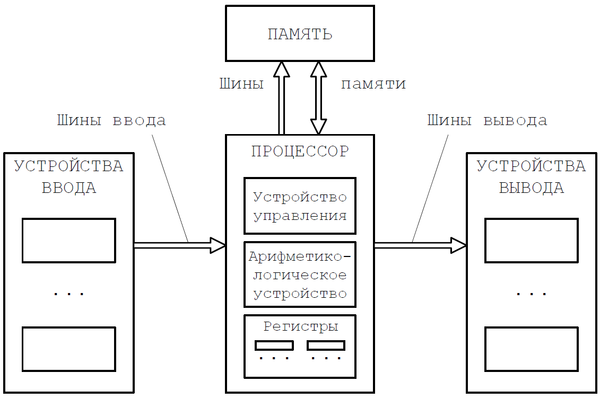
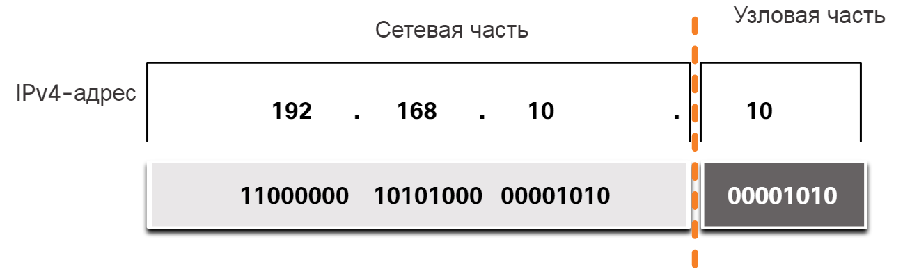
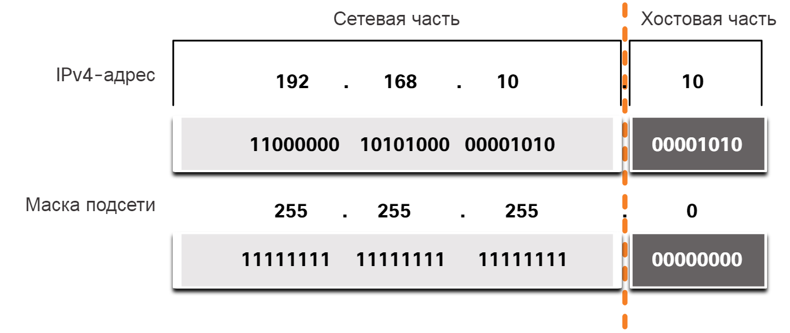
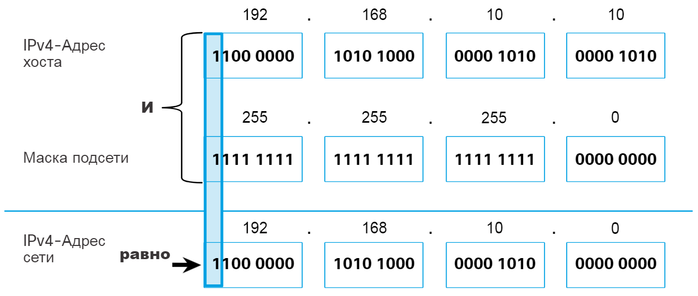
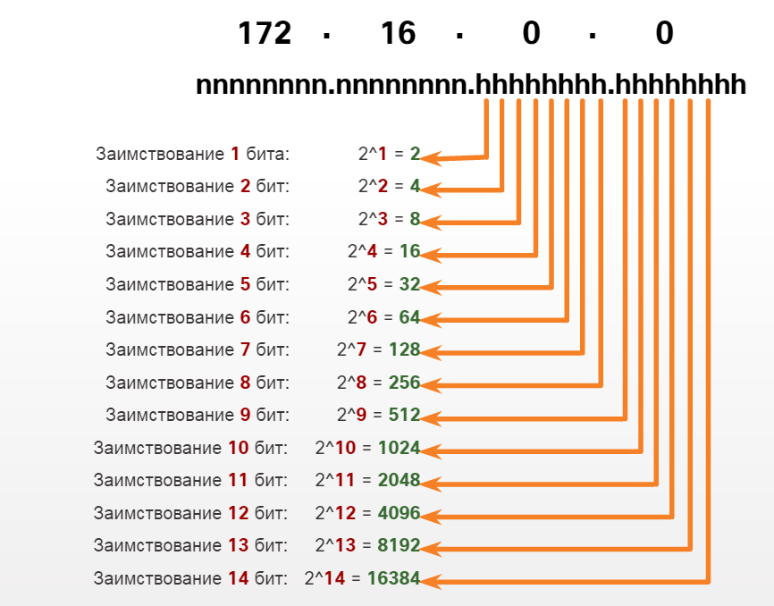
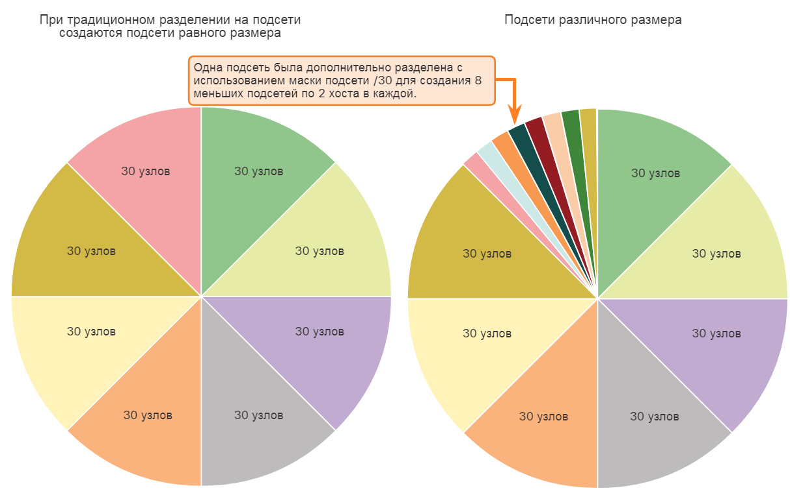

\# Билет №1

\## 1. Сообщения и сигналы. Кодирование. Типы сигналов: аналоговый и дискретный.

\\*\\*Информация\\*\\* – \\*сведения\\* о каких-либо процессах, событиях, фактах или предметах, \\*уменьшающие неопределённость события\\*. Её форма представления является сообщением, служащем для передачи информации от источника к получателю.

\\*\\*Сообщение\\*\\* – форма представления информации.

\\*\\*Сигнал\\*\\* – материальный источник сообщений. Представляет собой процесс изменения во времени физического состояния какого-либо объекта, служащего для отображения, регистрации и передачи сообщений.

\> Источником информации является физический объект, который формирует конкретное сообщение. Получатель этого сообщения и является получателем информации.

\\*\\*Процесс передачи информации\\*\\* заключается в том, что сооб­щения преобразуются в сигналы и по системе связи передаются получателю. Получатель, зная закон соответствия между сообще­ниями и сигналами, может извлечь содержащуюся в сообщении информацию. Для верного декодирования каждому сигналу должно соответствовать одно определенное сообщение.

Сигналы, в сетях и телекоммуникациях, могут быть дискретными и аналоговыми.

\\*\\*Аналоговые сигналы\\*\\* – непрерывные во времени сигналы, они определены во все моменты времени.

\> При \\*\\*аналоговом\\*\\* представлении физическая величина принимает бесконечное множество значений, причем ее значения изменяются непрерывно.

\\*\\*Дискретные сигналы\\*\\* – сигналы, представленные последовательностью отсчётов, т.е. значениями сигналов в дискретные моменты времени.

\> При \\*\\*дискретном\\*\\* представлении физическая величина принимает конечное множество значений, причем ее величина изменяется скачкообразно.

<p style="text-align: center;"><b><p style="text-align: center;">Сигналы</p></b></p>

Чтобы передать сигнал по сети, его нужно преобразовать в цифровую форму. \\*\\*Цифровые сигналы\\*\\* – это сигналы дискретные во времени (или в пространстве) и квантованные по уровню. Вычислительные процедуры в компьютере выполняются именно в цифровых сигналах. Процесс преобразования аналогового сигнала в форму, совместимую с цифровой системой обработки и передачи информации, называется \\*\\*кодированием\\*\\*.

Кодирование сообщений производится специальным устройством, которое называется \\*\\*кодером\\*\\* (кодирующим устройством) источника сообщения (датчика информации). В кодере кодовые комбинации представляются в виде опредёленных состояний накопительных эле­ментов.

Кодирование сигнала происходит в два этапа:

1. \\*\\*Дискретизация сигнала\\*\\* (если аналоговый).

Сигнал представляется в виде последовательности значений, взятых в дискретные моменты времени.

\> Разделение на временные промежутки.

1. \\*\\*Квантование сигнала\\*\\*.

Вся область значений сигнала разбивается на уровни, каждому из которы присваивается некоторое число. Отсчёты сигнала сравниваются с уровнями квантования и в качестве сигнала выбирается это число.

\> Выборка примерного значения.

<p style="text-align: center;"><b><p style="text-align: center;">Дискретизация и квантование</p></b></p>

\## 2. Организация параллельной работы устройств ввода-вывода и процессора.

\\*\\*Назначение системы ввода-вывода\\*\\* – обеспечение связи ядра ЭВМ с внешней средой, посредством периферийных устройств.

У каждого устройства ввода-вывода вычислительной системы (диск, принтер, мышь) есть специальный блок управления – \\*\\*контроллер\\*\\*. Он взаимодействует с \\*\\*драйвером\\*\\* – системным программным модулем для управления контроллером.

\> Взаимодействие контроллера и драйвера позволяет устройству \\*некоторое время\\* выполнять свои операции автономно, без взаимодействия с процессором компьютера.

\>

\> Срок автономности зависит от объёма выводимой информации и степени интеллектуальности контроллера.

Однако, контроллеры даже для самых простых функций работают сравнительно медленно, их скорость работы существенно ниже скорости работы процессора. То есть, процессы, происходящие в контроллерах, протекают в периоды между выдачами команд \\*независимо от ОС\\*.

Подсистема ввода-вывода нужна для выполнения следующих задач:

- В масштабе реального времени (так как в нём работают внешние устройства) спланировать запуск и приостановку разнообразных драйверов.

\> Так можно обеспечить приемлемое время реакции каждого драйвера на независимые события контроллера.

- Минимизировать загрузку процессора обработкой задач ввода-вывода, оставив как можно больше процессорного времени на выполнение пользовательских задач.

Существует три основных технологии организации подсистемы ввода-вывода:

1. \\*\\*Программируемый ввод-вывод с режимом опроса готовности\\*\\*.

Когда процессор встречает команду ввода-вывода (В-В), то он выполняет её и передаёт информацию соответствующим контроллерам. Процесс переводится в состояние ожидания завершения операции В-В, а процессор ждёт сигнал готовности. Этот сигнал отправляется контроллером после того как устройство выполняет команду.

\> Метод лёгкий, но режим ожидания жрёт много процессорного времени.

1. \\*\\*Режим обмена с прерыванием\\*\\*.

После выдачи очередной команды по управлению В-В, процесс прерывается и процессор может дальше заниматься своими грязными делишками. Устройство В-В выполняет свою задачу асинхронно, и через определённое время должно подать процессору сигнал "я сделаль". У проца ведётся отсчёт времени, если устройство не ответило – ОС считает, что связь с ним потеряна и выдаёт сообщение.

\> Метод сложнее в реализации, но существенно оптимизирует процессорное время.

1. \\*\\*Прямой доступ к памяти\\*\\*.

В-В осуществляет специальное устройство (модуль), дублирующее функции процессора по В-В. Когда проц должен повзаимодействовать с устройством В-В, он перенаправляет запрос на этот модуль, который осуществляет \\*\\*режим обмена с прерываниями\\*\\* и после операции передаёт инфу процу. То есть, проц работает с В-В только в начале и в конце выполнения операции.

\> Используется редко, можно забыть про этот метод.

\## 3. Преобразуйте выражение ((a+b)+c\\\*(d+e)+f)\\\*(g+h) в префиксную форму.

Алгебраическое выражение можно записать в трёх формах: инфиксной, префиксной и постфиксной.

\\*\\*Инфиксная форма\\*\\*. Выражение, где операторы находятся \\*\\*между\\*\\* операторами.

\> $2+2=4$

\\*\\*Префиксная форма\\*\\*. Выражение, где операторы находятся \\*\\*перед\\*\\* операторами.

\> $+2\;2=4$

Исходное выражение записано в инфиксной форме.

\>$((A+B)+C\\*(D+E)+F)\\*(G+H)$

Для наглядности, сначала нужно построить дерево для исходной формы:

1. Подписываем над выражением порядок операций;
1. Корнем дерева делаем операцию №1;
1. Фигачим в качестве узлов подписанные операторы, но в обратном порядке. К операторам добавляем потомков – аргументы операции. Если вместо аргумента идёт операция, фигачим её оператор и продолжаем пункт №3.

<p style="text-align: center;"><b><p style="text-align: center;">Префиксное дэрево</p></b></p>

Префиксная форма составляется через DFS (обход в глубину).

\\*\\*Метод обхода графа в глубину\\*\\* или `DFS` – обход графа "как можно глубже". Этот метод идёт по такому условию: если у элемента остались непросмотренные соседи, обход переходит на неё. Обход ведётся для каждой вершины, то есть можно помечать пройденность вершин (к примеру, как дополнительный массив пройденных вершин).

\> Мыш кродётся по лабиринту и ищет еду.

\\*\\*DFS двигается по граням туда и обратно, реализуется стеком.\\*\\*

\## 4. Задача

Разработайте программу «Телефонная книга», позволяющую отображать записи в телефонной книге, выполнять их редактирование (изменение выбранной записи), добавление новой записи, удаление выбранной записи, осуществлять поиск по критериям, сохранять содержимое в текстовом файле с заданным именем и загружать данные из этого текстового файла.

\\*\\*\\*\\*

\#### ~~Пафосное~~ Тупое решение

\```python

\# Функция для считывания файла в словарь

def file\\_to\\_dict(filename):

with open(filename, 'r', encoding='utf-8') as f:

data = f.readlines()

phones = {}

for record in data:

info = record.strip().split(': ')

phone, name = info[0], info[1]

if not phone in phones:

phones[phone] = name

return phones

\# Функция для записи словаря в файл

def dict\\_to\\_file(phones, filename):

with open(filename, 'w', encoding='utf-8') as f:

for phone, name in phones.items():

f.write(f'{phone}: {name}\n')

phones\\_file = 'Телефоны.txt'

phonebook = file\\_to\\_dict(phones\\_file)

while True:

command = int(input("""\nМеню:

1. Вывод телефонной книги
1. Поиск контакта
1. Добавление контакта
1. Переименование контакта
1. Удаление контакта

\0. Выход из программы

Введите действие:"""))

print()

if command == 1:

print('Вывод телефонной книги:')

for number, name in phonebook.items():

print(f'Номер: {number}, название: {name}')

elif command == 2:

take = int(input("""Поиск контакта.

Контакт нужно найти по номеру (1) или по названию (2)?"""))

if take == 1:

number = input('Номер контакта:')

if number in phonebook:

name = phonebook[number]

print(f'Номер: {number}, название: {name}')

else:

print(f'Контакт не найден!')

elif take == 2:

name = input('Название контакта:')

if name in phonebook.values():

number = list(phonebook.keys())[list(phonebook.values()).index(name)]

print(f'Номер: {number}, название: {name}')

else:

print(f'Контакт не найден!')

else:

break

elif command == 3:

print('Добавление контакта:')

number = input('Номер контакта:')

name = input('Название контакта:')

phonebook[number] = name

print(f'Контакт добавлен!')

elif command == 4:

print('Переименование контакта:')

number = input('Номер контакта:')

if number in phonebook:

name = phonebook[number]

print(f'Номер: {number}, название: {name}')

name = input('Введите новое название контакта')

phonebook[number] = name

print(f'Контакт переименован!')

else:

print(f'Контакт не найден!')

elif command == 5:

print('Удаление контакта:')

number = input('Номер контакта:')

if number in phonebook:

print(f'Номер: {number}, название: {name}')

del(phonebook[number])

print(f'Контакт удалён!')

else:

print(f'Контакт не найден!')

else:

break

dict\\_to\\_file(phonebook, phones\\_file)

\```

\#### Реально крутое решение с интерфейсом на Flask (веб-морда)

\```python

import sqlite3

import flask


conn = sqlite3.connect("phonebook.db")

cur = conn.cursor()

cur.execute('''CREATE TABLE IF NOT EXISTS phones (id INTEGER PRIMARY KEY, phone INTEGER, name TEXT);''')

conn.commit()

cur.close()

conn.close()

app = flask.Flask("Phonebook")


@app.route("/")

def index():

resp = '<html><head><meta http-equiv="Content-Type" content="text/html; charset=utf-8"><title>Телефонная книга</title></head><body>'

conn = sqlite3.connect("phonebook.db")

cur = conn.cursor()

cur.execute('''SELECT \\* FROM phones;''')

phones = cur.fetchall()

if len(phones) == 0:

resp += 'В базе пока нет номеров'

else:

resp += '<table border="1" width="100%" cellpadding="5"><tr><th>ID</th><th>Телефон</th><th>Абонент</th><th>Редактировать</th><th>Удалить</th></tr>'

for i in phones:

redlink = '<a href="/edit?id=%s">Редактировать</a>' % i[0]

dellink = '<a href="/delete?id=%s">Удалить</a>' % i[0]

resp += '<tr><th>%s</th><th>%s</th><th>%s</th><th>%s</th><th>%s</th></tr>' % (i[0], i[1], i[2], redlink, dellink)

resp += '</table>'

resp += '<p><a href="/find">Поиск</a></p><p><a href="/add">Добавить номер</a></p></body></html>'

conn.close()

return resp


@app.route("/add", methods = ['POST', 'GET'])

def add():

if flask.request.method == "POST":

conn = sqlite3.connect("phonebook.db")

cur = conn.cursor()

phone = flask.request.form["phone"]

name = flask.request.form["name"]

cur.execute('''INSERT INTO phones (phone, name) VALUES (%s, "%s");''' % (phone, name))

conn.commit()

conn.close()

return flask.redirect("/")

else:

resp = '<html><head><meta http-equiv="Content-Type" content="text/html; charset=utf-8"><title>Телефонная книга</title></head><body>'

resp += '<form action="/add" method="post"><p>Телефон:</p><p><input type = "number" name = "phone" /></p>'

resp += '<p>Абонент:</p><p><input type = "text" name = "name" /></p>'

resp += '<p><input type = "submit" value = "Добавить" /></p>'

resp += '<a href="/">Назад к списку</a></body></html>'

return resp


@app.route("/edit", methods = ['POST', 'GET'])

def edit():

conn = sqlite3.connect("phonebook.db")

cur = conn.cursor()

if flask.request.method == "POST":

id = flask.request.args.get("id")

phone = flask.request.form["phone"]

name = flask.request.form["name"]

cur.execute('''UPDATE phones SET phone = %s, name="%s" WHERE id = "%s";''' % (phone, name, id))

conn.commit()

conn.close()

return flask.redirect("/")

else:

id = flask.request.args.get("id")

cur.execute('''SELECT \\* FROM phones WHERE id="%s"''' % id)

phone = cur.fetchone()

resp = '<html><head><meta http-equiv="Content-Type" content="text/html; charset=utf-8"><title>Телефонная книга</title></head><body>'

resp += '<form action="/edit?id=%s" method="post"><p>Телефон:</p><p><input type = "number" name = "phone" value="%s" /></p>' % (phone[0], phone[1])

resp += '<p>Абонент:</p><p><input type = "text" name = "name" value="%s" /></p>' % phone[2]

resp += '<p><input type = "submit" value = "Изменить" /></p>'

resp += '<a href="/">Назад к списку</a></body></html>'

conn.close()

return resp


@app.route("/delete")

def delete():

conn = sqlite3.connect("phonebook.db")

cur = conn.cursor()

id = flask.request.args.get("id")

cur.execute('''DELETE FROM phones WHERE id="%s";''' % id)

conn.commit()

conn.close()

return flask.redirect("/")


@app.route("/find", methods = ['POST', 'GET'])

def find():

conn = sqlite3.connect("phonebook.db")

cur = conn.cursor()

resp = '<html><head><meta http-equiv="Content-Type" content="text/html; charset=utf-8"><title>Телефонная книга</title></head><body>'

if flask.request.method == "POST":

phone = flask.request.form["phone"]

name = flask.request.form["name"]

cur.execute('''SELECT \\* FROM phones WHERE phone LIKE "%''' + phone + '''%" AND name LIKE "%''' + name + '''%";''')

phones = cur.fetchall()

if len(phones) == 0:

resp += 'Результатов не обнаружено'

else:

resp += '<table border="1" width="100%" cellpadding="5"><tr><th>ID</th><th>Телефон</th><th>Абонент</th><th>Редактировать</th><th>Удалить</th></tr>'

for i in phones:

redlink = '<a href="/edit?id=%s">Редактировать</a>' % i[0]

dellink = '<a href="/delete?id=%s">Удалить</a>' % i[0]

resp += '<tr><th>%s</th><th>%s</th><th>%s</th><th>%s</th><th>%s</th></tr>' % (i[0], i[1], i[2], redlink, dellink)

resp += '</table>'

resp += '<form action="/find" method="post"><p>Поиск по номеру:</p><p><input type = "number" name = "phone" /></p>'

resp += '<p>Поиск по имени:</p><p><input type = "text" name = "name" /></p>'

resp += '<p><input type = "submit" value = "Искать" /></p>'

resp += '<a href="/">Назад к списку</a></body></html>'

conn.close()

return resp


app.run("0.0.0.0", 8080)

\```

\# Билет №2

\## 1. Основные понятия безопасности информации: конфиденциальность, целостность, доступность

\\*\\*Информационная безопасность\\*\\* – это не только защита информации, но ещё и поддержание инфраструктуры системы от воздействия, чреватых нанесением ущерба владельцам или пользователям системы.

\> \\*\\*Защита информации\\*\\* – это совокупность мероприятий, направленных на обеспечение конфиденциальности и целостности обрабатываемой информации, а также доступности информации для пользователей.

\>

\> Цель защиты информации – минимизация потерь, вызванных нарушением целостности данных, их конфиденциальности или недоступности информации для потребителей.

\\*\\*Конфиденциальность\\*\\* – свойство информации, гарантирующее, что доступ к информации имеет доступ только определенные лица. Означает не только доступ к информации, но и разграничение доступа к информации.

Конфиденицальность можно обеспечить разными методами: шифрованием, разграничением доступа к данным, законодательными актами, проведением инструктажа работников, привитие белой морали (~~морально белый персонаж, не Гаррош~~), повышением физической и программной защиты информации.

\>Яндекс.Еда, СДЕК, Delivery Club, Пикабу и РИА новости через свои сайты и приложения допустили слив почти полумиллиарда строк данных о пользователях. Повышает ли это доверие к ним? Квалифицированное ли у них сопровождение?

\\*\\*Целостность\\*\\* – свойство, при наличии которого информация сохраняет заранее определённые вид и качество. Например, как инкапсуляция пакетов в сетях.

Целостность достигается за счёт резервирования данных, организации антивирусной защиты, контроля целостности программ и данных, использования отказоустойчивых устройств.

\> Нельзя отправить пользователю только часть HTML-страницы сайта, или избить пикчу.

\\*\\*Доступность\\*\\* – такое состояние информации, когда она находится в том виде, месте и времени, которые необходимы пользователю, и в то время, когда она ему необходима.

Реализация права на доступ к информации. Как достигается доступность – очевидно (бубном и святым словом).

\> Никто не хочет пользоваться сайтами, которые периодически становятся недоступными или теряют данные как `RuTube`.

\## 2. Кластерные вычислительные системы, их производительность и применение.

\> Вычислительная система может строиться на основе целых компьютеров – многомашинная ВС, либо отдельных процессоров – многопроцессорная ВС.

\\*\\*MIMD\\*\\*

\\*\\*Кластерная вычислительная система\\*\\* или \\*\\*вычислительный кластер\\*\\* – набор соединенных между собой компьютеров, которые работают вместе и могут рассматриваться как единая система. В отличие от распределённых вычислений, все узлы вычислительного кластера выполняют одну и ту же задачу и управляются одной системой управления.

\> Кластер функционирует как единая система, то есть для пользователя или прикладной задачи вся совокупность вычислительной техники выглядит как один компьютер. Именно это и является самым важным при построении кластерной системы.

Серверы кластера обычно соединяются между собой по быстродействующей локальной сети, причем на каждом из серверов работает собственный экземпляр операционной системы. В большинстве случаев все вычислительные узлы кластера используют одинаковое оборудование и одну и ту же операционную систему.

\> Кластеры используются в вычислительных целях, в частности в научных исследованиях. Для вычислительных кластеров существенным показателем является высокая производительность процессора в операциях над числами с плавающей точкой (flops), и менее существенными – скорость операций ввода-вывода.

\>

\> Вычислительные кластеры позволяют уменьшить время расчетов, по сравнению с одиночным компьютером, разбивая задание на параллельно выполняющиеся ветки, которые обмениваются данными по связывающей сети.

Вычислительные кластеры обычно состоят из следующих компонентов:

1. Узел доступа;
1. Вычислительные узлы;
1. Файловый сервер;
1. Серверное хранилище данных (СХД) с общим доступом;
1. Локальная сеть LAN.


Эффективная производительность кластерных вычислительных систем оценивается как 5-15% от их пиковой производительности. Для сравнения: у лучших малопроцессорных систем из векторных процессоров (обычные компы) это соотношение оценивается как 30-50%.

Реальный пример кластера из лаборатории вычислительного интеллекта:

\> Кластер представляет собой сеть из 11 машин с распределенной файловой системой NFS. Общее число ядер CPU в кластере – 61, из них высокопроизводительных – 48. Максимальное число параллельных высокоуровневых задач (потоков) – 109. Общее число ядер графического процессора CUDA GPU – 1920 (NVidia GTX 1070 DDR5 8Gb).

\## 3. Задача

Разработайте базу данных для предприятия связи, которая содержит следующие таблицы: Сотрудники (табельный номер, фио, отдел, код\\\_должности, пол, дата рождения, стаж, семейное положение (Б-брак, Х- холост, Р- разведен), дети), Штатное расписание (код\\\_должности, должность, оклад). Установите связь между таблицами. Составьте запрос Зарплата, в котором зарплата сотрудников вычисляется по формуле оклад+премия. Премия зависит от стажа, если стаж <= 5 лет премия равна 50 % от оклада; если стаж больше 5лет премия равна 100% от оклада. Затем выведите  сводную информацию по отделам: количество сотрудников, максимальная зарплата, минимальная зарплата, общее количество детей в отделе.

\\*\\*\\*\\*

\```sql

CREATE DATABASE IF NOT EXISTS связисты;  -- Создать БД если не существует

USE связисты;  -- Использовать БД

-- Создать таблицу "Расписание"

CREATE TABLE IF NOT EXISTS Расписание(

код\\_должности INT PRIMARY KEY,

должность VARCHAR(30),

-- 12 - число знаков до ',', 2 - после

оклад DECIMAL(12, 2)

);

INSERT INTO Расписание (код\\_должности, должность, оклад)

VALUES (1, 'доцент', 360.00);

INSERT INTO Расписание (код\\_должности, должность, оклад)

VALUES (2, 'магистрант', 215.00);

INSERT INTO Расписание (код\\_должности, должность, оклад)

VALUES (3, 'преподаватель', 310.00);

-- Создать таблицу "Сотрудники"

CREATE TABLE IF NOT EXISTS Сотрудники(

табельный\\_номер INT PRIMARY KEY AUTO\\_INCREMENT,

фио VARCHAR(50),

отдел VARCHAR(30),

код\\_должности INT,

пол VARCHAR(1),

дата\\_рождения DATE,

стаж INT,

семья VARCHAR(1),

дети INT,

FOREIGN KEY (код\\_должности) REFERENCES Расписание (код\\_должности)

);

INSERT INTO Сотрудники (фио, отдел, код\\_должности, пол, дата\\_рождения, стаж, семья, дети)

VALUES ('Баранов П.Е.', 'ИСТ', 1, 'М', '1999-01-12', 13, 'Х', 1);

INSERT INTO Сотрудники (фио, отдел, код\\_должности, пол, дата\\_рождения, стаж, семья, дети)

VALUES ('Абрамова К.А.', 'МЭС', 1, 'Ж', '1989-04-26', 4, 'Х', 0);

INSERT INTO Сотрудники (фио, отдел, код\\_должности, пол, дата\\_рождения, стаж, семья, дети)

VALUES ('Семенов И.В.', 'МЭС', 2, 'М', '1979-05-13', 5, 'Р', 5);

INSERT INTO Сотрудники (фио, отдел, код\\_должности, пол, дата\\_рождения, стаж, семья, дети)

VALUES ('Ильиных Г.Р.', 'ИСТ', 3, 'Ж', '1985-03-05', 20, 'Б', 3);

\```

\> Составьте запрос Зарплата, в котором зарплата сотрудников вычисляется по формуле оклад+премия. Премия зависит от стажа:

\>

\> - если стаж <= 5 лет премия равна 50 % от оклада;

\> - если стаж больше 5 лет премия равна 100% от оклада.

\\*\\*Решение для MySQL:\\*\\*

\```sql

SELECT

фио, должность, оклад + IF(стаж<=5, оклад\\*0.5, оклад) AS Зарплата,

отдел, пол, дата\\_рождения, стаж, семья, дети

FROM

Сотрудники INNER JOIN Расписание USING (код\\_должности)

\```

\\*\\*Решение для SQLite:\\*\\*

\```sql

SELECT

фио, должность, отдел, пол, дата\\_рождения, стаж, семья, дети,

CASE WHEN стаж <= 5 THEN оклад + оклад\\*0.5 ELSE оклад\\*2 END AS Зарплата

FROM

Сотрудники INNER JOIN Расписание ON Сотрудники.код\\_должности=Расписание.код\\_должности

\```

\> Затем выведите сводную информацию по отделам: количество сотрудников, максимальная зарплата, минимальная зарплата, общее количество детей в отделе.

\\*\\*Решение для MySQL:\\*\\*

\```sql

SELECT

отдел,

COUNT(фио) AS `Кол-во сотрудников`,

MAX(оклад + IF(стаж<=5, оклад\\*0.5, оклад)) AS МАКС\\_ЗП,

MIN(оклад + IF(стаж<=5, оклад\\*0.5, оклад)) AS МИН\\_ЗП,

SUM(дети) AS Детей

FROM

Сотрудники INNER JOIN Расписание USING (код\\_должности)

GROUP BY

отдел

\```

Вместо `Сотрудники INNER JOIN Расписание USING (код\\_должности)` можно использовать `Сотрудники INNER JOIN Расписание ON Сотрудники.код\\_должности=Расписание.код\\_должности`.

\## 4. Задача

Составьте блок схему и напишите программу. Сформируйте одномерный массив А(n) случайных целых чисел из диапазона от 0 до 100 и вычислить сумму элементов, стоящих на четных местах.

\\*\\*\\*\\*

\#### \\*\\*Пафосное решение:\\*\\*

\```python

import numpy as np

n = 50

\# Генерация одномерного массива

one\\_dim\\_arr = np.random.randint(0, 100, size=n)

print(one\\_dim\\_arr)

\# Взятие каждого чётного элемента

even = one\\_dim\\_arr[::2]

print(even)

print(f'Сумма: {even.sum()}')

\```

\#### \\*\\*Решение 71-х:\\*\\*

\```pascal

Program abc;

Var a: array[1..100] of integer;

i, n, p: integer;

Begin

//Write ('Сколько элементов? '); Readln (n);

n:=100;

P:=0;

For i:=1 to n do

begin

a[i]:= Random(101); //патамушта он возвращает все элементы до Х-1. В нашем случае как раз до 100

writeln (a[i],' ');

if i mod 2 = 0 then P:=P+a[i];

end;

Writeln('Сумма элементов с четными номерами: ', P);

End.

\```

\# Билет №3

\## 1. Назначение и функции операционных систем (ОС).

\\*\\*Операционная система\\*\\* – комплекс программ, обеспечивающй взаимодействие всех устройств ЭВМ и позволяющий поользователю осуществлять управление ЭВМ.

\> ОС – посредник между пользователем, программами и оборудованием компа.

\\*\\*Главное назначение ОС\\*\\* – управление ресурсами, главными из которых является аппаратура компьютера. ОС управляет вычислительным процессом и информационным обменом между процессором, памятью, внешними устройствами.

По своей сути ОС является совокупностью ядра и набора прикладного ПО. \\*\\*Ядро ОС\\*\\* реализует интерфейс системных вызовов для прочего ПО, позволяющий абстрагироваться от взаимодействия с аппаратной частью и взаимодействовать с вычислительными ресурсами. Например, прозрачно и единообразно распределить память для процесса, вне зависимости от аппаратной части. Прикладное ПО используется пользователем для пользователя.

\\*\\*Основные функции, присущие простейшим ОС вроде MS DOS:\\*\\*

1. Предоставление пользовательского интерфейса;
1. Стандартизированный доступ к периферийным устройствам (устройства ввода-вывода), драйвера;
1. Загрузка приложений в ОЗУ и их выполнение, виртуальная память;
1. Управление процессами;
1. Управление ОЗУ, её распределение между процессами;
1. Управление ПЗУ (жёсткие диски и т.д) через файловую систему.

\\*\\*Дополнительные функции, присущие современным ОС вроде Windows 7 или Linux:\\*\\*

1. Многозадачность – параллельное/псевдопараллельное выполнение задач;
1. Взаимодействие между процессами;
1. Компьютерная сеть – межмашинное взаимодействие;
1. Защита ОС, прикладного ПО и пользовательской информации от деструктивного воздействия пользователей или приложений (от вирусов крч);
1. Многопользовательский режим работы и разграничение прав доступа.

\## 2. Виды мер обеспечения информационной безопасности: законодательные, морально-этические, организационные, технические, программно-математические.

\\*\\*Информационная безопасность\\*\\* – это не только защита информации, но ещё и поддержание инфраструктуры системы от воздействия, чреватых нанесением ущерба владельцам или пользователям системы.

\\*\\*Конфиденциальность\\*\\* – свойство информации, гарантирующее, что доступ к информации имеет доступ только определенные лица. Означает не только доступ к информации, но и разграничение доступа к информации.

\\*\\*Целостность\\*\\* – свойство, при наличии которого информация сохраняет заранее определённые вид и качество. Например, как инкапсуляция пакетов в сетях.

\\*\\*Доступность\\*\\* – такое состояние информации, когда она находится в том виде, месте и времени, которые необходимы пользователю, и в то время, когда она ему необходима.

Для защиты информации от посягательства третьих лиц применяются различные методы:

1. \\*\\*Законодательные (правовые)\\*\\*.

Для обеспечения ИБ в РФ изданы специальные нормативно-правовые акты, законы и указы, касающиеся правил обращения с информацией, нежелательной к разглашению. В них конкретно говорится о порядке предоставления доступа к таким материалам и об основных методах их использования. Оговаривается степень ответственности за разглашение, а также мера наказания.

\> Руководителям организаций необходимо своевременно знакомить рабонтиков с содержанием таких документов, предупреждая нарушение правил и повышая их бдительность.

1. \\*\\*Морально-этические\\*\\*.

Профилактические действия, в основном, воспитательного характера. Они предпринимаются для создания в обществе и отдельных коллективах здорового морального климата.

\> При приёме на работу необходимо предупреждать людей о необходимости соблюдения служебной этики. Сотрудников знакомят с предписаниями, связанными с сохранением коммерческих тайн и персональных данных клиентов фирмы.

1. \\*\\*Организационные\\*\\*.

Подбор персонала, его обучение, разработка должностных инструкций. Организация охраны помещений, в которых находятся конфиденциальные материалы, ввод пропускного режима. Контроль работы сотрудников, имеющих допуск в информационную систему.

\> Информация = люди, а для них нужна система и нормальная документация.

1. \\*\\*Физические\\*\\*.

Действия, направленные на снижение риска потери данных и выявление лиц, пытающихся проникнуть на охраняемую территорию или в информационную систему: установка видеокамер и сигнализации, опломбирование секретных документов, использование специальных меток для обнаружения угрозы утечки информации.

\> Физические методы накрытия тыринга.

1. \\*\\*Технические\\*\\*.

Приёмы "перестраховки", с помощью которых исключается возможность ошибочного или несанкционированного проникновения в информационную систему.

\> К примеру, для получения доступа к важным материалам необходимо получить разрешение нескольких руководящих лиц. Для совершения банковской транзакции требуется составление общего баланса счетов нескольких видов.

1. \\*\\*Программно-математические\\*\\*.

Специальные компьютерные программы и технологии: шифрование, маскировка информации, создание электронной подписи, использование паролей и секретных меток, обнаружение/предупреждение хакерских атак и ликвидация их последствий, усложнение входа в систему вводом биометрических данных.

\> Всё цифровое, что усложняет тыринг или слив информации.

\## 3. Что произойдёт, если единственный конструктор класса объявлен как final?

Класс – чертёж некой идеи, а \\*\\*конструктор\\*\\* – специальный метод, который автоматически вызывается при создании экземпляра объекта.

Фактически, конструктор создаёт в памяти объект с неким значением, на который и ссылается объявленная переменная, в которую "записывается" объект.

\> Конструктор – своеобразный инженер, который инициализирует объект при создании и позволяет автоматически присвоить ему некие значения по умолчанию, а также выполнить некие действия.

Модификатор `final` – специальное ключевое слово, указывающее на невозможность дальнейшего изменения объекта.

\> Если объект является ссылкой на другой объект, то `final` просто запретит изменение ссылки, но у того другого объекта можно будет поменять значение.

Однако, эта невозможность варьируется от объекта:

1. Если \\*\\*конструктор\\*\\* объявить как `final`, программа не запустится – это тупо, блять (с). `final` используется для остановки ПЕРЕОПРЕДЕЛЕНИЯ, а у конструктора итак нет этой возможности.

\> Легко сломать человека, не представляющего свою жизнь без указаний.

\> Для этого, нужно просто запретить ему кормить слонов… там где их нет, не было и не будет.

1. Если \\*\\*переменную\\*\\* объявить как `final` , то после присвоения её не изменить. В той же Java нет отдельного ключевого слова для констант, обычно их объявляют как `static final`.
1. Если \\*\\*поле\\*\\* объявить как `final`, то после инициализации его не изменить.
1. Если \\*\\*метод\\*\\* переопределить как `final`, то его нельзя изменить в дочерних классах.
1. Если \\*\\*класс\\*\\* переопределить как `final`, то ему нельзя иметь наследников (~~Китай~~).

\## 4. Нарисуйте дерево, соответствующее префиксному выражению c\\\*a+b\\\*c+de.

\\*\\*Дерево алгебраических выражений\\*\\* – двоичное дерево (не поиска), где узлы – операторы, а листья – операнды.

Алгебраическое выражение можно записать в трёх формах: инфиксной, префиксной и постфиксной.

\\*\\*Инфиксная форма\\*\\*. Выражение, где операторы находятся \\*\\*между\\*\\* операторами.

\> $2+2=4$

\\*\\*Префиксная форма\\*\\*. Выражение, где операторы находятся \\*\\*перед\\*\\* операторами.

\> $+2\;2=4$

\\*\\*Постфиксная форма\\*\\*. Выражение, где операторы находятся \\*\\*после\\*\\* операторов.

\> $2\;2+=4$

Следовательно, исходные данные предоставлены в префиксной форме. Если записать инфиксную форму в формате дерева (рисунки из задач №2 и №3), то получившееся дерево можно будет преобразовать в префиксную форму алгоритмов DSF.

Следовательно, нужно полученное выражение визуализировать в формате обратного построения алгоритмом DSF.

<p style="text-align: center;"><b><p style="text-align: center;">Префиксное дэрево</p></b></p>

\\*\\*Метод обхода графа в глубину\\*\\* или `DFS` – обход графа "как можно глубже". Этот метод идёт по такому условию: если у элемента остались непросмотренные соседи, обход переходит на неё. Обход ведётся для каждой вершины, то есть можно помечать пройденность вершин (к примеру, как дополнительный массив пройденных вершин).

\> Мыш кродётся по лабиринту и ищет еду.

\\*\\*DFS двигается по граням туда и обратно, реализуется стеком.\\*\\*

\# Билет №4

\## 1. Позиционные системы счисления. Методы перевода чисел.

\\*\\*Позиционная система счисления\\*\\* – система счисления, в которой значение цифры в записи числа зависит от её позиции в числе.

\> Количество цифр, используемых в системе счисления, определяется её основанием.

\>

\> В 2-чной системе лишь 2 цифры: 0 и 1, учитель и ученик;

\> В 10-чной системе 10 цифр: 0, 1, 2, 3, 4, 5, 6, 7, 8, 9

\> В 16-чной системе 16 цифр: 0, 1, 2, 3, 4, 5, 6, 7, 8, 9, A, B, C, D, E, F

\\*\\*Непозиционная система счисления\\*\\* – система счисления, в которой значение цифры в записи числа зависит только от её смысла.

\> Римские цифры, использование предметов для счёта.

Самые частоиспользуемые позиционные системы счисления – с основанием 2, 8, 10 и 16.

На 2-чной системе базируется вся современная электронно-вычислительная техника.

Использование 8-чной системы раньше было обширным в кодировании, сейчас встречается редко, например в старых модулях Linux-систем.

10-чная система используется людьми планеты Земля.

16-чная система вытеснила 8-чную систему, она позволяет компактно кодировать информацию: это и RGB-цвета, и юникод, и представление данных на низком уровне (ассемблер).

Перевод из любой системы в 10-чную очень прост: нужно представить число в виде суммы разрядных слагаемых. Цифры и разрядные единицы записываются в десятичной системе счисления.

<p style="text-align: center;"><b><p style="text-align: center;">Из любой системы в 10-чную</p></b></p>

Перевод из 10-чной в произвольную систему:

1. Разделить столбиком данное целое число на основание той системы счисления, в которую будет осуществлён перевод числа;
1. Если полученный результат меньше чем указанное основание системы счисления, то переходим к шагу 3. Если полученный результат больше или равен основанию системы счисления, то делим результат на основание системы счисление.
1. Получаем ответ: все полученные остатки + последний результат деления записываем в порядке, обратном порядку их получения.

<p style="text-align: center;"><b><p style="text-align: center;">Из 10-чной системы в другие</p></b></p>

\## 2. Основные защитные механизмы построения систем защиты информации: идентификация и аутентификация. Разграничение доступа. Контроль целостности.

\\*\\*Система защиты информации\\*\\* – комплекс организационных и технических мер, направленных на обеспечение информационной безопасности предприятия.

Главным объектом защиты являются данные, которые обрабатываются в автоматизированной системе управления и задействованные при выполнении рабочих процессов.

\> Система защиты информации нужна для минимизации рисков.

Основными защитными механизмами в таких системах являются идентификация, аутентификация, контроль и управление доступом, контроль целостности, шифрование.

\\*\\*Идентификация\\*\\* – распознавание участника процесса информационного взаимодействия перед тем, как к нему будут применены какие-либо аспекты ИБ. Этот процесс, обычно, опирается на заранее определённый идентификатор или другую \\*\\*уникальную\\*\\* информацию об участнике.

Например, идентификация может основываться на…

- …на знании некой секретной информации (пароль, ответ на секретный вопрос);
- …на владении неким реальным объектом: предметом или устройством (пропуск в институт, флешка-ключ для производственных программ);
- …на частях пользователя – биометрических параметрах (Face-ID, скан жопы).

\\*\\*Аутентификация\\*\\* – обеспечение уверенности в том, что участник процесса информационного взаимодействия распознан (идентифицирован) верно.

\> Проверка подлинности идентификации пользователя, процесса или иного компонента системы.

Главная проблема надёжной идентификации и аутентификации – возможность промежуточной подделки. Способ аутентификации можно узнать, украсть или подделать. Данные участника процесса могут быть перехвачены и подменены третьей стороной прямо во время их передачи.

Также, чем надёжнее способ защиты – тем он дороже, и тем больше головняка у участника.

\\*\\*Контроль и управление доступом\\*\\* – технология безопасности, обеспечивающая разрешение или запрет доступа к данным, для которых нужна идентификация. В информационных системах, может быть физической и логической:

- \\*\\*Физическое управление доступом\\*\\* применяется к техническим и аппаратным средствам ИС, а также к информации, представленной в печатной, визуальной и аудиоформе.

\>Представляет собой физические средства, типа сейфа или сурового охранника-сумоиста.

- \\*\\*Логическое управление доступом\\*\\* применяется к программным средствам и информации, представленной в электронной форме.

\> Представляет собой программные средства, типа систем администрирования.

\\*\\*Контроль целостности\\*\\* – технология безопасности, обеспечивающая обнаружение любых случайных или несанкционированных изменения информации, хранимой в информационной системе или передаваемой по каналам связи.

\> Простой пример контроля целостности – особая сургучная печать на письмах.

Контроль целостности базируется на понятиях хеш-функции и электронно-цифровой подписи:

- \\*\\*Хеш-функция\\*\\* –  труднообратимое преобразование данных, реализуемое, как правило, средствами симметричного (обратимого) шифрования.

\> Математический алгоритм, который отображает данные произвольного размера в битовый массив фиксированного размера.

- \\*\\*Электронная цифровая подпись\\*\\* (ЭЦП) – уникальная цифровая информация в виде комбинации символов. Из этой информации можно узнать, кто именно и когда подписал документ.

\> Цифровой и официально утверждённый законом аналог личной подписи от руки. Применяется для подписания и заверения электронных документов.

\## 3. Задача

Создайте и заполните базу данных сотрудников предприятия связи, Сотрудники (табельный номер, фио, отдел, код\\\_должности, пол, дата рождения, стаж, семейное положение, дети), Штатное расписание (код\\\_должности, должность, оклад), зарплата сотрудников вычисляется по формуле оклад+премия, где премия равна 80% от оклада. Установите связь между таблицами.  Составьте запросы для выборки информации:

- о сотрудниках: подразделение, фио, зарплата в рублях, зарплата в долларах (вычислить), отсортировав по фамилии;
- по каждому подразделению вычислить: среднюю заработную плату, количество женщин и детей.

\\*\\*\\*\\*

\```sql

CREATE DATABASE IF NOT EXISTS связисты;  -- Создать БД если не существует

USE связисты;  -- Использовать БД

-- Создать таблицу "Расписание"

CREATE TABLE IF NOT EXISTS Расписание(

код\\_должности INT PRIMARY KEY,

должность VARCHAR(30),

-- 12 - число знаков до ',', 2 - после

оклад DECIMAL(12, 2)

);

INSERT INTO Расписание (код\\_должности, должность, оклад)

VALUES (1, 'доцент', 360.00);

INSERT INTO Расписание (код\\_должности, должность, оклад)

VALUES (2, 'магистрант', 215.00);

INSERT INTO Расписание (код\\_должности, должность, оклад)

VALUES (3, 'преподаватель', 310.00);

-- Создать таблицу "Сотрудники"

CREATE TABLE IF NOT EXISTS Сотрудники(

табельный\\_номер INT PRIMARY KEY AUTO\\_INCREMENT,

фио VARCHAR(50),

отдел VARCHAR(30),

код\\_должности INT,

пол VARCHAR(1),

дата\\_рождения DATE,

стаж INT,

семья VARCHAR(1),

дети INT,

FOREIGN KEY (код\\_должности) REFERENCES Расписание (код\\_должности)

);

INSERT INTO Сотрудники (фио, отдел, код\\_должности, пол, дата\\_рождения, стаж, семья, дети)

VALUES ('Баранов П.Е.', 'ИСТ', 1, 'М', '1999-01-12', 13, 'Х', 1);

INSERT INTO Сотрудники (фио, отдел, код\\_должности, пол, дата\\_рождения, стаж, семья, дети)

VALUES ('Абрамова К.А.', 'МЭС', 1, 'Ж', '1989-04-26', 4, 'Х', 0);

INSERT INTO Сотрудники (фио, отдел, код\\_должности, пол, дата\\_рождения, стаж, семья, дети)

VALUES ('Семенов И.В.', 'МЭС', 2, 'М', '1979-05-13', 5, 'Р', 5);

INSERT INTO Сотрудники (фио, отдел, код\\_должности, пол, дата\\_рождения, стаж, семья, дети)

VALUES ('Ильиных Г.Р.', 'ИСТ', 3, 'Ж', '1985-03-05', 20, 'Б', 3);

\```

\>Составьте запросы для выборки информации:

\>

\>- о сотрудниках: подразделение, ФИО, зарплата в рублях, зарплата в долларах (вычислить), отсортировав по фамилии;

\```sql

SELECT

отдел, фио,

оклад \\* 1.8 AS `Зарплата (руб)`,

оклад \\* 1.8 / 60 AS `Зарплата (дол)`

FROM

Сотрудники INNER JOIN Расписание USING (код\\_должности)

ORDER BY

фио

\```

\>- по каждому подразделению вычислить: среднюю заработную плату, количество женщин и детей.

\```sql

SELECT

отдел,

AVG(оклад \\* 1.8) AS `Средняя ЗП`,

COUNT(CASE WHEN пол="Ж" THEN 1 END) AS `Кол-во женщин`,

SUM(дети) AS `Кол-во детей`

FROM

Сотрудники INNER JOIN Расписание USING(код\\_должности)

GROUP BY

отдел;

\```

\## 4. Задача

Создайте текстовый файл (с помощью Блокнота), содержащий фамилии студентов и их экзаменационные оценки по 5 дисциплинам. Напишите программу печати фамилий студентов, сдавших экзамены только на "5".

\\*\\*\\*\\*

\#### Пафосное решение:

\```python

\# Пример строки в файле: "Кислицын 4 4 4 4 4"

filename = 'Оценки.txt'

good\\_students = []

with open(filename, 'r', encoding='utf-8') as f:

data = f.readlines()

for record in data:

info = record.strip().split()

grades = set(info[1:])

if grades == {'5'}:

good\\_students.append(info[0])

for student in good\\_students:

print(f'Студент "{student}" сдал(-а) экзамены тольно на 5!')

\```

\#### Решение 71-х:

\```python

\# Пример строки в файле: "Кузнецова А. К. 4". Как видно по строке, решение не совсем нормальное.

file1 = open("4.4.txt", "r", encoding='utf-8')

while True:

\# считываем строку

line = file1.readline()

\# прерываем цикл, если строка пустая

if not line:

break

\# выводим строку

if line.find("5") != -1:

print(line)

\# закрываем файл

file1.close

\```

\# Билет №5

\## 1. Представление чисел в памяти компьютера.

Числовые данные обрабатываются в компьютере в двоичной системе счисления. Числа хранятся в памяти компьютера в двоичном коде (в виде последовательности нулей и единиц) в одной из двух форм: в форме с фиксированной точкой и в форме с плавающей точкой.

\\*\\*Форма с фиксированной точкой\\*\\* применяется к целым числам.

Часть памяти компьютера, в которой хранится одно число – \\*\\*ячейка\\*\\*. Минимальный размер ячейки, где может храниться целое число – 8 бит или 1 байт. Ячейки могут использовать 8, 16, 24 или 32 разряда памяти (1, 2, 3 и 4 байта).

Целые положительные числа можно записать в \\*\\*беззнаковом представлении\\*\\*. Его двоичная форма записывается в ячейку с конца: последней цифре числа соответствует последний разряд ячейки. Свободные разряды слева заполняются нулями.

\> В ячейку можно поместить $2^n-1$ беззнаковых чисел, где $n$ – количество битов в ячейке.

Для представления чисел, которые участвуют в вычислительных операциях, используется \\*\\*представление со знаком\\*\\*. В такой форме записи старший разряд всегда отводится под знак (0 для положительных чисел и 1 для отрицательных).

Все отрицательные значения в компьютере хранятся в \\*\\*обратном\\*\\* (дополнительном) коде, а положительные – в \\*\\*прямом\\*\\*. Для получения обратного кода, нужно:

1. Взять модуль числа и перевести его в двоичную систему (получим прямой код);

\> $-42\\_{10}\rightarrow 42=101010\\_2$

1. Инвертировать сигналы: нули заменяются на единицы, а единицы – на нули;

\> $101010\\_2=00101010\\_2 \rightarrow 11010101\\_2$

1. К полученному числу добавляется единица.

\> $11010101\\_2+1=11010110\\_2=-42\\_{10}$

\> Максимальное знаковое число для ячейки равно $2^{n-1}-1$ положительных и $2^{n-1}$ отрицательных.

\>

\> Хранение отрицательных чисел в обратном коде позволяет процессору заменить операцию вычитания на операцию сложения: не нужно определять положительность или отрицательность величины, а затем сравнивать модули для определения знака результата – достаточно просто сложить числа.

\\*\\*Форма с плавающей точкой\\*\\* применяется к вещественным числам. Люди используют естественную форму записи вещественных чисел ($42 \cdot 10^5$), но в компьютерах применяется экспоненциальная форма записи ($a = \pm m \cdot q^p$):

- $m$ – мантисса, представляющая собой правильную дробь (числитель меньше знаменателя, т.е верх меньше низа);
- $q$ – система счисления, в которой представлено число;
- $p$ – порядок числа (количество цифр перед запятой).

В памяти компьютера, один разряд отводится под знак мантиссы, один – под знак порядка, а остальное – под саму мантиссу и порядок числа.

\> Чем больше \\*\\*бит\\*\\* отводится под мантиссу – тем точнее представляемая величина.

\> Чем больше \\*\\*ячеек\\*\\* отводится под порядок – тем шире диапазон от наименьшего до наибольшего числа.

<p style="text-align: center;"><b><p style="text-align: center;">Формат записи "с плавающей запятой"</p></b></p>

\## 2. Назначение ЭМ ВОС и всех уровней протокольного стека.

\### 2.0 Об эталонной модели OSI

Многоуровневая модель для описания сетевых протоколов и операций (OSI) обеспечивает следующие преимущества.

- \\*\\*Упрощение разработки протоколов.\\*\\*

Протоколы, работающие на определенном уровне, определяют формат обрабатываемых данных и интерфейс верхних и нижних уровней;

- \\*\\*Стимулирование конкуренции.\\*\\*

Продукты разных поставщиков могут взаимодействовать друг с другом;

- \\*\\*Предотвращение влияния изменений технологий или функций одного уровня на другие уровни\\*\\* (верхние и нижние);
- \\*\\*Общий язык для описания функций сетевого взаимодействия.\\*\\*

Эталонная модель OSI определяет широкий список функций и сервисов, реализуемых на каждом уровне. Она обеспечивает единообразное применение всех сетевых протоколов и сервисов, описывая то, что необходимо сделать на определённом уровне, но не предписывая конкретные способы выполнения.

<p style="text-align: center;"><b><p style="text-align: center;">Уровни модели OSI</p></b></p>

Уровни модели OSI принято называть по номеру, но их можно упоминать и по названию:

| Уровень                      | Описание                                                     |

\| :--------------------------- | :----------------------------------------------------------- |

| \\*\\*7. Прикладной\\*\\*            | Содержит протоколы для обмена данными между процессами.      |

| \\*\\*6. Уровень представления\\*\\* | Обеспечивает общее представление данных, передаваемых между службами уровня приложений. |

| \\*\\*5. Сеансовый\\*\\*             | Предоставляет услуги уровню представления для организации его диалога и управления обменом данными. |

| \\*\\*4. Транспортный\\*\\*          | Определяет службы для сегментирования, передачи и повторной сборки данных для индивидуальной связи между конечными устройствами. |

| \\*\\*3. Сетевой\\*\\*               | Предоставляет функции для обмена отдельными частями данных по сети между указанными оконечными устройствами. |

| \\*\\*2. Канальный\\*\\*             | Описывает способы обмена кадрами данных при обмене данными между устройствами по общей среде передачи данных. |

| \\*\\*1. Физический\\*\\*            | Представляет данные в понятном для устройств формате. Обеспечивает непосредственную взаимосвязь со средой передачи данных. |

\### 2.1 Физический уровень

\> Отвечает за обмен физическими сигналами между физическими устройствами.

Для передачи данных по сети необходимо сначала установить физическое подключение к ней. В качестве такого подключения может использоваться проводная или беспроводная связь по некой среде передачи данных – это зависит от сети.

Физический уровень OSI (уровень 1) обеспечивает перемещение битов, формирующих кадр канального уровня, по физической среде. Он кодирует такой кадр в виде последовательности сигналов, которые принимаются устройствами и на них восстанавливаются (тоже средствами физического уровня) в кадр.

Основные элементы уровня: физические компоненты (устройства, среды передачи и т.п), способы кодирования данных, способы передачи сигналов.

\> Протоколов на этом уровне нет – работает спецназ: радиосвязь, электрические провода, волоконно-оптические провода…

\### 2.2 Канальный уровень

\> Обеспечивает установление, поддержание и разъединение соединений каналов связи.

\>

\> Задача: сформировать кадры с адресом отправителя и получателя, после чего отправить их по сети.

Канальный уровень OSI (уровень 2) подготавливает сетевые данные для физической сети. Он отвечает за связь между сетевыми интерфейсными картами, то есть его задача – работа с соединениями информационных каналов: их нужно устанавливать, поддерживать и разъединять.

\> Если бы канального уровня не существовало, протоколы сетевого уровня (т.к он стоит выше), например IP, должны были бы обеспечивать соединение для всех типов средств подключения, которые могли встретиться на пути следования пакета. Более того, им пришлось бы каждый раз адаптироваться к новой сетевой технологии или среде.

На канальном уровне, устройство имеет физический адрес – это MAC-адрес, задаваемый физическим оборудованием (сетевой платой).

По стандарту IEEE, канальный уровень делится на два отдельных подуровня:

- \\*\\*Подуровень LLC (Logical Link Control)\\*\\*, управляющий логическими связями. Отвечает за связь с сетевым уровнем.
- \\*\\*Подуровень MAC (Media Access Control)\\*\\*, управляющий доступом к среде. Отвечает за инкапсуляцию данных и доступ к среде передачи данных (связь с физическим уровнем).

Работа канального уровня начинается с синхронизации двух удалённых устройств.

\> \\*\\*Синхронизация\\*\\* – процесс установления и поддержания временных соотношений между двумя и более процессами.

Синхронизация, в свою очередь, начинается с запуска драйвера соответствующего протокола. На компах, обычно, используется Ethernet.

\> Примеры протоколов: 802.11 (беспроводная связь), Ethernet (сетевой порт компуктера), Frame Relay (как Ethernet, но специализирован на подключениях), HDLC (блть), Token Ring (блть), FDDI (блть), MPLS (блть).

\### 2.3 Сетевой уровень

\>Выполняет маршрутизацию блоков данных через сеть.

\>

\>Протоколы этого уровня занимаются построением маршрута от одного сетевого устройства к другому, с учётом всех потенциальных неполадок внутри сети.

Сетевой уровень OSI (уровень 3) предоставляет сервисы, позволяющие хостам обмениваться данными по сети. Для этого, протоколы данного уровня выполняют четыре основных операции:

- \\*\\*Адресация оконечных устройств\\*\\*. Хостам необходимо назначить уникальный IP-адрес для возможности их идентификации в сети;
- \\*\\*Инкапсуляция\\*\\*, во время которой источник IP-пакета добавляет информацию заголовка IP, например IP-адрес узла источника (отправляющего) и узла назначения (получающего).
- \\*\\*Маршрутизация\\*\\*. Сетевой уровень предоставляет сервисы, с помощью которых пакеты направляются к узлу назначения в другой сети. Для этого, пакет должен быть обработан маршрутизатором – он выбирает пути для пакетов и направляет их к узлу назначения (это и есть маршрутизация).
- \\*\\*Деинкапсуляция\\*\\*, во время которой получатель IP-пакета проверяет IP-заголовок пакета: IP-адрес назначения в нём должен совпадать с собственным IP-адресом устройства – тогда пакет, уже без заголовка IP, передаётся на транспортный уровень.

\> Примеры протоколов: IPv4, IPv6, ICMP (для диагностики), RIP (древняя маршрутизация по локальным сетям), BGP (маршрутизация локальных сетей в сети интернет), OSPF (маршрутизация по локальным сетям), ARP (найти MAC-адрес по IP), RARP (найти IP по MAC-адресу).

\### 2.4 Транспортный уровень

\> Обеспечивает логическое соединение между двумя хостами.

\>

\> Главная задача – транспортировка пакетов.

Транспортный уровень OSI (уровень 4) является посредником (каналом) между уровнями приложений и сетевыми уровнями – фактически, он согласовывает их работу: транспортный уровень описывает сам механизм передачи данных, вне зависимости от их типа.

\> Программы прикладного уровня генерируют данные, которыми необходимо обмениваться между узлами источника и назначения. Транспортный уровень отвечает за логические связи между приложениями, работающими на разных узлах.

Протоколы транспортного уровня TCP и UDP используют номера портов для управления несколькими одновременными сеансами связи.

\> Примеры протоколов: TCP (надёжная доставка), UDP (ненадёжная доставка).

\### 2.5 Сеансовый уровень

\> Управляет взаимодействием между приложениями (прикладными процессами).

\>

\> Оперирует чистыми данными и отвечает за поддержку сеанса связи.

Сеансовый уровень OSI (уровень 5) служит для установления и поддержания связи между приложениями отправителя и получателя. На данном уровне происходит обмен данными для установления связи, поддержания ее в активном состоянии и для перезапуска сеансов, которые были прерваны или неактивны в течение продолжительного времени.

\> Сеансовый уровень обеспечивает взаимодействие между прикладными процессами независимо от метода и техники передачи информации (то есть, он занимается выделением ресурсов, вызовом нужных приложений и так далее).

Именно сеансовый уровень аутентифицирует право пользователя на доступ к услуге, синхронизирует приложения, а также устанавливает соединение и поддерживает его между двумя удалёнными программами.

\> Примеры протоколов: RPC (удалённый вызов процедур), NetBIOS (служба сессий на старых компах).

\>

\> Видеозвонок по сети происходит через сеансовый уровень.

\### 2.6 Уровень представления данных

\> Определяет синтаксис передаваемой информации, то есть форму передачи информации: текста, графики, звука.

\>

\> Занимается шифрованием данных, когда при передаче их необходимо защитить.

Уровень представления OSI (уровень 6) служит для приведения данных, переданных транспортным уровнем, в вид доступный прикладному уровню. То есть, на нём форматируются данные для уровня приложений и устанавливаются стандарты форматов файлов.

\> Фактически, данный уровень представляет сообщение в той форме, которая необходима получателю.

Следовательно, функции уровня сводятся к обеспечению шифровки/дешифровки данных, а также к их сжатию/распаковке.

\> Примеры протоколов: ASCII (соответствие кодировок), SSL (криптография), TLS (криптография покруче).

\### 2.7 Прикладной уровень

\> Своеобразный GUI между моделью OSI и пользователем.

Прикладной уровень OSI (уровень 7) обеспечивает работу и взаимодействие сетевых приложений с базовой сетью, по которой передаются сообщения. Данный уровень определяет семантику информации, то есть её смысловое содержание.

\> Протоколы уровня приложений используются для обмена данными между программами, выполняемыми на узле источника и узле назначения.

Основные функции уровня сводятся к обеспечению интерфейса между пользователем и общесетевыми службами, а также аутентификация пользователя по имени и паролю.

На прикладном уровне работают браузеры, всякие приложения типа Steam и BattleNet.

\> Примеры протоколов: HTTP (передача данных через запросы), FTP (передача файлов по сети), Telnet (связь через терминал), SSH (безопасное удалённое подключение), SMTP (передача почты), DHCP (динамическая настройка IP на узле).

\### 2.8 Инкапсуляция

В рамках сетевых моделей, к сегментации добавляется ещё одно свойство: по мере перехода данных от приложения к физической среде, на каждом уровне к нему добавляется специальная информация уровня. Этот процесс называется \\*\\*инкапсуляцией\\*\\* (это как собирать матрёшку), а обратное снятие информации уровня – \\*\\*деинкапсуляцией\\*\\* (это как добираться до самой маленькой матрёшки).

\> Для передачи данных по сети, исходные данные сначала оборачиваются в матрёшку  из специальной информации, а затем разворачиваются из неё.

\>

\> На каждом уровне, матрёшка представляет собой массив данных, который называется \\*\\*единицей данных протокола (PDU)\\*\\*. И на каждом уровне, PDU имеет своё название:

\>

\> - \\*\\*Данные\\*\\* на уровне приложений;

\> - \\*\\*Сегмент\\*\\* на транспортном уровне;

\> - \\*\\*Пакет\\*\\* на сетевом уровне;

\> - \\*\\*Кадр\\*\\* на канальном уровне;

\> - \\*\\*Биты\\*\\* на физическом уровне.

<p style="text-align: center;"><b><p style="text-align: center;">Функционал PDU по уровням модели OSI</p></b></p>

\## 3. Задача

Составьте блок-схему и напишите программу тестовой проверки знаний. Программа должна вывести 10 примеров (например, вычисления значений таблицы умножения), задающихся случайным образом и выставить оценку за 10 правильных ответов – «отлично», за 9 и 8 – «хорошо», за 7 и 6 «удовлетворительно», за 6 и менее – «плохо».

\\*\\*\\*\\*

\#### Пафосное решение:

\```python

import numpy as np

def generate\\_numbers(count, num\\_start, num\\_end):

mul1 = np.random.randint(num\\_start, num\\_end, size=count)

mul2 = np.random.randint(num\\_start, num\\_end, size=count)

for i in range(count):

yield mul1[i], mul2[i]

def quiz(count, start\\_number, end\\_number):

correct\\_answers = 0

for num1, num2 in generate\\_numbers(count, start\\_number, end\\_number):

res = input(f'{num1} \\* {num2} =')

if res.isdigit() and num1\\*num2 == int(res):

print('Правильно!')

correct\\_answers += 1

else:

print('Неверно!')

if correct\\_answers == 10:

return 'Отлично'

elif correct\\_answers in [9, 8]:

return 'Хорошо'

elif correct\\_answers in [7, 6]:

return 'Удовлетворительно'

else:

return 'Плохо'

TOTAL = 10

start\\_number, end\\_number = 1, 13  # Диапазон чисел в примерах

result = quiz(TOTAL, start\\_number, end\\_number)

print(result)

\```

\#### Решение 71-х:

\```python

import random

i=0

k=0

for i in range(10):

a = random.randint(1, 9)

b = random.randint(1, 9)

print(a," x ",b )

result = int(input())

if ((a\\*b) == result):

k = k+2;

if (k == 10):

print("Отлично")

elif (8 <= k <= 9):

print ("Хорошо")

elif (6 <= k <= 7):

print("Удовлетворительно")

else:

print("Плохо")

\```

\## 4. Задача

Составьте программу, которая рисует на экране шахматную доску.

\\*\\*\\*\\*

\#### Пафосное решение

\```python

import numpy as np

import matplotlib.pyplot as plt

def checkerboard(n):

A = np.zeros((n, n), dtype=int)

A[1::2, ::2] = 1

A[::2, 1::2] = 1

return A


n = 10

fig, ax = plt.subplots()

ax.imshow(checkerboard(n), cmap=plt.cm.gray, interpolation='nearest')

plt.show();

\```

\#### Тупое решение

\```python

import tkinter as tk

import math

root = tk.Tk() # Вывод окна

root.title("Шахматная доска")

N = 5

h, w = 600, 600

canvas = tk.Canvas(root);

canvas["height"], canvas["width"] = h, w

canvas["background"] = "#eeeeff"

canvas["borderwidth"] = 2

canvas.pack()

x, y, c = 20, 20, 1

a = (h - (x + y)) / N

for i in range(N):

while x < h-40:

if c % 2 == 0:

col = "white"

else:

col = "black"

c += 1

canvas.create\\_rectangle(x, y, x+a, y+a, fill=col)

x += a

x = 20

y += a;

if N%2 == 0:

c += 1

tk.mainloop()

\```

\# Билет №6

\## 1. Назначение, область применения и способы оценки производительности многопроцессорных вычислительных систем

\> Вычислительная система может строиться на основе целых компьютеров – многомашинная ВС, либо отдельных процессоров – многопроцессорная ВС.

\\*\\*MIMD\\*\\*

\\*\\*Многопроцессорные вычислительные системы\\*\\* – это системы, содержащие несколько процессоров, информационно взаимодействующих между собой либо на уровне регистров процессорной памяти, либо на уровне оперативной памяти.

Многопроцессорные системы представляют собой основ­ной путь построения вычислительных систем сверхвысо­кой производительности. При создании таких систем возни­кает много сложных проблем, к которым в первую очередь следует отнести:

1. Распараллеливание вычислитель­ного процесса (программ) для эффективной загрузки про­цессоров системы;
1. Преодоление конфликтов при попытках нескольких процессоров использовать один и тот же ресурс системы (например, некоторый модуль памяти);
1. Уменьшение влияния конфликтов на производительность системы, осу­ществление быстродействующих экономичных по аппара­турным затратам межмодульных связей.

Можно выделить две основные сферы применения описываемых систем:

1. Обработка транзакций в режиме реального времени;
1. Создание хранилищ данных для организации систем поддержки принятия решений.

Cфера применения многопроцессорных вычислительных систем (МВС) охватывает области в различных отраслях науки, бизнеса и производства:

1. Предсказания погоды, климата и глобальных изменений в атмосфере;
1. Науки о материалах;
1. Структурная биология;
1. Разработка фармацевтических препаратов;
1. Генетика;
1. Квантовая хромодинамика;
1. Астрономия;
1. Транспортные задачи;
1. Гидро- и газодинамика;
1. Управляемый термоядерный синтез;
1. Эффективность систем сгорания топлива;
1. Геоинформационные системы;
1. Наука о мировом океане;
1. Распознавание и синтез речи; распознавание изображений.

Главной отличительной особенностью многопроцессорной вычислительной системы является ее производительность – количество операций, производимых системой за единицу времени. Различают пиковую (\\*теоретическая\\*) и реальную производительность.

\\*\\*Пиковая производительность\\*\\* – произведение пиковой производительности одного процессора на число таких процессоров в данной машине, если предположить, что все устройства компьютера работают в максимально производительном режиме.

Оценить пиковую производительность можно двумя способами:

1. Использовать в оценке число команд, выполняемых компьютером в единицу времени.

Измеряется в \\*\\*MIPS\\*\\* (Million Instructions Per Second).

\> Очень специфично и зависит от программ. Даёт лишь самое общее представление о производительности компьютера.

1. Использовать в оценке число вещественных операций, выполняемых компьютером в единицу времени.

Измеряется в \\*\\*FLOPS\\*\\* (Floating point operations per second).

\> Позволяет узнать нижнюю оценку времени выполнения для каждой из программ.

\>Чем больше \\*\\*пиковая\\*\\* производительность, тем \\*\\*теоретически\\*\\* быстрее пользователь сможет решить свою задачу.

\\*\\*Реальная производительность\\*\\* – производительность, достигаемая в работе с определённым приложением. Зависит от взаимодействия программной модели, в которой реализовано приложение, с архитектурными особенностями машины, на которой приложение запускается.

Определить реальную производительность можно с помощью специальных тестирующих программ – \\*\\*бенчмарков\\*\\*.

\> Чем больше \\*\\*реальная\\*\\* производительность, тем \\*\\*фактически\\*\\* быстрее пользователь сможет решить свою задачу.

\## 2. Стек протокола TCP/IP. Инкапсуляция протоколов TCP/IP.

В настоящее время, основными многоуровневыми моделями являются:

1. \\*\\*Эталонная модель взаимодействия открытых систем\\*\\*, более известная как \\*\\*`OSI`\\*\\*.
1. \\*\\*Эталонная модель TCP/IP\\*\\*, более известная как "\\*\\*протокольный стек `TCP/IP`\\*\\*".

\> Эталонные модели так называются, потому что их сочли достаточно годными для общего признания эталоном представления работы сети. Такую модель можно также назвать \\*\\*протокольным стеком\\*\\*, потому что фактически она представляет собой стек из протоколов.

<p style="text-align: center;"><b><p style="text-align: center;">Эталонные модели функционирования сети</p></b></p>

1. Чтобы хосты могли взаимодействовать по сети, каждое устройство должно соблюдать один и тот же набор правил, называемых \\*\\*протоколами\\*\\*. Протокол обеспечивает взаимодействие компьютерных (или распределённых) сетей в пределах одного уровня модели.

Принцип инкапсуляции полностью аналогичен OSI:

<p style="text-align: center;"><b><p style="text-align: center;">Инкапсуляция TCP/IP</p></b></p>

\## 3. Задача

Составьте блок-схему и напишите программу, которая формирует двумерный массив случайных целых чисел из диапазона (-10; 10), находит первую строку, состоящую из нулей, и выдает ее номер или сообщение о том, что такой строки нет.

\\*\\*\\*\\*

\#### \\*\\*Пафосное решение:\\*\\*

\```python

import numpy as np

N, M = 5, 5

DIAP = (-10, 10)

arr = np.random.randint(\\*DIAP, size=(N, M))

print(arr)

res = np.where(~arr.any(axis=1))[0]

if res.size:

print(f'Строка с индексом "{res}" состоит из нулей')

else:

print('Строки из нулей нет!')

\```

\#### \\*\\*Решение 71-х:\\*\\*

\```python

import random

massiv = []

for i in range (10):

massiv.append([])

for j in range (3):

massiv[i].append(random.randint(-1,1))

print(massiv)

k=0

test = True

for i in range(10):

for j in range(3):

if (massiv[i][j] == 0):

k= k+1

if (k == 3):

print ("Нулевая строка под номером ", i+1 )

test = False

k=0

if test :

print("Такой строки не существует")

\```

\## 4. Задача

Составьте программу, которая создает на диске англо-русский словарь. Программа должна уметь отвечать на заданные вопросы и вводить новые слова. Для апробации полученного результата составьте отсортированный словарь английских слов, которые используются в языке программирования. Желательно, чтобы словарь был представлен в виде выровненных столбцов и сохранял новые слова после каждого сеанса работы.

\\*\\*\\*\\*

\#### Скомунизженно у 71-х: она аналогична задаче №2, но я заебался

\```python

\# Пример строки в файле: "for,для". Решение кривое и не полностью удовлетворяет условию желательности.

while True:

f = open('6.4.txt')

lines = f.readlines()

inp = int(input("\nДействия:\n1. Вывести все слова\n2. Поиск\n3. Добавить новое слово\n4. Выход\nВвод: "))

if inp == 1:

for i in lines:

print(i.split(",")[0]," ⋙ ",i.split(",")[1], end="")

elif inp == 2:

fin = input("Введите слово для поиска: ")

for i in lines:

if i.find(fin.lower()) != -1:

print(i.split(",")[0]," - ",i.split(",")[1])

break

elif inp == 3:

en = input("Введите слово на английском: ")

ru = input("Введите слово на русском: ")

f.close()

f = open('6.4.txt', 'a')

f.write(en+","+ru)

f.close()

elif inp == 4:

f.close()

exit()

\```

\# Билет №7

\## 1. Графы. Обходы графов.

\*\*Граф\*\* – математическая модель набора связей (отношений). То есть, это наглядное представление отношений между какими-либо объектами.

\> В математическом виде, граф: (V, E, $\phi$). V – множество вершин, E – множество рёбер, $\phi$ – отношения между ними.

\*\*Обход графа\*\* – это переход от одной его вершины к другой в поисках свойств связей этих вершин. Связи (линии, соединяющие вершины) называются \*\*рёбрами\*\* графа, а вершины  – \*\*узлами\*\*. Если у узла нет потомков, он называется \*\*листом\*\*.

\*\*Путь в графе\*\* – некая последовательность вершин, каждая из которых соединена со следующей ребром. Численно путь характеризуется суммой весов этих рёбер.

\*\*Ориентированный граф\*\* – граф, рёбра которого имеют направление. То есть, из вершины 1 может быть дуга в вершину 2, но не всегда будет дуга из вершины 2 в вершину 1. В орграфе у ребра всегда есть начало и конец.

\*\*Неориентированный граф\*\* – граф, рёбра которого не имеют направления. То есть, если есть ребро между вершинами – из первой вершины всегда можно попасть во вторую, а из второй вершины – в первую.

Существует два основных метода обхода графа: DFS и BFS.

\### Обход графа в глубину (DFS)

\*\*Метод обхода графа в глубину\*\* или `DFS` – обход графа "как можно глубже". Этот метод идёт по такому условию: если у элемента остались непросмотренные соседи, обход переходит на неё. Обход ведётся для каждой вершины, то есть можно помечать пройденность вершин (к примеру, как дополнительный массив пройденных вершин).

\> Мыш кродётся по лабиринту и ищет еду.

\*\*DFS двигается по граням туда и обратно, реализуется стеком.\*\*

Как правило, это рекурсивная процедура: рекурсивно перебираются все исходящие из рассматриваемой вершины рёбра. Если ребро ведёт в вершину, которая не была рассмотрена ранее, то рекурсивный алгоритм обхода запускается для этой вершины, а после его работы – аналогично ко всем другим рёбрам.

В данной реализации предполагается, что до обработки графа, все его вершины являются непросмотренными, то есть окрашенными в белый цвет. Тогда, нужно пройти по всем вершинам графа, и если вершина белая – выполнить для неё алгоритм:

1) Перекрасить вершину в чёрный цвет, то есть пометить просмотренной.
1) Для всех смежных вершин, для актуальной, окрашенных в белый цвет, рекурсивно выполнить алгоритм, начиная с шага 1.

Такой проход позволяет выявлять циклы: если на шаге 2 будет вершина, окрашенная в чёрный цвет, то это означает нахождение цикла.

\> Применяется в головоломках с единственным решением, для обнаружения циклов на графе, для нахождения пути между вершинами.

\### Обход графа в ширину (BFS)

\*\*Метод обхода графа в ширину\*\* или `BFS` – обход графа "как можно шире".

\> Круги, от упавшего в воду камня, огибают препятствия при распространении.

\*\*BFS распространяется по соседям в поисках цели, реализуется очередью.\*\*

Этот метод идёт по такому условию: берётся некая вершина, а затем посещаются все вершины на расстоянии $k$ от неё, после чего $k+1$ и аналогично до достижения просмотренных вершин или конца графа.

Когда для вершины просматриваются все прямые соседи, она помечается как просмотренная. Тогда, можно разбить по цветам: белый – вершины, которая ещё не достигнута; серый – уже добавленная в очередь вершина; чёрный – извлечённая из очереди вершина.

Используется очередь вместо стека, так как проход идёт равномерно во все стороны.

\> Применяется для определения кратчайших путей, индексации веб-страниц ботами, поиска в соцсетях и нахождения доступных соседних узлов в P2P сетях типа BitTorrent.

\## 2. Криптографические механизмы конфиденциальности, целостности и аутентичности информации. Электронная цифровая подпись.

\*\*Криптография\*\* – наука о методах преобразования (шифрования) информации с целью сокрытия и защиты её от несанкционированных пользователей.

\*\*Ключ\*\* – сменный элемент шифра, который применён для шифрования конкретного сообщения.

\> Криптография представляет собой совокупность методов преобразования данных, направленных на то, чтобы сделать эти данные бесполезными для злоумышленника.

Такие преобразования позволяют решить главные вопросы, касающихся безопасности информации: защиту её конфиденциальности, целостности и аутентичности.

В основные криптографические механизмы входят:

- \*\*Механизм организации конфиденциальности информации\*\*.

В системе должно осуществляться шифрование всей конфиденциальной информации, записываемой на съёмные устройства (флешки, диски)  или передаваемой по сети. Должны автоматически очищаться области внешней памяти, содержащие ранее незашифрованную информацию.

- \*\*Механизм обеспечения целостности информации\*\*.

В системе должна обеспечиваться целостность программных средств, неизменность программной среды. Целостность и неизменность должны проверяться по аттестованным алгоритмам, в соответствии с актуальными ГОСТ.

- \*\*Механизм организации аутентичности информации\*\*.

В системе должны использоваться разные криптографические ключи для шифрования информации, относящейся к разным группам доступа. Доступ к информации и ключам должен дополнительно контролироваться специальными алгоритмами. Сертификация средств криптографической защиты должна проводиться специальными и лицензированными центрами.

\*\*Электронная цифровая подпись\*\* (ЭЦП) – уникальная цифровая информация в виде комбинации символов. Из этой информации можно узнать, кто именно и когда подписал документ. Формируется для \*\*исходного\*\* состояния документа. Любое изменение документа = новая подпись.

\> Цифровой и официально утверждённый законом аналог личной подписи от руки. Применяется для подписания и заверения электронных документов.

Механизм ЭЦП, обычно, используется на алгоритмах асимметричного шифрования и включает две процедуры: формирование подписи отправителем (использует ключ отправителя) и верификация получателя (использует общедоступный ключ)

Использование ЭЦП позволяет осуществить:

- \*\*Контроль целостности\*\* и защита от подделки документа.

ЭЦП вычисляется для исходного состояния документа и соответствует лишь ему. Изменение документа (нарушение целостности) делает подпись недействительной.

- \*\*Подтверждение авторства\*\* и \*\*невозможность отказа\*\* от него.

Создать ЭЦП можно лишь зная определённый ключ, который должен быть известен только владельцу. Зная ключ, можно подтвердить авторство. При этом, отказаться от ЭЦП нельзя.

ЭЦП может формироваться на основе алгоритмов шифрования:

- \*\*Алгоритмы симметричного шифрования\*\*.

Основаны на использовании одного и того же секретного ключа для шифрования и дешифрования информации.

\> 1. Одноключевые, с секретным ключом.

- \*\*Алгоритмы асимметричного шифрования\*\*.

Основаны на использовании общедоступного ключа для шифрования, а для дешифрования – другой, являющийся секретным. Знание общедоступного ключа не позволяет определить секретный ключ.

\> 1. С открытым ключом.

\## 3. Назовите принципы ООП и расскажите о каждом.

\*\*Объектно-ориентированное программирование\*\* – концепция программирования, базирующаяся на использовании объектов.

\> Если в структурной концепции главную роль играют \*\*логика и понимание последовательности выполнения действия для достижения поставленной цели\*\*, то в объектной концепции – \*\*представление программы как системы взаимодействующих объектов\*\*.

\*\*Классом\*\* в ООП понимается некая сущность, у которой можно смоделировать свойства и поведения. То есть, класс – некая идея сущности, своеобразный чертёж. Идею можно воплотить, и это воплощение будет называться \*\*экземпляром\*\* или \*\*объектом\*\*. У идеи есть некие характерные свойства – \*\*атрибуты\*\* или \*\*поля\*\*. Идее характерны некие способы взаимодействия – \*\*методы\*\*.

В современном ООП принято выделять пять основных принципов (механизмов):

- \*\*Абстракция\*\*. Сущности и взаимодействия можно смоделировать (представить в качестве некой концепции) как классы и методы.

\> 1. Яблок много разных бывает – красные, зелёные, вкусные и червистые. Но городские жители при слове "яблоко" знают о каком объекте речь – они знают идею "яблочности". Вот эта идея "яблочности" и есть абстракция, то есть набор всех таких характеристик объекта.

- \*\*Инкапсуляция\*\*. Свойство системы, позволяющее объединять данные и методы, работающие с ними, в классе, попутно скрыв детали реализации от пользователя.

\> 1. Наполнить желудок едой можно напрямую, положив еду в желудок. Это опасно, поэтому прямой доступ к желудку закрыт. Наполнение желудка происходит через элемент интерфейса "рот", а обычному пользователю не обязательно знать, что между ртом и желудком есть другие элементы говнокода.

- \*\*Наследование\*\*. Свойство системы, позволяющее описать новый класс на основе уже существующего с частично или полностью заимствующейся функциональностью.

\> 1. На заводе есть общая идея стола, прямо таки столистый стол (\*\*родительский класс\*\*). Но людям нужны разные столы, и поэтому на заводе есть другие коробки с идеями письменного, обеденного или журнального столика – все они являются наследником (\*\*дочерним классом\*\*) идеи столистого стола, но по своему изменяют её.

\> 1. Я получил власть, которая и не снилась моему отцу!

- \*\*Полиморфизм\*\*. Свойство системы использовать объекты с одинаковым интерфейсом без информации о типе и внутренней структуре объекта.

\> 1. Человек может /есть. Кошка может /есть. Но эти действия проходят по разному, и в обычном диалоге нам не нужно уточнять "а вот кошка есть с помощью такого комплекта зубов, языка интегральной формы X и атомного излучателя", мы просто понимаем "кошка ест, чо те непонятно".

\> 1. Аналогично с вождением велосипеда – умеешь ездить на одном, сможешь поехать и на другом.

- \*\*Композиция\*\*. Объекты зачастую формируются или состоят из других объектов.

\> 1. Компьютер можно считать объектом. Компьютер содержит разные устройства – видеокарту, процессор, материнскую плату и так далее. Эти устройства тоже можно считать объектами.

\>    Компьютер – объект, содержащий другие объекты.

\## 4. Задача

Составьте блок-схему и напишите тестовую программу для проверки умения умножать числа от 2 до 9 на числа в пределах от 1 до 100. Программа должна вывести 10 примеров. Оценка выставляется по следующему правилу: за 10 правильных ответов – «отлично», за 9 и 8 – «хорошо», за 7 и 6 «удовлетворительно», за 6 и менее – «плохо».

\-----

\#### Пафосное решение:

\~~~ python

import numpy as np

def generate\_numbers(count, diap1, diap2):

mul1 = np.random.randint(\*diap1, size=count)

mul2 = np.random.randint(\*diap2, size=count)

for i in range(count):

yield mul1[i], mul2[i]

def quiz(count, diap1, diap2):

correct\_answers = 0

for num1, num2 in generate\_numbers(count, diap1, diap2):

res = input(f'{num1} \* {num2} =')

if res.isdigit() and num1\*num2 == int(res):

print('Правильно!')

correct\_answers += 1

else:

print('Неверно!')

if correct\_answers == 10:

return 'Отлично'

elif correct\_answers in [9, 8]:

return 'Хорошо'

elif correct\_answers in [7, 6]:

return 'Удовлетворительно'

else:

return 'Плохо'

TOTAL = 10

diap1, diap2 = (2, 9), (1, 100)

result = quiz(TOTAL, diap1, diap2)

print(result)

\~~~

\#### Решение 71-х:

\~~~ python

import random

i=0

k=0

for i in range(10):

a = random.randint(1, 9)

b = random.randint(1, 9)

print(a," x ",b )

result = int(input())

if ((a\*b) == result):

k = k+1;

if (k == 10):

print("Отлично")

elif (8 <= k <= 9):

print ("Хорошо")

elif (6 <= k <= 7):

print("Удовлетворительно")

else:

print("Плохо")

\~~~

\# Билет №8

\## 1. Принципы объектно-ориентированного программирования. Дайте определение понятию “класс”, как правильно организовать доступ к полям класса?

\*\*Объектно-ориентированное программирование\*\* – концепция программирования, базирующаяся на использовании объектов.

\> Если в структурной концепции главную роль играют \*\*логика и понимание последовательности выполнения действия для достижения поставленной цели\*\*, то в объектной концепции – \*\*представление программы как системы взаимодействующих объектов\*\*.

\*\*Классом\*\* в ООП понимается некая сущность, у которой можно смоделировать свойства и поведения. То есть, класс – некая идея сущности, своеобразный чертёж. Идею можно воплотить, и это воплощение будет называться \*\*экземпляром\*\* или \*\*объектом\*\*. У идеи есть некие характерные свойства – \*\*атрибуты\*\* или \*\*поля\*\*. Идее характерны некие способы взаимодействия – \*\*методы\*\*.

\*\*Класс\*\* – своеобразный чертёж объекта, позволяющий воплотить содержащуюся в нём идею в качестве экземпляра объекта.

\*\*Класс\*\* – это способ описания сущности, определяющий состояние и поведение, зависящее от этого состояния, а также правила для взаимодействия с данной сущностью (контракт).

У класса есть специальные поля для отображения характеристик, присущих идее. Эти характеристики называются \*\*атрибутами\*\* или \*\*полями\*\*. Ожидаемо, что у атрибутов может быть возможность узнать их значение (\*цвет яблока\*) или изменить его (\*перекрасить яблоко в синий\*).

\~~~ python

class Apple:

color = 'green'  # color - атрибут

\~~~

Согласно концепциям ООП, пользователю (будь то разработчик или юзверь) опасно давать прямой доступ к характеристикам. Всего одна опечатка в коде изменяет операцию проверки равенства значения `==` в операцию присвоения `=` и наоборот.

Для выполнения операций получения или изменения значений, применяют специальные методы. \*\*Геттеры\*\* (`getАтрибут()`) для получения значения и \*\*сеттеры\*\* (`setАтрибут()`) для изменения значения. Отсутствие геттеров и сеттеров приводит к нарушению идеи инкапсуляции, а их присутствие позволяет безопасно выполнять эти действия, а также модифицировать выполнение по своему усмотрению.

\> В геттер можно вшить проверку значения или принт прикольного сообщения, а в сеттер – проверку на допустимость значения или что-нибудь крутое.

В современном ООП принято выделять пять основных принципов (механизмов):

- \*\*Абстракция\*\*. Сущности и взаимодействия можно смоделировать (представить в качестве некой концепции) как классы и методы.

\> - Яблок много разных бывает – красные, зелёные, вкусные и червистые. Но городские жители при слове "яблоко" знают о каком объекте речь – они знают идею "яблочности". Вот эта идея "яблочности" и есть абстракция, то есть набор всех таких характеристик объекта.

- \*\*Инкапсуляция\*\*. Свойство системы, позволяющее объединять данные и методы, работающие с ними, в классе, попутно скрыв детали реализации от пользователя.

\> - Наполнить желудок едой можно напрямую, положив еду в желудок. Это опасно, поэтому прямой доступ к желудку закрыт. Наполнение желудка происходит через элемент интерфейса "рот", а обычному пользователю не обязательно знать, что между ртом и желудком есть другие элементы говнокода.

- \*\*Наследование\*\*. Свойство системы, позволяющее описать новый класс на основе уже существующего с частично или полностью заимствующейся функциональностью.

\> - На заводе есть общая идея стола, прямо таки столистый стол (\*\*родительский класс\*\*). Но людям нужны разные столы, и поэтому на заводе есть другие коробки с идеями письменного, обеденного или журнального столика – все они являются наследником (\*\*дочерним классом\*\*) идеи столистого стола, но по своему изменяют её.

\> - Я получил власть, которая и не снилась моему отцу!

- \*\*Полиморфизм\*\*. Свойство системы использовать объекты с одинаковым интерфейсом без информации о типе и внутренней структуре объекта.

\> - Человек может /есть. Кошка может /есть. Но эти действия проходят по разному, и в обычном диалоге нам не нужно уточнять "а вот кошка есть с помощью такого комплекта зубов, языка интегральной формы X и атомного излучателя", мы просто понимаем "кошка ест, чо те непонятно".

\> - Аналогично с вождением велосипеда – умеешь ездить на одном, сможешь поехать и на другом.

- \*\*Композиция\*\*. Объекты зачастую формируются или состоят из других объектов.

\> - Компьютер можно считать объектом. Компьютер содержит разные устройства – видеокарту, процессор, материнскую плату и так далее. Эти устройства тоже можно считать объектами.

\>   Компьютер – объект, содержащий другие объекты.

\## 2. Графы. Способы реализации.

\*\*Граф\*\* – математическая модель набора связей (отношений). То есть, это наглядное представление отношений между какими-либо объектами.

\> В математическом виде, граф: (V, E, $\phi$). V – множество вершин, E – множество рёбер, $\phi$ – отношения между ними.

\*\*Обход графа\*\* – это переход от одной его вершины к другой в поисках свойств связей этих вершин. Связи (линии, соединяющие вершины) называются \*\*рёбрами\*\* графа, а вершины  – \*\*узлами\*\*. Если у узла нет потомков, он называется \*\*листом\*\*.

\*\*Путь в графе\*\* – некая последовательность вершин, каждая из которых соединена со следующей ребром. Численно путь характеризуется суммой весов этих рёбер.

\*\*Ориентированный граф\*\* – граф, рёбра которого имеют направление. То есть, из вершины 1 может быть дуга в вершину 2, но не всегда будет дуга из вершины 2 в вершину 1. В орграфе у ребра всегда есть начало и конец.

\*\*Неориентированный граф\*\* – граф, рёбра которого не имеют направления. То есть, если есть ребро между вершинами – из первой вершины всегда можно попасть во вторую, а из второй вершины – в первую.

Граф можно реализовать (представить) разными способами.

\> \*\*Матрицу инцидентности и список рёбер можно не указывать, это чисто доп. инфа.\*\*

\### 2.1 Матрица смежности

Граф хранится в формате двумерного массива (матрицы).  Размер зависит от количества вершин в графе.

\*\*Матрица смежности графа\*\* – это квадратная матрица, в которой каждый элемент принимает одно из двух значений: 0 или 1.

Число строк матрицы смежности равно числу столбцов и соответствует количеству вершин графа. 0 – соответствует отсутствию ребра, 1 – соответствует наличию ребра.

Когда из одной вершины в другую проход свободен (имеется ребро), в ячейку заносится 1, иначе – 0. Все элементы на главной диагонали равны 0 если граф не имеет петель.

\> Базовые операции взаимодействия с графом становятся чрезвычайно эффективными с данной моделью реализации, но лишь когда число вершин графа невелико, а число рёбер – относительно большое.

Однако, матрица смежности требует $n^2$ объём памяти для $n$ вершин. Поэтому, на практике, годится только для маленьких графов и различных "классических" алгоритмов.

<p style="text-align: center;"><b><p style="text-align: center;">Матрица смежности графа</p></b></p>

\### 2.2 Матрица инцидентности

Граф хранится в формате двумерного массива (матрицы).  Размер зависит от количества рёбер в графе.

\*\*Матрица инцидентности (инциденции) графа\*\* – это матрица, количество строк в которой соответствует числу вершин, а количество столбцов – числу рёбер. В ней указываются связи между инцидентными элементами графа (ребро и вершина).

\> Инцидентность – когда вершина `b` является началом или концом ребра `c`. Например, если вершины `b` и `c` соединены ребром `t`, то они инцидентны ребру `t`.

В неориентированном графе если вершина инцидентна ребру то соответствующий элемент равен 1, в противном случае элемент равен 0.

В ориентированном графе если ребро выходит из вершины, то соответствующий элемент равен 1, если ребро входит в вершину, то соответствующий элемент равен -1, если ребро отсутствует, то элемент равен 0.

\> Плюсы и минусы аналогичны матрице смежности.

<p style="text-align: center;"><b><p style="text-align: center;">Матрица инцидентности графа</p></b></p>

\### 2.3 Список смежности

Граф можно представить в формате \*\*списка смежности\*\* – списка, который для каждой вершины содержит список смежных с ней вершин.

Списки инцидентности целесообразнее использовать когда:

- число вершин графа велико;
- число рёбер графа относительно невелико;
- во время действия алгоритма часто требуется модифицировать граф.

Быстродействие списка смежности падает с увеличением количества рёбер.

\> На практике, списки смежности чаще всего используются в прикладных целях.

<p style="text-align: center;"><b><p style="text-align: center;">Список смежности</p></b></p>

\### 2.4 Список рёбер

В \*\*списке рёбер\*\* в каждой строке записываются две смежные вершины и вес соединяющего их ребра (для взвешенного графа).

Популярная структура данных, всё аналогично списку смежности.

<p style="text-align: center;"><b><p style="text-align: center;">Список рёбер</p></b></p>

\## 3. Задача

Составьте блок-схему и напишите программу, в которой принимается строка символов, состоящая из букв и пробелов (символы до пробела считаются словом). Слова отделяются друг от друга запятой и пробелом. Необходимо подсчитать количество слов.

\-----

\#### \*\*Пафосное решение:\*\*

\~~~ python

import re

s = 'Найдя нужный вам код вы сможете определить, к какому региону относится тот или иной номер'

words = re.split('[, ]+', s)

print(f'Количество слов: {len(words)}')

\~~~

\#### \*\*Решение 71-х:\*\*

\~~~ python

s = input("Введите строку: ")

k=0

for i in s.split(' '):

if i !="":

k=k+1

print("Количество слов = ",k)

\~~~

\## 4. Задача

Создайте и заполните базу данных сотрудников предприятия связи, содержащую следующие таблицы: Сотрудники (табельный номер, ФИО, пол, номер\\_должности, отдел, дата рождения, стаж, семейное положение, дети); Штатное расписание (номер\\_должности, должность, оклад). Установите связь между таблицами.  Составьте запрос Зарплата, в котором зарплата сотрудников вычисляется по формуле оклад + премия. Премия зависит от стажа и составляет:

\- 50% от оклада, если стаж меньше или равен 3годам,

\- 70% от оклада, если стаж больше 3, но меньше 8

\- 100% в остальных случаях.

Составьте и выполните запросы на выборку информации о тех сотрудниках, у которых зарплата больше средней, отсортировав по отделам, внутри отдела по фамилии: отдел, ФИО, должность, зарплата.

\-----

\~~~ sql

CREATE DATABASE IF NOT EXISTS связисты;  -- Создать БД если не существует

USE связисты;  -- Использовать БД

-- Создать таблицу "Расписание"

CREATE TABLE IF NOT EXISTS Расписание(

код\_должности INT PRIMARY KEY,

должность VARCHAR(30),

-- 12 - число знаков до ',', 2 - после

оклад DECIMAL(12, 2)

);

INSERT INTO Расписание (код\_должности, должность, оклад)

VALUES (1, 'доцент', 360.00);

INSERT INTO Расписание (код\_должности, должность, оклад)

VALUES (2, 'магистрант', 215.00);

INSERT INTO Расписание (код\_должности, должность, оклад)

VALUES (3, 'преподаватель', 310.00);

-- Создать таблицу "Сотрудники"

CREATE TABLE IF NOT EXISTS Сотрудники(

табельный\_номер INT PRIMARY KEY AUTO\_INCREMENT,

фио VARCHAR(50),

отдел VARCHAR(30),

код\_должности INT,

пол VARCHAR(1),

дата\_рождения DATE,

стаж INT,

семья VARCHAR(1),

дети INT,

FOREIGN KEY (код\_должности) REFERENCES Расписание (код\_должности)

);

INSERT INTO Сотрудники (фио, отдел, код\_должности, пол, дата\_рождения, стаж, семья, дети)

VALUES ('Баранов П.Е.', 'ИСТ', 1, 'М', '1999-01-12', 13, 'Х', 1);

INSERT INTO Сотрудники (фио, отдел, код\_должности, пол, дата\_рождения, стаж, семья, дети)

VALUES ('Абрамова К.А.', 'МЭС', 1, 'Ж', '1989-04-26', 4, 'Х', 0);

INSERT INTO Сотрудники (фио, отдел, код\_должности, пол, дата\_рождения, стаж, семья, дети)

VALUES ('Семенов И.В.', 'МЭС', 2, 'М', '1979-05-13', 5, 'Р', 5);

INSERT INTO Сотрудники (фио, отдел, код\_должности, пол, дата\_рождения, стаж, семья, дети)

VALUES ('Ильиных Г.Р.', 'ИСТ', 3, 'Ж', '1985-03-05', 20, 'Б', 3);

\~~~

\> Составьте запрос Зарплата, в котором зарплата сотрудников вычисляется по формуле оклад+премия. Премия зависит от стажа и составляет:

\>

\> - 50% от оклада, если стаж меньше или равен 3 годам,

\> - 70% от оклада, если стаж больше 3, но меньше 8

\> - 100% в остальных случаях.

\~~~ sql

SELECT

фио, должность, оклад + IF(стаж<=3, оклад\*0.5, IF(стаж<=8, оклад\*0.7, оклад)) AS Зарплата

FROM

Сотрудники INNER JOIN Расписание USING (код\_должности)

\~~~

\> Составьте и выполните запросы на выборку информации о тех сотрудниках, у которых зарплата больше средней, отсортировав по отделам, внутри отдела по фамилии: отдел, ФИО, должность, зарплата.

\~~~ sql

SELECT

отдел, фио, должность,

оклад + IF(стаж<=3, оклад\*0.5, IF(стаж<=8, оклад\*0.7, оклад)) AS Зарплата

FROM

Сотрудники INNER JOIN Расписание USING (код\_должности)

HAVING

Зарплата > (SELECT

AVG(оклад + IF(стаж<=3, оклад\*0.5, IF(стаж<=8, оклад\*0.7, оклад))) AS ЗП

FROM

Сотрудники INNER JOIN Расписание USING (код\_должности))

ORDER BY

отдел, фио

\~~~

\# Билет №9

\## 1. Дайте определение понятию “конструктор”. Чем отличаются конструкторы по умолчанию, копирования и конструктор с параметрами?

Класс – чертёж некой идеи, а \\*\\*конструктор\\*\\* – специальный метод, который автоматически вызывается при создании экземпляра объекта.

Фактически, конструктор создаёт в памяти объект с неким значением, на который и ссылается объявленная переменная, в которую "записывается" объект.

\> Конструктор – своеобразный инженер, который инициализирует объект при создании и позволяет автоматически присвоить ему некие значения по умолчанию, а также выполнить некие действия.

1. Объявление конструктора состоит из модификатора доступа и имени класса.\\*

\```java

class Студент{

String name;

int age;

Студент()  // Конструктор

{

name = "Никита Сухих";

age = 21;

}

}

\```

Существует несколько видов конструкторов. Они различаются только входными параметрами и их свойствами:

- \\*\\*Конструктор по умолчанию\\*\\* является конструктором, который не принимает параметров на вход. Нужен для создания "объекта по умолчанию";

\```java

Student() {...}

\```

- \\*\\*Конструктор копирования\\*\\* является конструктором, который на вход принимает объект того же класса. Обычно, используется для копирования принятого объекта;

\```java

Student(Student student) {...}

\```

- \\*\\*Конструктор с параметрами\\*\\* является конструктором, который на вход принимает ряд параметров. Обычно, используется для создания объекта с атрибутами, чьи значения взяты из переданных параметров.

\```java

Student(String name, int age) {...}

\```

Если \\*\\*конструктор\\*\\* объявить как `final`, программа не запустится – это тупо, блять (с). `final` используется для остановки ПЕРЕОПРЕДЕЛЕНИЯ, а у конструктора итак нет этой возможности.

\> Легко сломать человека, не представляющего свою жизнь без указаний.

\> Для этого, нужно просто запретить ему кормить слонов… там где их нет, не было и не будет.

\## 2. Особенности реализации класса в программе.

\\*\\*Объектно-ориентированное программирование\\*\\* – концепция программирования, базирующаяся на использовании объектов.

\> Если в структурной концепции главную роль играют \\*\\*логика и понимание последовательности выполнения действия для достижения поставленной цели\\*\\*, то в объектной концепции – \\*\\*представление программы как системы взаимодействующих объектов\\*\\*.

\\*\\*Классом\\*\\* в ООП понимается некая сущность, у которой можно смоделировать свойства и поведения. То есть, класс – некая идея сущности, своеобразный чертёж. Идею можно воплотить, и это воплощение будет называться \\*\\*экземпляром\\*\\* или \\*\\*объектом\\*\\*. У идеи есть некие характерные свойства – \\*\\*атрибуты\\*\\* или \\*\\*поля\\*\\*. Идее характерны некие способы взаимодействия – \\*\\*методы\\*\\*.

\\*\\*Класс\\*\\* – своеобразный чертёж объекта, позволяющий воплотить содержащуюся в нём идею в качестве экземпляра объекта.

\\*\\*Класс\\*\\* – это способ описания сущности, определяющий состояние и поведение, зависящее от этого состояния, а также правила для взаимодействия с данной сущностью (контракт).

Реализация класса в программе обусловлена особенностями синтаксиса соответствующего языка.

Например, на Java класс объявляется с помощью ключевого слова `class`, с его именем и модификатором доступа:

\```java

package java.lang;

public final class Integer {

}

\```

Ключевое слово `final` позволяет указать, что от данного класса нельзя наследовать - он является финальным в иерархии.

Состояние экземпляра класса хранится в переменных членах класса, которые называются полями. Объявление поля состоит из модификатора доступа, типа поля и его имени (дополнительно, можно присвоить полю начальное значение, которое поле будет иметь во всех свеже-созданных экземплярах класса).

\```java

package java.lang;

public final class Integer {

// Задание значения при инициализации

private final int value = 5;

// Задание значения в конструкторе

public Integer (int value) {

this.value = value;

}

}

\```

Модификатор `final` означает, что значение полю можно присвоить лишь один раз - после этого, менять его нельзя.

\## 3. Структура ОС UNIX. Особенности функционирования.

\\*\\*Операционная система\\*\\* – комплекс программ, обеспечивающй взаимодействие всех устройств ЭВМ и позволяющий поользователю осуществлять управление ЭВМ.

\> ОС – посредник между пользователем, программами и оборудованием компа.

\\*\\*Главное назначение ОС\\*\\* – управление ресурсами, главными из которых является аппаратура компьютера. ОС управляет вычислительным процессом и информационным обменом между процессором, памятью, внешними устройствами.

\\*\\*UNIX\\*\\* – это многопользовательская, многозадачная ОС, включает в себя достаточно мощные средства защиты программ и файлов различных пользователей. Написана на языке С и является машинно-независимой, что обеспечивает её высокую мобильность и лёгкую переносимость прикладных программ на ПК различной архитектуры.

Важной особенностью ОС семейства UNIX является её модульность и обширный набор сервисных программ, которые позволяют создать благоприятную операционную обстановку для пользователей-программистов.

Поддерживает иерархическую файловую структуру, виртуальную память, многооконный интерфейс, многопроцессорные системы, многопользовательскую систему управления базами данных, неоднородные вычислительные сети.

\> В системе UNIX местом хранения данных является \\*файловая система\\*. Более того, в UNIX \\*\\*все устройства\\*\\*, с которыми работает операционная система, также представлены в виде специальных файлов в файловой системе.

\\*\\*Unix way:\\*\\*

- Пишите программы, которые делают что-то одно и делают это хорошо;
- Пишите программы, которые бы работали вместе;
- Пишите программы, которые бы поддерживали текстовые потоки, поскольку это универсальный интерфейс. Иными словами, всё есть файл. Например сетевые сокеты.

\\*\\*Архитектура ОС UNIX\\*\\* – многоуровневая. Её можно представить в виде трёх уровней:

- Монолитное ядро. Основные функции: управление процессами, памятью и так далее. Функционал доступен через интерфейс системных вызовов (второй уровень);
- Системные утилиты и демоны. Обеспечивают программный интерфейс для доступа к процедурам ядра;
- Пользовательские программы.

Первые два уровня работают на уровне привилегий системы, третий – на уровне пользователя.

<p style="text-align: center;"><b><p style="text-align: center;">Ядро ОС UNIX</p></b></p>

\## 4. Задача

Создайте массив случайных чисел от – 100 до + 100. В заданном списке (массиве) удалите отрицательные элементы, а вместо каждого из таких элементов в конец списка добавьте нули.

\\*\\*\\*\\*

\#### \\*\\*Пафосное решение:\\*\\*

\```python

import numpy as np

n = 10

\# Генерация одномерного массива

arr = np.random.randint(-100, 100, size=n)

print('Начальный массив:', arr)

arr = arr[arr > 0]

arr = np.append(arr, np.zeros(n - arr.shape[0], dtype=int))

print('Финальный массив:', arr)

\```

\#### \\*\\*Решение 71-х:\\*\\*

\```python

from random import randint

a = [randint(-100,100) for r in range(100)]

print(a,len(a))

a[:] = [x for x in a if x >= 0]

1. extend([0 for r in range(100 - len(a))])

print(a,len(a))

\```

\# Билет №10

\## 1. Какие модификации уровня доступа вы знаете, расскажите про каждый из них.

\*\*Модификаторы уровня доступа\*\* – специальные ключевые слова, описывающие, на каком уровне программы должен быть доступ к соответствующему классу, методу или полю.

\> Под доступом здесь понимается "а можно ли из метода класса A обратиться к методу класса B", и всё в таком духе.

В госах вопросы строятся по `Java`, а в ней есть четыре типа доступа:

- `public`, когда доступ разрешён отовсюду, без ограничений;

\~~~ java

public static void visibleEverywhere() {}

\~~~

- `protected`, когда доступ разрешён только для дочерних классов и классов текущего пакета;

\~~~ java

protected static void inSubclasses() {}

\~~~

- `default` или отсутствие модификатора, когда доступ разрешён только для классов текущего пакета;

\~~~ java

static void inPackage() {}

\~~~

- `private`, когда доступ разрешён только в пределах текущего класса.

\~~~ java

private void inClass() {}

\~~~

\## 2. Мультипроцессорные вычислительные системы, их производительность, применение и разновидности.

\*\*MIMD\*\* или \*\*multiple instruction stream / multiple data stream\*\* – множественный поток команд и множественный поток данных.

Современные компы.

\> В системе есть много процессоров, объединённых в единый комплекс и работающих каждый со своим потоком команд и данных.

\*\*Многопроцессорные вычислительные системы\*\* – это системы, содержащие несколько процессоров, информационно взаимодействующих между собой либо на уровне регистров процессорной памяти, либо на уровне оперативной памяти.

\*\*Мультипроцессор\*\* – это подкласс \*многопроцессорных\* компьютерных систем, где есть несколько процессоров и одно адресное пространство, видимое для всех процессоров. Мультипроцессор запускает одну копию ОС с одним набором таблиц, в том числе тех, которые следят какие страницы памяти свободны.

\> Мультипроцессоры, как и прочие кластерные системы, нужны для больших вычислений – они позволяют решать задачи с огромным количеством обрабатываемых данных.

Для мультипроцессорных систем используют модульный принцип построения, позволяющий наращивать их структуру, решать проблемы надежности, а также снижать стоимость производства.

Под \*\*модулем\*\* понимают любое функциональное устройство вычислительной системы с собственным управлением, способное функционировать самостоятельно под воздействием команд процессора. Наличие однотипных модулей в вычислительных системах дает возможность переключать потоки информации при обнаружении неисправностей в модулях: система изменяет свои параметры, но сохраняет работоспособность.

\> Модульность аппаратных средств повышает отказоустойчивость вычислительной системы.

Территориальную распределенность мультипроцессор не поддерживает – все его блоки располагаются в одном или нескольких близко расположенных конструктивах, как и у обычного компьютера.

Основное достоинство мультипроцессора – его высокая производительность, которая достигается за счет параллельной работы нескольких процессоров. Так как при наличии общей памяти взаимодействие процессоров происходит очень быстро, мультипроцессоры могут эффективно выполнять даже приложения с высокой степенью связи по данным.

Различают пиковую (\*теоретическая\*) и реальную производительность.

\*\*Пиковая производительность\*\* – произведение пиковой производительности одного процессора на число таких процессоров в данной машине, если предположить, что все устройства компьютера работают в максимально производительном режиме.

Оценить пиковую производительность можно двумя способами:

- Использовать в оценке число команд, выполняемых компьютером в единицу времени.

Измеряется в \*\*MIPS\*\* (Million Instructions Per Second).

\> - Очень специфично и зависит от программ. Даёт лишь самое общее представление о производительности компьютера.

- Использовать в оценке число вещественных операций, выполняемых компьютером в единицу времени.

Измеряется в \*\*FLOPS\*\* (Floating point operations per second).

\> - Позволяет узнать нижнюю оценку времени выполнения для каждой из программ.

\>

\> Чем больше \*\*пиковая\*\* производительность, тем \*\*теоретически\*\* быстрее пользователь сможет решить свою задачу.

\*\*Реальная производительность\*\* – производительность, достигаемая в работе с определённым приложением. Зависит от взаимодействия программной модели, в которой реализовано приложение, с архитектурными особенностями машины, на которой приложение запускается.

Определить реальную производительность можно с помощью специальных тестирующих программ – \*\*бенчмарков\*\*.

\> Чем больше \*\*реальная\*\* производительность, тем \*\*фактически\*\* быстрее пользователь сможет решить свою задачу.

\*\*Мультипроцессоры классифицируются на:\*\*

\> Это свойство позволяет характеризовать как тип архитектуры мультипроцессорной системы, так и способ организации вычислительного процесса в системе.

- \*\*Симметричные мультипроцессоры (SMP).\*\*

Предполагает однородность всех процессоров и единообразие их включения в общую схему мультипроцессорной системы.

Процессоры в SMP пользуются одной ОЗУ и должны располагаться в одном системном блоке. Это ограничивает масштабирование до 4-8 процессоров. Зато, они могут очень быстро обмениваться данными.

- \*\*Ассиметричные мультипроцессоры (AMP).\*\*

Разные процессоры могут отличаться как своими характеристиками, так и функциональной ролью в системе.

Функциональная неоднородность влечёт за собой структурные отличия во фрагментах системы, содержащих разные процессоры системы: они могут быть физически расположены в разных устройствах с разной технической реализацией.

Наиболее простая конструкция (на ней базируется идея кластера), функционирует по принципу "ведущий-ведомый".

\## 3. Виды интерфейсов операционных систем ОС.

\*\*Операционная система\*\* – комплекс программ, обеспечивающй взаимодействие всех устройств ЭВМ и позволяющий поользователю осуществлять управление ЭВМ.

\> ОС – посредник между пользователем, программами и оборудованием компа.

\*\*Главное назначение ОС\*\* – управление ресурсами, главными из которых является аппаратура компьютера. ОС управляет вычислительным процессом и информационным обменом между процессором, памятью, внешними устройствами.

Основным интерфейсом ОС является \*\*интерфейс системных вызовов\*\* (\*\*API OS\*\*). \*\*Системным вызовом\*\* называется обращение процесса к ядру ОС для выполнения какой-либо операции, например чтения файла.

В общем случае, ОС обладает пользовательским интерфейсом – набором приёмов взаимодействия пользователя с приложениями и функционалом ОС. Интерфейсы отличаются между собой по способу управления ПО. В настоящее время, выделяют три основных вида пользовательских интерфейсов:

1. \*\*Командный (текстовый) интерфейс\*\*.

Взаимодействие осуществляется через текстовые команды. Ориентированы на однозадачность, сравнительно быстрые ввиду отсутствия графики, однако работа невозможна без знания специальных команд.

\> - Far Manager, MS-DOS, терминал Linux.

1. \*\*Графический интерфейс\*\*.

Взаимодействие осуществляется через графические обозначения, посредством различных периферийных устройств (мышь, клавиатура, сенсорный экран). Ориентированы на многозадачность, но сравнительно медленные из-за подгрузки графики. Зато, работать с ними можно на интуитивном уровне.

\> - MS Word, PyCharm, проводник Windows, Gnom Shell.

1. \*\*Голосовой интерфейс\*\*.

Взаимодействие осуществляется через голосовые команды человека. В настоящее время, полноценное управление ОС голосовым интерфейсом невозможно. Сам интерфейс является перспективным, однако качество распознавания устной речи ещё далеко от полноценного применения. Требовательна к аппаратной части (нужен мощный комп).

\> - Kortana, GLaDOS.

\## 4. Задача

Составьте программу «Автозаправка». На форме укажите сумму денег, на которую необходимо купить бензин, тип бензина выбирается из списка (76,92, 96). Каждый тип бензина имеет свою цену. Вычислите количество бензина, которое можно купить на заданную сумму и наоборот указать количество бензина и вычислить сумму денег.

\-----

\### \*\*Консольная версия\*\*

\~~~ python

fuel = {

'76': 100,

'92': 120,

'96': 85,

}

\# Сколько стоит количество бензина

def calculate\_fuel(fuel\_code, fuel\_count):

price = 0

fuel\_code = str(fuel\_code)

if fuel\_code in fuel:

price = fuel[fuel\_code] \* fuel\_count

return price

\# Сколько бензина можно купить на сумму

def calculate\_price(fuel\_code, fuel\_price):

fuel\_count = 0

fuel\_code = str(fuel\_code)

if fuel\_code in fuel:

fuel\_count = fuel\_price / fuel[fuel\_code]

return fuel\_count

calculate\_fuel(92, 3)

calculate\_price(92, 333)

\~~~

\### Версия для паскаля

\~~~ pascal

uses FormsABC;

var

v1 := new RealField('Рублей:');

s1 := new Space(30);

v2 := new RealField('Литров:');

f1 := new FlowBreak(10);

b1 := new Button('Вычислить литры');

s2 := new Space(25);

b2 := new Button('Вычислить стоимость');

f2 := new FlowBreak(10);

t1 := new TextLabel('Выберите тип бензина:');

actions := new ComboBox();

Price: array of integer;

procedure CountOfLiters;

var

liters: real;

begin

v2.Value := Round(v1.Value/price[actions.SelectedIndex],2);

end;

procedure CountOfValue;

begin

v1.Value := Round(v2.Value\*price[actions.SelectedIndex],2);

end;

begin

SetLength(Price,3);

b1.Click += CountOfLiters;

b2.Click += CountOfValue;

for var i := 0 to Price.Length-1 do

begin

price[i] := Random(100)+20;

end;

actions.Items.Add('"76" - '+price[0]+'р. за литр');

actions.Items.Add('"92" - '+price[1]+'р. за литр');

actions.Items.Add('"96" - '+price[2]+'р. за литр');

actions.SelectedIndex := 0;

end.

\~~~
# Билет №11
## 1. О чем говорят ключевые слова “this”, “super” в ООП, где и как их можно использовать?
**Объектно-ориентированное программирование** – концепция программирования, базирующаяся на использовании объектов.
> Если в структурной концепции главную роль играют **логика и понимание последовательности выполнения действия для достижения поставленной цели**, то в объектной концепции – **представление программы как системы взаимодействующих объектов**.

**Классом** в ООП понимается некая сущность, у которой можно смоделировать свойства и поведения. То есть, класс – некая идея сущности, своеобразный чертёж. Идею можно воплотить, и это воплощение будет называться **экземпляром** или **объектом**. У идеи есть некие характерные свойства – **атрибуты** или **поля**. Идее характерны некие способы взаимодействия – **методы**.

**Класс** – своеобразный чертёж объекта, позволяющий воплотить содержащуюся в нём идею в качестве экземпляра объекта.

**Класс** – это способ описания сущности, определяющий состояние и поведение, зависящее от этого состояния, а также правила для взаимодействия с данной сущностью (контракт).

Ключевое слово `this` является ссылкой на текущий экземпляр класса.
> Используется, когда нужно обратиться к текущему экземпляру класса.

Ключевое слово `super` является ссылкой на класс, производным от которого является текущий класс. По концепции наследования, это банально ссылка на родительский класс из дочернего класса.
> Используется, когда нужно в классе или его экземпляре вызвать метод, конструктор или старосту из родительского класса.
## 2. Основные понятия реляционной базы данных.
**База данных** – упорядоченный набор структурированной информации или данных, которые обычно хранятся в электронном виде в компьютерной системе.

**База данных** – имеющая название совокупность данных, которая отражает состояние объектов и их отношений в рассматриваемой предметной области.

Базы данных бывают разными: **иерархическими** (древовидная структура), **сетевыми** (графовидная структура) и **реляционными** (табличное представление данных).

**Схема базы данных** – структура базы данных, описанная на формальном языке, поддерживаемом СУБД. В реляционных базах, схема определяет таблицы и поля в каждой таблице, а также ключи и прочие параметры.

**SQL** – это язык структурированных запросов (Structured Query Language), позволяющий хранить, манипулировать и извлекать данные из реляционных баз данных. Он предназначен только для взаимодействия с базами данных.

**Реляционная модель** определяет способ представления данных (структуру данных), методы защиты данных (целостность данных), и операции, которые можно выполнять с данными (манипулирование данными). Её основные принципы:

- Все данные на концептуальном уровне представляются в виде объектов, заданных в виде строк и столбцов. Эти объекты называются **отношением**, более распространённое название – **таблица**;
- В пересечение строки и столбца таблицы можно занести только одно значение;
- Все операции выполняются над целыми отношениями, а результатом этих операций является отношение.

<p style="text-align: center;"><b><p style="text-align: center;">Таблица "Сотрудник"</p></b></p>

На примере таблицы "Сотрудник" можно наглядно рассмотреть терминологию баз данных:

- **Отношение** или **таблица** – структура данных целиком, набор записей, в примере – `Сотрудник`;
- **Кортеж** или **запись** – каждая строка, содержащая данные, в примере - `<001, Борин С.А, 234-01-23, программист>`. Все кортежи в отношении должны быть различны (таблица не должна содержать повторяющиеся строки);
- **Мощность** или **число записей** – число кортежей в таблице, в примере - `3`. Мощность отношения может быть любой (от 0 до бесконечности), порядок следования кортежей неважен;
- **Атрибут** или **поле** – столбец в таблице, в примере – `Табельный номер, Фамилия И.О., Телефон, Должность`;
- **Размерность** – число атрибутов в таблице, в примере – `4`. Размерность отношения должна быть больше 0, порядок следования атрибутов существенен;
- **Домен атрибута** – допустимые значения (неповторяющиеся), которые можно занести в поле, например для атрибута `Должность` домен – `{инженер, программист}`.

Реляционные базы данных могут содержать множество таблиц, связанных друг с другом. Основные виды связи:

- Связь **один к одному**. Используется редко. Есть таблица, где одной записи соответствует одна запись связанной таблицы, и наоборот.
> 1. Один автор может написать только одну книгу.
- Связь **один ко многим**. Есть таблица, где одной записи соответствует несколько записей связанной таблицы, а каждой записи связанной таблицы соответствует только одна запись первой таблицы.
> 1. Один автор может написать несколько книг, а одна книга написана только одним автором.
- Связь **многие ко многим**. Каждой записи одной таблицы соответствует несколько записей во второй, и наоборот, каждой записи второй таблицы соответствует несколько записей в первой
> 1. Один автор может написать несколько книг, а одна книга может быть написана несколькими авторами.

Связь в реляционных БД осуществляется посредством ключей:

- **Первичный ключ** или `PRIMARY KEY`. Поле, которое используется для обеспечения уникальности данных в таблице. Обязателен для каждой таблицы.
> 1. Все записи в столбце ключа являются уникальными.
- **Внешний ключ** или `FOREIGN KEY`. Обеспечивает однозначную логическую связь между таблицами одной БД. *Ключ, который используется для связи таблицы 1 с другой таблицей 2.*
  Например, записи таблицы 1 должны ссылаться на данные из таблицы 2. Тогда, в таблице 1 создаётся специальный столбец, значения в котором совпадают со значениями первичного ключа другой таблицы.
> 1. Есть таблица с фамилиями и их айдишниками, есть таблица с номерами телефонов и их айдишниками. В таблице номеров можно добавить столбец и обозначить его внешним ключом со ссылкой на первичный ключ таблицы фамилий.
> 1. Зачем? Чтобы можно было составлять запрос к обеим таблицам и получать сводную информацию о фамилиях и их номерах телефонов.
1. ~~~ sql
1. FOREIGN KEY (связанное_поле_зависимой_таблицы)  
   REFERENCES главная_таблица (связанное_поле_главной_таблицы)
   ~~~
- **Составной ключ**. Ключ, содержащий несколько полей (атрибутов). Позволяет заменять специально вводимые идентификаторы на комбинацию полей (например, комбинация айдишников фамилии и его номера, используемых в сводной таблице для раздельных таблиц фамилий и номеров).
## 3. Задача
Выполните действия в двоичной системе счисления для выражения: 156/6-13\*7+18. Переведите каждое из исходных чисел в двоичную систему счисления. Результат переведите в десятичную систему счисления. Проверьте правильность решения.

-----
**Для перевода числа в двоичную систему, быстрее всего представить его как сумму степеней двойки:**

- $156\_{10}=128+16+8+4=2^7+2^4+2^3+2^2=10011100\_{2}$
- $6\_{10}=2^2+2^1=110\_{2}$
- $13\_{10}=2^3+2^2+2^0=1101\_{2}$
- $7\_{10}=2^2+2^1+2^0=111\_{2}$
- $18\_{10}=2^4+2^1=10010\_{2}$

**Сложение 2-чных чисел:** поразрядно складываем цифры в столбиках. Если в разряде в сумме получается 2, единица переносится в соседний слева разряд. (Всё как в обычной арифметике, просто в обычке перенос при 10).

**Вычитание 2-чных чисел:** как сложение, но вычитаемое записывается в обратном коде (все 1 меняются на 0, а все 0 – на 1, и к полученному числу прибавляется 1).

**Умножение и деление 2-чных чисел:** один в один как для обычных чисел.

<p style="text-align: center;"><b><p style="text-align: center;">Умножение и деление двоичных чисел</p></b></p>

<p style="text-align: center;"><b><p style="text-align: center;">Выполнение двоичных действий</p></b></p>

**Проверка:**

$156/6-13\*7+18=26-91+18=-47$
## 4. Задача
Спроектируйте базу данных для предприятия связи, содержащую следующие таблицы: Сотрудники (отдел, табельный номер, фио, пол, код должности, дата рождения, хобби, стаж), Штатное расписание (код должности, должность, оклад). Установите связь между таблицами. Создайте форму для ввода и редактирования данных в таблицах. Сформируйте запрос 1 «Зарплата», в котором хранится информация о зарплате каждого сотрудника, зарплата = оклад + премия, где премия зависит от стажа работы и, если стаж меньше или равен 5 лет премия равна 50% от оклада; если стаж больше 5 лет премия равна 100% от оклада; запрос 2, содержащий информацию о сотрудницах (пол- женский), имеющих зарплату выше средней по отделу, вывести поля: отдел, ФИО, пол, должность, зарплата.

-----
~~~ sql
CREATE DATABASE IF NOT EXISTS связисты;  -- Создать БД если не существует
USE связисты;  -- Использовать БД

-- Создать таблицу "Расписание"
CREATE TABLE IF NOT EXISTS Расписание(
    код_должности INT PRIMARY KEY,
    должность VARCHAR(30),
     -- 12 - число знаков до ',', 2 - после
    оклад DECIMAL(12, 2)
);

INSERT INTO Расписание (код_должности, должность, оклад) 
    VALUES (1, 'доцент', 360.00);
INSERT INTO Расписание (код_должности, должность, оклад) 
    VALUES (2, 'магистрант', 215.00);
INSERT INTO Расписание (код_должности, должность, оклад) 
    VALUES (3, 'преподаватель', 310.00);

-- Создать таблицу "Сотрудники"
CREATE TABLE IF NOT EXISTS Сотрудники(
    табельный_номер INT PRIMARY KEY AUTO_INCREMENT, 
    фио VARCHAR(50),
    отдел VARCHAR(30),
    код_должности INT,
    пол VARCHAR(1),
    дата_рождения DATE,
    стаж INT,
    семья VARCHAR(1),
    дети INT,
    FOREIGN KEY (код_должности) REFERENCES Расписание (код_должности)
);

INSERT INTO Сотрудники (фио, отдел, код_должности, пол, дата_рождения, стаж, семья, дети) 
    VALUES ('Баранов П.Е.', 'ИСТ', 1, 'М', '1999-01-12', 13, 'Х', 1);
INSERT INTO Сотрудники (фио, отдел, код_должности, пол, дата_рождения, стаж, семья, дети) 
    VALUES ('Абрамова К.А.', 'МЭС', 1, 'Ж', '1989-04-26', 4, 'Х', 0);
INSERT INTO Сотрудники (фио, отдел, код_должности, пол, дата_рождения, стаж, семья, дети) 
    VALUES ('Семенов И.В.', 'МЭС', 2, 'М', '1979-05-13', 5, 'Р', 5);
INSERT INTO Сотрудники (фио, отдел, код_должности, пол, дата_рождения, стаж, семья, дети) 
    VALUES ('Ильиных Г.Р.', 'ИСТ', 3, 'Ж', '1985-03-05', 20, 'Б', 3);
~~~
> Сформируйте запросы:
>
> - запрос1 «Зарплата», в котором хранится информация о зарплате каждого сотрудника, зарплата = оклад + премия, где премия зависит от стажа работы и если стаж меньше или равен 5 лет премия равна 50% от оклада; если стаж больше 5 лет премия равна 100% от оклада;
~~~ sql
SELECT
    фио, должность, оклад + IF(стаж<=5, оклад*0.5, оклад) AS Зарплата
FROM
    Сотрудники INNER JOIN Расписание USING (код_должности)
~~~
> - запрос 2, содержащий информацию о сотрудницах (пол - женский), имеющих зарплату выше средней по отделу, вывести поля: отдел, фио, пол, должность, зарплата.
~~~ sql
SELECT
    отдел, фио, должность, пол,
    оклад + IF(стаж<=5, оклад*0.5, оклад) AS Зарплата
FROM
    Сотрудники INNER JOIN Расписание USING(код_должности)
    INNER JOIN (SELECT отдел, AVG(оклад + IF(стаж<=5, оклад*0.5, оклад)) AS СредЗП
                FROM Сотрудники INNER JOIN Расписание USING(код_должности)
                GROUP BY отдел
               ) AS t USING(отдел)
WHERE
    (оклад + IF(стаж<=5, оклад*0.5, оклад)) > СредЗП
    AND пол = 'ж'
~~~

\# Билет №12

\## 1. Понятие компьютерного вируса, виды, вредоносные функции, пути распространения, проявление действия.

\*\*Компьютерный вирус\*\* – специально написанная программа, или часть программного кода, деструктивного характера. Он может внедряться в систему или код других программ, распространять свои копии по разнообразным каналам связи.

\> В современной компьютерной безопасности, вирус – ЛЮБАЯ функция, заменяющая незаражённый объект на отличающийся от него заражённый объект.

Определить сложные вирусы трудно, обычно это делается через анализ свойств и поведения объекта, а также его местоположение в системе (вирусы часто вшиваются в системные файлы).

Основной вредоносный функционал вирусов:

Вирусы можно классифицировать по разному, популярны классификации по "среде обитания" и функционалу:

- \*\*Среда обитания\*\* – где вирус обворачивает свои делишки.

\*\*Программные вирусы\*\*. Внедряются внутрь прикладных программ, размножаются через непровенное ПО и через заражение других программ.

\> Ставишь себе прогу из УрТИСИ – и хоба, программный вирус, плати за общагу.

\*\*Загрузочные вирусы\*\*. Внедряются в системные области носителей информации.

\> Втыкаешь флешку в комп УрТИСИ – и хоба, загрузочный вирус.

\*\*Макровирусы\*\*. Внедряются в популярные виды документов, редакторы которых имеют средства для исполнения скриптовых команд (MS Office).

\> Качаешь вордовскую методичку препода – и хоба, у тебя на компе Белкина.

\2. \*\*Функционал\*\* – чо вирус делает.

\*\*Черви\*\* (\*\*Worm\*\*). Делает копии самого себя. В чистом виде, это нужно для захламления компа. В составном виде – для распространения других видов вирусов.

\*\*Трояны\*\* (\*\*Trojan\*\*). Маскируется внутри безвредных программ, при её запуске – делает разные штуки. Обычно, используется для тыринга или избиения личных данных пользователя.

\*\*Маскировщики\*\* (\*\*RootKit\*\*). Маскирует вредоносную активность. Используется как компонент вируса, который скрывает его присутствие и действия.

\> Если антивирус сразу крашится при запуске, а браузер закрывается при вбивании в поисковик слова "вирус" – работает маскировщик.

\*\*Шпионы\*\* (\*\*SpyWare\*\*). Тырят данные о действиях и поведении пользователя. В первую очередь, коммуниздят адреса, пароли и данные кредитных карт.

\*\*Зомби\*\* (\*\*Zombie\*\*). Позволяют незаметно и удалённо управлять заражённым компом (например, через службу удалённого доступа). Могут быть объединены в бот-нет сетку для DDOS атаки.

\*\*Рекламщики\*\* (\*\*AdWare\*\*). Встраиваются в программы и ОС, крутят пользователю рекламу курсов от инфоцыган (не путать с УрТИСИ) и браузера Амиго.

\> Тамбовский волк тебе амиго (с)

\*\*Блокировщики\*\* (\*\*WinLock\*\*). Блокируют пользователю доступ к ОС. При загрузке компа, пользователю выдаётся окно с обвинением в загрузке нелегального контента, а файлы компа шифруются. Окно якобы должно пропасть после перевода денег на указанный счёт, но в реальности – нет.

Основными \*\*путями распространения вирусов\*\* являются съёмные накопители данных (флешки, диски, карты памяти) и компьютерные сети (вложения в почтовых письмах, сетевые службы операционной системы, подмена данных при взаимодействии с сервером).

\*\*Проявление действия вирусов\*\*:

- Частые зависания и сбои в работе компьютера, его медленная работа;
- Ранее работавшие проги начинают неправильно работать, или не работать вообще. \*\*Зог\*\*;
- Проблемы с загрузкой операционной системы;
- Исчезновение файлов и папок, или искажение их содержимого;
- Изменение даты и времени модификации файлов;
- Изменение размеров файлов;
- Существенное уменьшение свободной памяти в ОЗУ;
- Существенная занятость ЦП в моменты, когда он ять не должен быть загружен;
- Вывод на экран непредусмотренных сообщений или изображений;
- Подача непредусмотренных звуковых сигналов.

\## 2. Адресация сети Интернет по протоколам Ipv4 и Ipv6.

\### 2.1 Характеристика протокола IP

Протокол IP был разработан как протокол с низкой нагрузкой. Он обеспечивает только те функции, которые необходимы для доставки пакета от узла источника к узлу назначения по взаимосвязанной системе сетей. IP не предназначен для мониторинга и управления потоком пакетов. Эти функции, при необходимости, выполняются другими протоколами на других уровнях, в первую очередь – протоколом TCP на уровне 4.

\*\*Основные характеристики IP:\*\*

- \*\*Без установления соединения.\*\*

Перед отправкой пакетов данных соединение с хостом назначения не устанавливается.

\> Обмен данными без установления соединения аналогичен отправке письма без предварительного уведомления получателя.

- \*\*Негарантированная доставка.\*\*

Протокол IP не гарантирует получение всех доставляемых пакетов.

- \*\*Независимость от среды.\*\*

Канальный уровень в модели OSI отвечает за приём IP-пакета и его подготовку к транспортировке по среде передачи данных. Это означает, что пересылка пакетов IP не ограничивается какой-либо конкретной коммуникационной средой.

\### 2.2 Структура адреса на примере IPv4

Адрес IPv4 является иерархическим и состоит из раздела сети и раздела хоста. Определяя ту или иную часть, необходимо обращать внимание не на десятичное значение, а на 32-битную последовательность, как показано на рисунке.

<p style="text-align: center;"><b><p style="text-align: center;">Структура IPv4 адреса</p></b></p>

- Биты в сетевой части адреса должны быть одинаковыми у всех устройств, находящихся в одной сети;
- Биты в хостовой части адреса должны быть уникальными для каждого хоста в сети;
- Если два узла имеют одну битовую комбинацию в определенной сетевой части 32-битного потока, то эти два узла находятся в одной и той же сети.

Узел может определить, какая часть 32-битного потока является сетевой, а какая узловой с помощью \*\*маски подсети\*\* – 32-битового значения, отделяющего сетевую часть адреса от хостовой части.

В битовой форме, маска подсети – непрерывная последовательность единиц, за которой следует непрерывная последовательность нулей. Последовательность единичных битов имеет длину сетевой части адреса, и именно так узел может разделить сетевую и хостовую части адреса.

<p style="text-align: center;"><b><p style="text-align: center;">Наглядное разделение частей маской</p></b></p>

Идентификация сетевой и узловой частей IPv4 адреса происходит через побитовое применение операции "логическое И" к адресу и маске. То есть, маска под сети не содержит сетевой или узловой части IPv4-адреса; она лишь указывает компьютеру, где искать эти части в конкретном IPv4-адресе.

<p style="text-align: center;"><b><p style="text-align: center;">Выделение сетевой части IPv4 адреса</p></b></p>

Маска имеет сокращённую форму: так как в ней главную роль играет непрерывная последовательность битовых единиц, начинающаяся со старшего разряда, то можно представлять маску просто как количество единичных битов. Например, адрес `192.168.0.13` и маску `255.255.128.0` (17 единиц подряд, в битовой форме) можно объединить как  `192.168.0.13/17`, где `/17` и есть сокращённая запись маски – \*\*длина префикса\*\*.

Сетевой адрес также называется \*\*префиксом\*\* или \*\*сетевым префиксом\*\*. Длина префикса означает количество бит, установленных в единицу (1) в маске подсети.

\### 2.3 Классовая адресация

На заре IPv4, адреса в интернете распределялись согласно классовой адресации стандарта RFC. Он разделяет одноадресные диапазоны на следующие классы:

- Класс A. Диапазон `от 0.0.0.0/8 до 127.0.0.0/8`. Разрабатывался для очень крупных сетей;
- Класс B. Диапазон `от 128.0.0.0/16 до 191.255.0.0/16`. Разрабатывался для средних и крупных сетей;
- Класс C. Диапазон `от 192.0.0.0/24 до 223.255.255.0/24`. Разрабатывался для небольших сетей;
- Класс D. Диапазон `от 224.0.0.0 до 239.0.0.0`. Разрабатывался для многоадресных рассылок;
- Класс E. Диапазон `от 240.0.0.0 до 255.0.0.0`. Разрабатывался для экспериментальных адресов.

С появлением World Wide Web, классическая адресация перестала эффективно распределять ограниченное адресное пространство IPv4. Ей на смену пришла бесклассовая адресация – она игнорирует правила классов.

В то время, с ограниченным количеством компьютеров, использующих Интернет, классическая адресация была эффективным средством распределения адресов. Так, сети классов A и B имеют очень большое количество адресов узлов, а класс C имеет очень мало. На сети класса А приходится 50% сетей IPv4. Это привело к тому, что большинство доступных адресов IPv4 не используются.

\### 2.4 Сегментирование сетей

\> \*\*Сегментирование сети\*\* – разделение сети на подсети.

Для создания IPv4-подсетей задействуются один или несколько бит из узловой части в качестве бит сетевой части. Для этого, расширяется маска подсети: биты заимствуются из узловой части адреса. Чем больше заимствовано бит из узловой части, тем больше подсетей можно создать. Чем больше бит, заимствованных для увеличения числа подсетей, тем меньше количество узлов в подсети.

Разделение сетей проще всего выполнить на границах октетов /8, /16 и /24. Важно помнить, что увеличение длины префикса сокращает число узлов в каждой подсети.

| \*\*Длина префикса\*\* | \*\*Маска подсети\*\* | \*\*Маска подсети в двоичной системе (n = сеть, h = хост)\*\*    | \*\*# хостов\*\* |

\| :----------------- | :---------------- | :----------------------------------------------------------- | :----------- |

| \*\*/8\*\*             | \*\*255\*\*.0.0.0     | \*\*`nnnnnnnn`\*\*`.hhhhhhhh.hhhhhhhh.hhhhhhhh` \*\*`11111111`\*\*`.00000000.00000000.00000000` | 16 777 214   |

| \*\*/16\*\*            | \*\*255.255\*\*.0.0   | \*\*`nnnnnnnn.nnnnnnnn`\*\*`.hhhhhhhh.hhhhhhhh` \*\*`11111111.11111111`\*\*`.00000000.00000000` | 65 534       |

| \*\*/24\*\*            | \*\*255.255.255\*\*.0 | \*\*`nnnnnnnn.nnnnnnnn.nnnnnnnn`\*\*`.hhhhhhhh` \*\*`11111111.11111111.11111111`\*\*`.00000000` | 254          |

Некоторые подсети проще, чем другие. Если требуется большее количество подсетей, необходимо использовать IPv4-сеть с большим числом бит в узловой части для заимствования. Например, адрес сети 172.16.0.0 имеет маску по умолчанию /16 или 255.255.0.0. Данный адрес имеет по 16 бит в сетевой и узловой части. 16 бит в узловой части можно использовать для создания подсетей.

<p style="text-align: center;"><b><p style="text-align: center;">Количество созданных подсетей</p></b></p>

Стандартные схемы подсетей, вроде /16, создают подсети с одинаковым количеством узлов. Однако, не каждой создаваемой подсети потребуется столько хостов – по этой причине, многие занятые IPv4 адреса остаются неиспользуемыми.

Для решения этой проблемы была разработана \*\*маска подсети переменной длины (VLSM)\*\*.

Так, в предыдущем примере разделения на подсети, ко всем подсетям применялась одна маска подсети – то есть, все эти подсети содержали одинаковое число доступных адресов узлов.

\> При традиционной схеме разделения сети на подсети, создаются подсети одинакового размера.

VLSM же позволяет разделять пространство сети на неравные части – VLSM-маска подсети может варьироваться в зависимости от количества бит, которые были заимствованы для конкретной подсети. Эти биты образуют «переменную» часть маски.

<p style="text-align: center;"><b><p style="text-align: center;">Average базовый IPv4 и enjoyer VLSM</p></b></p>

\*\*Примечание\*\*: При использовании VLSM, всегда нужно начинать с обеспечения соответствия требованиям к узлам в крупнейших подсетях. Разбиение продолжается до тех пор, пока не будет удовлетворено требование к узлам в наименьшей подсети.

\### 2.5 Что не так с IPv4

На протяжении многих лет разрабатывались дополнительные протоколы и процессы для решения новых задач. Тем не менее даже в результате изменений IPv4 по-прежнему имеет три основных недостатка.

- \*\*Нехватка IP-адресов.\*\*

IPv4 может предложить лишь ограниченное количество уникальных публичных IP4-адресов – примерно 4 миллиарда, чего недостаточно современному человечеству.

- \*\*Нехватка сквозных соединений.\*\*

\*\*Преобразование сетевых адресов (NAT)\*\* представляет собой технологию, которая  позволяет различным устройствам совместно использовать один публичный IPv4-адрес, скрывая адреса узлов внутри сети.

Это позволяет уменьшить количество используемых адресов, но может представлять проблему при использовании технологий, для которых необходимы сквозные соединения.

- \*\*Повышенная сложность сети.\*\*

Хоть NAT и продлило срок службы IPv4, оно было предназначено лишь как механизм перехода на IPv6.

NAT в своей разнообразной реализации создает дополнительную сложность в сети, создавая задержку и затрудняя поиск и устранение неисправностей.

\### 2.6 IPv6: да придёт спаситель

IPv6 помогает преодолеть ограничения протокола IPv4 и значительно расширяет доступные возможности, предлагая функции, которые оптимально соответствуют текущим и прогнозируемым сетевым требованиям.

К улучшениям, которые предлагает протокол IPv6, относятся следующие.

- \*\*Расширенное адресное пространство.\*\*

IPv6-адреса используют 128-битную иерархическую адресацию, в отличие от протокола IPv4, использующего 32 бита.

- \*\*Улучшенная обработка пакетов.\*\*

Структура заголовка IPv6 была упрощена благодаря уменьшению количества полей.

- \*\*Отсутствие необходимости в использовании NAT.\*\*

NAT был создан для временного разрешения нехватки адресов в IPv4, однако в IPv6 такой проблемы уже нет.

32-битное адресное пространство IPv4 предусматривает примерно `4 294 967 296` уникальных адресов. Адресное пространство протокола IPv6 поддерживает `340 282 366 920 938 463 463 374 607 431 768 211 456` или 340 ундециллионов адресов. Примерно столько песчинок можно найти на всех пляжах нашей планеты.

<p style="text-align: center;"><b><p style="text-align: center;">Пространство адресов IP</p></b></p>

\### 2.7 Инкапсуляция и маршрутизация IP

Протокол IP инкапсулирует сегмент транспортного уровня (уровень чуть выше сетевого уровня) или другие данные путем добавления заголовка IP. Заголовок протокола IP используется для доставки пакета на узел назначения.

Процесс инкапсуляции данных от уровня к уровню обеспечивает возможность разрабатывать и масштабировать сервисы на различных уровнях без влияния на другие уровни. То есть, сегменты транспортного уровня можно легко упаковать с помощью протоколов IPv4 или IPv6 или любого нового протокола, который может быть создан в будущем.

IP-заголовок проверяется устройствами уровня 3 (т.е. маршрутизаторами и коммутаторами уровня 3), когда он перемещается по сети к месту назначения.

\> Информация об IP-адресации остается неизменной с момента выхода пакета с исходного хоста до момента его прибытия на хост назначения, за исключением случаев, когда она переводится устройством, выполняющим преобразование сетевых адресов (NAT) для IPv4.

Маршрутизаторы реализуют протоколы маршрутизации для маршрутизации пакетов между сетями. Во время маршрутизации, выполняемой этими промежуточными устройствами, учитывается содержимое заголовка только того пакета, который инкапсулирует сегмент. Во всех остальных случаях часть данных пакета (т.е. инкапсулированная единица данных протокола (PDU) транспортного уровня) во время выполнения процессов на сетевом уровне остается неизменной.

\> IP-пакет может фрагментироваться маршрутизаторами по мере необходимости. Ответственность за его сборку лежит на принимающей стороне.

\## 3. Задача

Напишите программу для торговой фирмы. При продаже товара предусмотрено начисление торговой скидки по следующим правилам. Если сумма покупки не превышает 1000 руб., скидка не предоставляется. Если куплено товара на общую сумму от 1001 до 3000 руб., предоставляется скидка 5% от стоимости товара. Если стоимость покупки превышает 3000 руб., предоставляется скидка 7% от стоимости товара. (Товар сформировать в виде списка, каждый товар имеет свою цену. Товар выбирать из списка).

\*\*\*\*

\```pascal

uses FormsABC;

const

goods: array of string = ('Носок', 'Шампунь', 'Морковка', 'Шапка', 'Шишка',

'Коврик', 'Телефон', 'Шоколадка', 'Кот', 'Ёлочка');

var

list := new ListBox();

f1 := new FlowBreak(10);

Value1 := new IntegerField('Штук:');

f2 := new FlowBreak(5);

Calculate := new Button('Купить');

f3 := new FlowBreak(5);

res := new TextLabel('Стоимость покупки: ');

discount := new TextLabel('Скидка');

ArrOfGoods: array [,] of string;

cost: array [0..9] of integer;

procedure MyClick;

var

cost: integer;

temp: string;

sum: real;

good: string;

begin

temp := list.SelectedItem.ToString.Split('-')[0];

good := Trim(list.SelectedItem.ToString.Split('-')[1]);

temp := temp.Remove(temp.Length - 3, 2);

cost := temp.ToInteger;

sum := cost \* Value1.Value;

if sum < 1 then

begin

res.Text := 'Нельзя взять меньше 1 товара.';

discount.Text := 'Ошибка!';

end

else

begin

case round(sum) of

0..1000: begin discount.Text := 'Скидка НЕ предоставляется.'; end;

1001..3000: begin sum := sum \* 0.95; discount.Text := 'Скидка в 5%.'; end;

else begin sum := sum \* 0.93; discount.Text := 'Скидка в 7%.'; end;

end;

res.Text := 'Стоимость [' + Value1.Value.ToString + ' x ' + good + '] = ' + (sum).ToString + 'р.';

end;

end;

begin

Calculate.Click += MyClick;

SetLength(ArrOfGoods, 10, 2);

for var i := 0 to 9 do

begin

cost[i] := Random(600) + 200;

ArrOfGoods[i, 0] := goods[i];

ArrOfGoods[i, 1] := cost[i].ToString;

list.Items.Add(ArrOfGoods[i, 1] + 'р. - ' + ArrOfGoods[i, 0]);

end;

list.SelectedIndex := 0;

end.

\```

\## 4. Напишите (на псевдоязыке) процедуру обмена элементами в позициях p и NEXT(p) для однонаправленного связанного списка.

Один из основных представителей АТД – \*\*связный список\*\*. Это линейная структура, данные в которой хранятся последовательно (один элемент за другим, без разветвлений).

\> Так как структура АТД списка линейна, то операция поиска ведётся вплоть до нахождения искомого: от первого элемента до последнего.

\>

\> Результат поиска позволяет найти место, куда можно вставить новый элемент или откуда удалить старый.

Следовательно, сложность поиска составляет O(n), а вставки/удаления/изменения – O(1).

\> Базовые операции над списком: вставка, удаление, поиск, изменение.

Преимущество списка состоит в быстром добавлении и удалении элементов, однако доступ к ним осуществляется последовательно, и произвольный доступ к элементам может быть затруднительным.

АТД список можно \*\*реализовывать через указатели\*\*. Такой список представляет собой последовательность узлов, каждый из которых является объектом с данными и указанием на то, где находится следующий (иногда, и предыдущий) объект в последовательности. Эти списки – очень гибкая структура: их можно объединять или разбивать, вставлять или удалять любую позицию.

\> Список на указателях – коробки с ярлыками, где между ярлыками протянута нить. В коробку можно хоть налить суп и кинуть в него учебник по философии, на ярлык не влияет.

<p style="text-align: center;"><b><p style="text-align: center;">Структура списка на указателях</p></b></p>

<p style="text-align: center;"><b><p style="text-align: center;">Вставка в список на указателях</p></b></p>

<p style="text-align: center;"><b><p style="text-align: center;">Удаление из списка на указателях</p></b></p>

\*\*Однонаправленный связный список\*\* – связный список, в котором "движение" только в одну сторону (можно переместиться из начала в конец, но не из конца в начало).

Позиции `p` и `NEXT(p)` означают некий элемент и следующий за ним элемент. Например:

<p style="text-align: center;"><b><p style="text-align: center;">Однонаправленный связный список</p></b></p>

В указателях однонаправленного связного списка хранятся ссылки только на СЛЕДУЮЩИЙ элемент списка. Тогда, алгоритм обмена элементов следующий:

- В указатель `Prev_p` ставится следующим элементом `Next_p`;
- В указатель `Next_p` ставится следующим элементом `p`;
- В указатель `p` ставится следующим элементом элемент, следующий для `Next_p`.

На \*белкокоде\* это выглядит так:

\```pascal

pPred^.Next := NextP

NextP^.Next := p

p^.Next := NextP^.Next

\```

\# Билет №13

\## 1. Понятие системы команд в ЭВМ. Классификация команд и их формат. Понятие адресации команд и данных в ЭВМ. Виды адресаций команд.

Важной составной частью архитектуры ЭВМ является \*\*система команд\*\* – соглашение о предоставляемых архитектурой средствах программирования. Система команд ЭВМ определяется структурой и форматами команд, а также списком (перечнем) команд и способами адресации.

\> В системе команд описываются: определённые типы данных, инструкции, системы регистров, методы адресации, модели памяти, методы ввода и вывода, способы обработки прерываний и исключений.

\*\*Командой\*\* называется некоторым образом кодированная информация, определяющая выработку в ЭВМ последовательностей сигналов, предназначенных для выполнения определенной операции (действия) машины над заданными числовыми и нечисловыми кодами.

Команды можно классифицировать разными способами:

<p style="text-align: center;"><b><p style="text-align: center;">Классификация команд ЭВМ</p></b></p>

В общем случае, команда должна как-то указывать:

- Подлежающую выполнению операцию;
- Адреса исходных данных, над которыми выполняется операция;
- Адрес, по которому должен быть помещён результат операции.

Следовательно, команда состоит из двух частей: операционной и адресной. В операционную часть заносится информация об операции (обычно, это код операции – `КОП`), в адресную – необходимые адреса.

В зависимости от количества адресов, разнятся и форматы команд:

- \*\*Безадресный\*\*. Команда используется для обращения к регистру.
- \*\*Одноадресный\*\*. Содержит адрес операнда, после выполнения команды записывает результат в ячейку по этому адресу.
- \*\*Двухадресный\*\*. Адрес операнда 1, адрес операнда 2. Результат записывается в один из этих адресов.
- \*\*Трёхадресный\*\*. Адрес операнда 1, адрес операнда 2, адрес для результата.
- \*\*Четырёхадресный\*\*. Адрес операнда 1, адрес операнда 2, адрес для результата, адрес следующей выполняемой команды.

Адресация также бывает нескольких видов:

- \*\*Прямая\*\*. Когда в адресном поле (поле адреса команды) располагается адрес операнда.
- \*\*Непосредственная\*\*. Когда в адресном поле располагается сам операнд.
- \*\*Косвенная\*\*. Когда в адресном поле располагается адрес ячейки, хранящей адрес операнда.
- \*\*Относительная\*\*. Когда адрес формируется как сумма базового адреса из регистра, и смещения из адресного поля.
- \*\*Безадресная\*\*. В команде нет поля адреса, а адрес операнда дефолтен или не нужен.

\## 2. Принципы объектно-ориентированного программирования. Дайте определение понятию “метод”, что такое сигнатура метода, какие методы называются перегруженными?

\*\*Объектно-ориентированное программирование\*\* – концепция программирования, базирующаяся на использовании объектов.

\> Если в структурной концепции главную роль играют \*\*логика и понимание последовательности выполнения действия для достижения поставленной цели\*\*, то в объектной концепции – \*\*представление программы как системы взаимодействующих объектов\*\*.

\*\*Классом\*\* в ООП понимается некая сущность, у которой можно смоделировать свойства и поведения. То есть, класс – некая идея сущности, своеобразный чертёж. Идею можно воплотить, и это воплощение будет называться \*\*экземпляром\*\* или \*\*объектом\*\*. У идеи есть некие характерные свойства – \*\*атрибуты\*\* или \*\*поля\*\*. Идее характерны некие способы взаимодействия – \*\*методы\*\*.

В современном ООП принято выделять пять основных принципов (механизмов):

- \*\*Абстракция\*\*. Сущности и взаимодействия можно смоделировать (представить в качестве некой концепции) как классы и методы.

\> Яблок много разных бывает – красные, зелёные, вкусные и червистые. Но городские жители при слове "яблоко" знают о каком объекте речь – они знают идею "яблочности". Вот эта идея "яблочности" и есть абстракция, то есть набор всех таких характеристик объекта.

- \*\*Инкапсуляция\*\*. Свойство системы, позволяющее объединять данные и методы, работающие с ними, в классе, попутно скрыв детали реализации от пользователя.

\> Наполнить желудок едой можно напрямую, положив еду в желудок. Это опасно, поэтому прямой доступ к желудку закрыт. Наполнение желудка происходит через элемент интерфейса "рот", а обычному пользователю не обязательно знать, что между ртом и желудком есть другие элементы говнокода.

- \*\*Наследование\*\*. Свойство системы, позволяющее описать новый класс на основе уже существующего с частично или полностью заимствующейся функциональностью.

\> На заводе есть общая идея стола, прямо таки столистый стол (\*\*родительский класс\*\*). Но людям нужны разные столы, и поэтому на заводе есть другие коробки с идеями письменного, обеденного или журнального столика – все они являются наследником (\*\*дочерним классом\*\*) идеи столистого стола, но по своему изменяют её.

\>

\> Я получил власть, которая и не снилась моему отцу!

- \*\*Полиморфизм\*\*. Свойство системы использовать объекты с одинаковым интерфейсом без информации о типе и внутренней структуре объекта.

\> Человек может /есть. Кошка может /есть. Но эти действия проходят по разному, и в обычном диалоге нам не нужно уточнять "а вот кошка есть с помощью такого комплекта зубов, языка интегральной формы X и атомного излучателя", мы просто понимаем "кошка ест, чо те непонятно".

\>

\> Аналогично с вождением велосипеда – умеешь ездить на одном, сможешь поехать и на другом.

- \*\*Композиция\*\*. Объекты зачастую формируются или состоят из других объектов.

\> Компьютер можно считать объектом. Компьютер содержит разные устройства – видеокарту, процессор, материнскую плату и так далее. Эти устройства тоже можно считать объектами.

\> Компьютер – объект, содержащий другие объекты.

\*\*Метод\*\* – это последовательность команд, которые вызываются по определенному имени.

\*\*Метод\*\* – процедуры и функции, выполняющие действия над объектами класса, и объявление которых (процедур и функций) включено в описание класса.

\*\*Метод\*\* – функции для работы с атрибутами (характеристиками) класса.

\*\*Метод\*\* – характеристика поведения, присущего объекту.

Комбинация имени метода и его параметров, включая их количество и порядок, называется \*\*сигнатурой\*\*. А \*\*контрактом метода\*\* называется сочетание его сигнатуры и возвращаемого значения, включая его тип.

\> Сигнатура метода – нечто, позволяющее однозначно идентифицировать конкретный метод.

\> Сигнатура определяет входные параметры и их типы, а также выходной параметр и его тип.

В зависимости от языка, сигнатура метода включает в себя:

- `Java`: имя метода + параметры метода (порядок имеет значение);
- `C#`: имя метода + количество параметров + типы параметров + порядок параметров + модификаторы параметров.

\*\*Перегрузка методов\*\* – это возможность создавать несколько методов с одинаковым названием, но разными параметрами. Не все языки программирования позволяют это делать.

\> Перегрузка методов – часть такой составляющей ООП, как полиморфизм.

Зачем нужна перегрузка методов? Всё очень просто. Например, существует метод для сложения чисел. Он универсальный и позволяет складывать числовые значения атрибутов.

Но ведь его, по смыслу и логике, можно применить и для сложения объектов. Чтобы объекты определённых классов можно было складывать с помощью такого метода, нужно создать перегрузку метода, принимающего соответствующие параметры и под капотом производящего все манипуляции. Бум.

\## 3. Задача

Создайте и заполните базу данных сотрудников предприятия связи, содержащей следующие таблицы: Сотрудники (отдел, табельный номер, фио, пол, код\\_должности, дата рождения, стаж, семейное положение, дети); Штатное расписание (код\\_должности, должность, оклад). Установите связь между таблицами. Сформируйте запросы: запрос 1, содержащий поля: отдел, фио, дата рождения, зарплата (зарплата считается оклад+премия, премия = 100% от оклада), отсортировав по отделам; запрос 2 вывести отдел, фио, дата рождения и стаж тех сотрудников, возраст которых больше среднего возраста всех сотрудников.

\*\*\*\*

\```sql

CREATE DATABASE IF NOT EXISTS связисты;  -- Создать БД если не существует

USE связисты;  -- Использовать БД

-- Создать таблицу "Расписание"

CREATE TABLE IF NOT EXISTS Расписание(

код\_должности INT PRIMARY KEY,

должность VARCHAR(30),

-- 12 - число знаков до ',', 2 - после

оклад DECIMAL(12, 2)

);

INSERT INTO Расписание (код\_должности, должность, оклад)

VALUES (1, 'доцент', 360.00);

INSERT INTO Расписание (код\_должности, должность, оклад)

VALUES (2, 'магистрант', 215.00);

INSERT INTO Расписание (код\_должности, должность, оклад)

VALUES (3, 'преподаватель', 310.00);

-- Создать таблицу "Сотрудники"

CREATE TABLE IF NOT EXISTS Сотрудники(

табельный\_номер INT PRIMARY KEY AUTO\_INCREMENT,

фио VARCHAR(50),

отдел VARCHAR(30),

код\_должности INT,

пол VARCHAR(1),

дата\_рождения DATE,

стаж INT,

семья VARCHAR(1),

дети INT,

FOREIGN KEY (код\_должности) REFERENCES Расписание (код\_должности)

);

INSERT INTO Сотрудники (фио, отдел, код\_должности, пол, дата\_рождения, стаж, семья, дети)

VALUES ('Баранов П.Е.', 'ИСТ', 1, 'М', '1999-01-12', 13, 'Х', 1);

INSERT INTO Сотрудники (фио, отдел, код\_должности, пол, дата\_рождения, стаж, семья, дети)

VALUES ('Абрамова К.А.', 'МЭС', 1, 'Ж', '1989-04-26', 4, 'Х', 0);

INSERT INTO Сотрудники (фио, отдел, код\_должности, пол, дата\_рождения, стаж, семья, дети)

VALUES ('Семенов И.В.', 'МЭС', 2, 'М', '1979-05-13', 5, 'Р', 5);

INSERT INTO Сотрудники (фио, отдел, код\_должности, пол, дата\_рождения, стаж, семья, дети)

VALUES ('Ильиных Г.Р.', 'ИСТ', 3, 'Ж', '1985-03-05', 20, 'Б', 3);

\```

\>Сформируйте запросы:

\>

\>- запрос 1, содержащий поля: отдел, фио, дата рождения, зарплата (зарплата считается оклад+премия, премия= 100% от оклада), отсортировав по отделам;

\```sql

SELECT

отдел, фио, дата\_рождения, оклад\*2 AS Зарплата

FROM

Сотрудники INNER JOIN Расписание USING (код\_должности)

ORDER BY

отдел

\```

\>- запрос 2 вывести отдел, фио, дата рождения и стаж тех сотрудников, возраст которых больше среднего возраста всех сотрудников.

\```sql

SELECT

отдел, фио, дата\_рождения,

оклад\*2 AS Зарплата,

(YEAR(CURRENT\_DATE) - YEAR(дата\_рождения)) -

(DATE\_FORMAT(CURRENT\_DATE, '%m%d') < DATE\_FORMAT(дата\_рождения, '%m%d')) AS Возраст

FROM

Сотрудники INNER JOIN Расписание USING (код\_должности)

WHERE

(YEAR(CURRENT\_DATE) - YEAR(дата\_рождения)) -

(DATE\_FORMAT(CURRENT\_DATE, '%m%d') < DATE\_FORMAT(дата\_рождения, '%m%d'))

\>

(SELECT

AVG((YEAR(CURRENT\_DATE) - YEAR(дата\_рождения)) -

(DATE\_FORMAT(CURRENT\_DATE, '%m%d') < DATE\_FORMAT(дата\_рождения, '%m%d')))

FROM Сотрудники)

ORDER BY

отдел

\```

\## 4. Преобразуйте выражение ((a+b)+c\\*(d+e)+f)\\*(g+h) в постфиксную форму.

Алгебраическое выражение можно записать в трёх формах: инфиксной, префиксной и постфиксной.

\*\*Инфиксная форма\*\*. Выражение, где операторы находятся \*\*между\*\* операторами.

\> $2+2=4$

\*\*Постфиксная форма\*\*. Выражение, где операторы находятся \*\*после\*\* операторов.

\> $2\;2+=4$

Исходное выражение записано в инфиксной форме.

\>$((A+B)+C\*(D+E)+F)\*(G+H)$

Для наглядности, сначала нужно построить дерево для исходной формы:

Подписываем над выражением порядок операций;

Корнем дерева делаем операцию №1;

Фигачим в качестве узлов подписанные операторы, но в обратном порядке. К операторам добавляем потомков – аргументы операции. Если вместо аргумента идёт операция, фигачим её оператор и продолжаем пункт №3.

<p style="text-align: center;"><b><p style="text-align: center;">Префиксное дэрево</p></b></p>

Постфиксная форма составляется через BFS (обход в ширину).

\*\*Метод обхода графа в ширину\*\* или `BFS` – обход графа "как можно шире".

\> Круги, от упавшего в воду камня, огибают препятствия при распространении.

\*\*BFS распространяется по соседям в поисках цели, реализуется очередью.\*\*
# Билет №14
## 1. Графы. Кратчайшие расстояния.
**Граф** – математическая модель набора связей (отношений). То есть, это наглядное представление отношений между какими-либо объектами.
> В математическом виде, граф: (V, E, $\phi$). V – множество вершин, E – множество рёбер, $\phi$ – отношения между ними.

**Обход графа** – это переход от одной его вершины к другой в поисках свойств связей этих вершин. Связи (линии, соединяющие вершины) называются **рёбрами** графа, а вершины  – **узлами**. Если у узла нет потомков, он называется **листом**.

**Путь в графе** – некая последовательность вершин, каждая из которых соединена со следующей ребром. Численно путь характеризуется суммой весов этих рёбер.

**Ориентированный граф** – граф, рёбра которого имеют направление. То есть, из вершины 1 может быть дуга в вершину 2, но не всегда будет дуга из вершины 2 в вершину 1. В орграфе у ребра всегда есть начало и конец.

**Неориентированный граф** – граф, рёбра которого не имеют направления. То есть, если есть ребро между вершинами – из первой вершины всегда можно попасть во вторую, а из второй вершины – в первую.

Одной из актуальнейших задач, связанных с графами, является задача поиска кратчайшего пути из одной вершины в другую.

**Кратчайший путь** от одной вершины графа к другой – это путь, при котором сумма весов рёбер, его составляющих, должна быть минимальна. **Длиной пути** может, контекстно, считаться либо число рёбер, либо число промежуточных вершин, либо суммарное число вершин.

Кратчайший путь между парой вершин не всегда уникален – могут быть альтернативы.
> Как юниту быстрее всего попасть в нужную зону локации?
> Как замутить минимальную задержку сигнала?

**Взвешенный граф** – граф, у которого каждому ребру сопоставлено некое число (**вес**).

Есть два основных решения данной задачи: алгоритм Дейкстры и алгоритм Беллмана-Форда. Её можно также решить через поиск в ширину, алгоритм Флойда, но алгоритм Дейкстры гораздо круче.
### Алгоритм Дейкстры
Алгоритм Дейкстры находит кратчайшие пути от одной из вершин графа до всех остальных. Работает только с направленными ациклическими (без циклов) графами без рёбер с отрицательным весом.
> Алгоритм Дейкстры работает на том основании, что любой подпуть B -> D кратчайшего пути A -> D между вершинами A и D также является кратчайшим путем между вершинами B и D.

Данный алгоритм состоит из шагов:

1. Найти узел с наименьшей стоимостью;
1. Проверить, существует ли более дешёвый путь к соседям этого узла, и если существует – обновить их стоимости;
1. Повторять, пока не будут пройдены все узлы;
1. Profit! Вес каждой вершины = вес пути до неё из начальной вершины. Если бесконечность – в неё не попасть из стартовой вершины.

<p style="text-align: center;"><b><p style="text-align: center;">Алгоритм Дейкстры</p></b></p>
### Алгоритм Беллмана-Форда
**НЕОБЯЗАТЕЛЕН, МОЖНО ВООБЩЕ ЗАБИТЬ НА НЕГО.**

Алгоритм Беллмана-Форда находит в ориентированном графе кратчайшие пути от исходной вершины до всех остальных. В отличие от алгоритма Дейкстры допускает обработку рёбер с отрицательным весом и может даже обнаруживать отрицательные циклы.
> Алгоритм Беллмана-Форда плохо масштабируется, но применим к любым графам. Хорошо подходит для распределённых систем.
>
> Если встречает цикл отрицательного веса – уходит в бесконечный цикл.

В простейшем случае, суть алгоритма следующая:

Расстояние от исходной вершины до всех остальных объявляется как бесконечность, а до исходной – как ноль. Создаётся массив для всех бесконечных значений. На i-й итерации он хранит ответ на задачу для i рёбер входящих в путь;

Вычисляются самые короткие расстояния – нужно пройти по каждому ребру и попробовать улучшить расстояние до вершин, которые оно соединяет. Выполняется столько раз, сколько вершин в графе (т.е, в массиве бесконечных значений, куда не входит исходная вершина).
## 2. Классификация машин по Флинну.
**Классификация Флинна** – общая классификация архитектур ЭВМ по признакам наличия параллелизма в потоках команд и данных.

Классификация базируется на понятии **потока**, под которым понимается *последовательность элементов, команд или данных, обрабатываемая процессором*.

На основе числа потоков команд и потоков данных Флинн выделяет четыре класса архитектур:

- **SISD** или **single instruction stream / single data stream** – одиночный поток команд и одиночный поток данных.
  Первые компы, такие как МЭСМ или ABC. Первый суперкомпьютер CDC 6600.
> 1. В таких компах есть только один поток команд, все команды обрабатываются последовательно друг за другом, и каждая команда запускает одну операцию с одним потоком данных.
- **SIMD** или **single instruction stream / multiple data stream** – одиночный поток команд и множественный поток данных.
  Комповые прототипы вроде illiac, суперкомпьютеры 70-х, вроде CRAY-1.
> 1. В таких компах есть только один поток команд, но он поддерживает векторные команды – одну арифметическую операцию можно выполнять сразу над многими данными.
- **MISD** или **multiple instruction stream / single data stream** – множественный поток команд и одиночный поток данных.
  В реальности, таких компов пока что нет.
> 1. В системе есть много процессоров, обрабатывающих один и тот же поток данных.
- **MIMD** или **multiple instruction stream / multiple data stream** – множественный поток команд и множественный поток данных.
  Современные компы.
> 1. В системе есть много процессоров, объединённых в единый комплекс и работающих каждый со своим потоком команд и данных.
## 3. Задача
Составьте программу «Автозаправка». На форме укажите сумму денег, на которую необходимо купить бензин, тип бензина выбирается из списка (76,92, 96). Каждый тип бензина имеет свою цену. Вычислите количество бензина, которое можно купить на заданную сумму и наоборот указать количество бензина и вычислить сумму денег.

-----
### **Консольная версия**
~~~ python
fuel = {
    '76': 100,
    '92': 120,
    '96': 85,
}

# Сколько стоит количество бензина
def calculate_fuel(fuel_code, fuel_count):
    price = 0
    fuel_code = str(fuel_code)
    if fuel_code in fuel:
        price = fuel[fuel_code] * fuel_count
    return price

# Сколько бензина можно купить на сумму
def calculate_price(fuel_code, fuel_price):
    fuel_count = 0
    fuel_code = str(fuel_code)
    if fuel_code in fuel:
        fuel_count = fuel_price / fuel[fuel_code]
    return fuel_count

calculate_fuel(92, 3)
calculate_price(92, 333)
~~~
### Версия для паскаля
~~~ pascal
uses FormsABC;

var
v1 := new RealField('Рублей:');
s1 := new Space(30);
v2 := new RealField('Литров:');

f1 := new FlowBreak(10);

b1 := new Button('Вычислить литры');
s2 := new Space(25);
b2 := new Button('Вычислить стоимость');

f2 := new FlowBreak(10);

t1 := new TextLabel('Выберите тип бензина:');

actions := new ComboBox();
Price: array of integer;

procedure CountOfLiters;
var
liters: real;
begin
v2.Value := Round(v1.Value/price[actions.SelectedIndex],2);
end;

procedure CountOfValue;
begin
v1.Value := Round(v2.Value*price[actions.SelectedIndex],2);
end;

begin
SetLength(Price,3);

b1.Click += CountOfLiters;
b2.Click += CountOfValue;

for var i := 0 to Price.Length-1 do
begin
price[i] := Random(100)+20;
end;
actions.Items.Add('"76" - '+price[0]+'р. за литр');
actions.Items.Add('"92" - '+price[1]+'р. за литр');
actions.Items.Add('"96" - '+price[2]+'р. за литр');
actions.SelectedIndex := 0;

end.
~~~
## 4. Нарисуйте все возможные деревья двоичного поиска для элементов 1, 2, 3, 4.
**АТД дерево** – ориентированный граф, элементы которого образуют иерархическую структуру с направлением связей "из одной вершины ко множеству".

**Бинарный поиск** – алгоритм, на входе получающий отсортированный список элементов, а на выходе возвращающий ту позицию, в которой был найден искомый элемент.
На примере чисел: с бинарным поиском, нужно просто загадывать число в середине списка и сключать половину списка.
> \- Цифры от одного до ста, поехали!
> \- 63? Много! (отсекается всё что больше 63, остаются [1 : 63])
> \-25? Мало! (отсекается всё что меньше 25, остаются [25 : 63])
> \-42? Да!

**Двоичное дерево поиска** или **бинарное дерево поиска**, это дерево, где значение левого потомка меньше значения родителя, а значение правого – больше. Оно наглядно визуализирует бинарный поиск. У каждого узла не больше двух прямых потомков.
> Бинарный поиск позволяет найти, в отсортированном списке из 4 миллиардов элементов, искомое значение не более чем за 32 попытки.

<p style="text-align: center;"><b><p style="text-align: center;">Разница в деревьях</p></b></p>

Для элементов `[1, 2, 3, 4]` можно составить $4!=24$ различных комбинаций. Двоичных деревьев меньше, так как не все комбинации подпадают под правило составления двоичных деревьев.
> Все деревья рисовать не нужно, надо сказать что их дохрена (меньше 24) и нарисовать хотя бы несколько.

Например, для этого ряда, есть такие двоичные деревья и их комбинации ключей:
> **Комбинация ключей** – порядок, в котором элементы заносились в двоичное дерево.

<p style="text-align: center;"><b><p style="text-align: center;">Бинарные деревья для [1, 2, 3, 4]</p></b></p>

\# Билет №15

\## 1. Цели и задачи файловой системы (ФС). Примеры ФС и их особенности.

\*\*Файл\*\* – именованная область внешней памяти, в которую можно записывать и из которой можно считывать данные.

\*\*Файловая система\*\* (ФС) – часть ОС, назначение которой состоит в предоставлении пользователю интерфейса для работы с данными, хранящимися во внешней памяти.

\> ФС играет роль промежуточного слоя, экранирующего все сложности физической организации долговременного хранилища данных, и создающего для программ более простую логическую модель этого хранилища, а также предоставляя им набор удобных в использовании команд для манипулирования файлами.

\*\*Цели использования файловой системы:\*\*

- Экранирование физической организации долговременного хранилища данных;
- Создание простой логической модели этого хранилища;
- Предоставление программам и пользователям удобного набора команд для манипулирования файлами.

\*\*Файловые системы решают несколько задач:\*\*

- Определение правил построения имен файлов и каталогов;
- Определение правил и формы размещения файлов на диске;
- Предоставление программам функций для работы с файлами;
- Обеспечение защиты данных в случае сбоев и ошибок;
- Обеспечение разграничения прав доступа к данным для каждого пользователя;
- Обеспечение совместной работы с файлами.

У каждой ОС есть свой популярный набор файловых систем: Windows (FAT32, NTFS, exFAT), Linux (ext), MAC (HFS):

- `FAT`. ФС, в основе которой лежит \*\*файловая таблица\*\* – она хранит в себе записи об имеющихся файлах, времени их создания и последнего доступа к ним. Версии FAT отличаются только длиной записи блока.

В FAT нет журналирования, поэтому чтение/запись идёт быстрее (меньше времени тратится на логи). Она быстро работает с малыми и средними каталогами, но с фрагментированным диском и большими каталогами (по количеству файлов) – очень медленно.

\> FAT32 до сих пор используется для небольших флешек и старого оборудования, хоть и не поддерживает файлы размером больше 4 Гб.

\>

\> FAT64 известна как exFAT, она часто применяется для ёмких флешек и карт памяти. Может работать не только с Windows, но и с MAC.

- `NTFS`. Журналируемая (с продвинутым логированием) ФС. Как и FAT, основывается на таблицах, однако в NTFS они более совершенные и называются MFT. Строкам MFT соответствуют файлы раздела, а столбцы – атрибуты файлов (дата создания, размер, права доступа и прочее).

NTFS рационально использует место на носителе, она надёжна и быстро работает с большими файлами. Однако, не поддерживает системы ниже Windows NT и имеет ряд ограничений при работе с другими ОС (MAC и Linux читают NTFS, но не могут записывать).

\> NTFS – родная система для современной винды.

- `ext`. Построена на ядре Linux, журналируемость опциональна. Основной элемент ФС – \*\*суперблок\*\*, который содержит общую информацию о ФС и находится в 1024 байтах от начала раздела. Работоспособность ФС напрямую зависит от целостности суперблока.

Низкий уровень фрагментации, активно улучшается разработчиками и поддерживается многими дистрибутивами Linux. Однако, не поддерживается проверка контрольных сумм для данных, а производительность падает в разделах с размером около 100 Тб.

В Windows и MAC работает только через специальное ПО и драйверы.

\> Одна из самых быстрых ФС на запись и чтение данных, но низкая отказоустойчивость: в домашних условиях, с NTFS восстановить данные гораздо вероятнее чем с ext4.

- `ZFS`. ФС, объединённая с менеджером логических томов. Поддерживает базовый функционал ФС и продвинутые возможности, такие как хранение файлов на нескольких устройствах, шифрование в реальном времени и создание снапшотов (копия файлов и каталогов ФС на определённый момент времени). Поддерживает огромный размер файлов, разделов и самой ФС.

Из недостатков, не в полной мере поддерживается всеми современными ОС, и на многих аппаратных сборках лагает как дедушкина перфокарта.

\> Новомодное чудо заморское.

\## 2. АТД - список. Реализация с помощью указателей.

Нотация \*\*О-большое\*\* описывает скорость работы алгоритма. Оно не сообщает скорость алгоритмов в секундах, а \*позволяет сравнить количество операций\*.

\> Например, для списка размером \*\*N\*\* поиск должен выполнить \*\*N\*\* операций для нахождения последнего элемента, поэтому поиск имеет вид O(n).

\*\*Указатель\*\* – ячейка памяти, чьё значение указывает на другую ячейку.

\> Указатель – своеобразный ярлык, который можно использовать для указания на какой-либо объект или другой ярлык.

\*\*Абстрактные типы данных\*\* являются некой математической моделью того, по какому макету должны храниться данные в структуре, и как должен обеспечиваться доступ ко всему объёму данных.

Один из основных представителей АТД – \*\*связный список\*\*. Это линейная структура, данные в которой хранятся последовательно (один элемент за другим, без разветвлений).

\> Так как структура АТД списка линейна, то операция поиска ведётся вплоть до нахождения искомого: от первого элемента до последнего.

\>

\> Результат поиска позволяет найти место, куда можно вставить новый элемент или откуда удалить старый.

Следовательно, сложность поиска составляет O(n), а вставки/удаления/изменения – O(1).

\> Базовые операции над списком: вставка, удаление, поиск, изменение.

Преимущество списка состоит в быстром добавлении и удалении элементов, однако доступ к ним осуществляется последовательно, и произвольный доступ к элементам может быть затруднительным.

АТД список можно \*\*реализовать через массивы\*\*, то есть создать несколько массивов разных типов и одного размера, и считать, что вся информация о каком-либо объекте списка разбивается по размерностям одного индекса.

Этот способ неудобен для динамических изменений массивов (удаляешь элемент – создаёшь новый массив и сдвигаешь в нём элементы), они также требуют больше места в памяти, но переход на конкретную позицию списка осуществляется за O(1).

АТД список можно \*\*реализовывать через указатели\*\*. Такой список представляет собой последовательность узлов, каждый из которых является объектом с данными и указанием на то, где находится следующий (иногда, и предыдущий) объект в последовательности. Эти списки – очень гибкая структура: их можно объединять или разбивать, вставлять или удалять любую позицию.

\> Список на указателях – коробки с ярлыками, где между ярлыками протянута нить. В коробку можно хоть налить суп и кинуть в него учебник по философии, на ярлык не влияет.

<p style="text-align: center;"><b><p style="text-align: center;">Структура списка на указателях</p></b></p>

<p style="text-align: center;"><b><p style="text-align: center;">Вставка в список на указателях</p></b></p>

<p style="text-align: center;"><b><p style="text-align: center;">Удаление из списка на указателях</p></b></p>

\*\*Краткая разница между реализациями через массивы и через указатели:\*\*

В статических массивах нужно знать длину списка, а в динамических – учитывать, что изменение размера фактически создаёт новый список из старого и удаляет старый.

В этом плане, реализация через указатели лучше, так как такой список можно динамически менять посредством выделения памяти под новый элемент, или освобождения за счёт удаления старого;

Из п.1 вытекает, что в плане использования памяти, рациональнее использовать реализацию на указателях, однако в плане обработки данных преобладают массивы.

К примеру, переход на конкретную позицию списка быстрее в массивах, так как в них имеются индексы. В указательных реализациях, сначала нужно найти эту позицию, что увеличивает время поиска.

\## 3. Задача

Составьте блок-схему и напишите программу. Ввести строку символов, состоящую из букв русского и латинского алфавита и пробелов. Вычислить и вывести на экран количество слов в строке (символы до пробела считаются словом).

\*\*\*\*

\#### \*\*Пафосное решение:\*\*

\```python

s = 'Ввести строку символов состоящую из букв русского и латинского алфавита и пробелов'

s = s.split()

for word in s:

print(f'"{word}"')

print()

print(len(s))

\```

\#### \*\*Решение 71-х:\*\*

\```python

string = input("Введите строку: ")

string = string.split(" ")

count = 0

for s in string:

s = s.replace(",", "")

if s != None and s != "":

count += 1

print('кол-во слов: ', count)

\```

\## 4. Задача

Перевести каждое из исходных чисел в двоичную систему счисления: 8\*(24+3)/12. Выполнить действия в двоичной системе счисления. Результат перевести в десятичную систему счисления. Проверить правильность решения.

\*\*\*\*

\*\*Для перевода числа в двоичную систему, быстрее всего представить его как сумму степеней двойки:\*\*

- $8\_{10}=2^3=1000\_{2}$
- $24\_{10}=2^4+2^3=11000\_{2}$
- $3\_{10}=2^1+2^0=11\_{2}$
- $12\_{10}=2^3+2^2=1100\_{2}$

\*\*Сложение 2-чных чисел:\*\* поразрядно складываем цифры в столбиках. Если в разряде в сумме получается 2, единица переносится в соседний слева разряд. (Всё как в обычной арифметике, просто в обычке перенос при 10).

\*\*Вычитание 2-чных чисел:\*\* как сложение, но вычитаемое записывается в обратном коде (все 1 меняются на 0, а все 0 – на 1, и к полученному числу прибавляется 1).

\*\*Умножение и деление 2-чных чисел:\*\* один в один как для обычных чисел.

<p style="text-align: center;"><b><p style="text-align: center;">Умножение и деление двоичных чисел</p></b></p>

<p style="text-align: center;"><b><p style="text-align: center;">Выполнение двоичных действий</p></b></p>

\*\*Проверка:\*\*

$8\*(24+3)/12=8\*27/12=18$

\# Билет №16

\## 1. Классификация антивирусных программ. Программы-детекторы, программы-доктора, программы-ревизоры, программы-фильтры. Профилактика заражения вирусом.

\*\*Компьютерный вирус\*\* – специально написанная программа, или часть программного кода, деструктивного характера. Он может внедряться в систему или код других программ, распространять свои копии по разнообразным каналам связи.

\> В современной компьютерной безопасности, вирус – ЛЮБАЯ функция, заменяющая незаражённый объект на отличающийся от него заражённый объект.

Определить сложные вирусы трудно, обычно это делается через анализ свойств и поведения объекта, а также его местоположение в системе (вирусы часто вшиваются в системные файлы).

\*\*Антивирусная программа\*\* – компьютерное обеспечение для выявления, предотвращения и нейтрализации вредононых программ. Они бывают разнообразными, каждая из которых лучше выполняет какую-то одну функцию (специализируется на ней).

\> Антивирусные программы принято классифицировать по специализации на решении проблемы.

- \*\*Программа-детектор\*\*. Обеспечивает поиск и обнаружение вирусов в памяти (включая ОЗУ).

Может быть универсальным – проверяет неизменность файлов по контрольным суммам. Однако, часто выдаёт ложные срабатывания из-за невозможности определить причину искажения файлов.

Может быть специализированным – ищет известные вирусы по известным участкам кода. Специализированные детекторы могут находить только те вирусы, которые известны разработчикам детектора.

- \*\*Программа-доктор\*\*. Обеспечивает поиск, обнаружение и лечение вирусов в памяти.

Совмещает модуль сканирования (программа-детектор) и модуль "лечения". Под лечением подразумевается удаление из файла тела программы вируса, тем самым возвращая файлы в их исходное состояние. Перед лечением, вирусы ищутся и уничтожаются в ОЗУ.

- \*\*Программа-ревизор\*\* (инспектор). Обеспечивает запоминание исходного состояния программ, каталогов и системных областей вируса (когда компьютер не заражён) и периодическое сравнение текущего состояния с исходным.

Улучшенная версия программы-доктора. Может обнаруживать даже скрытые вирусы и отличать естественные изменения программы (например, пользователем) от изменений, внесённых вирусом.

\> Вирус не сможет перехватить обращение ревизора к ОС, так как такой антивирус может не пользоваться средствами ОС для обращения к памяти.

- \*\*Программа-фильтр\*\* (монитор). Обеспечивает обнаружение симптомов и симптомных действий заражения, проявляющихся при работе компьютера.

Например, фильтр может спалить попытки коррекции исполняемых файлов, записи в загрузочные сектора диска, или прямой записи на диск по абсолютному адресу памяти.

\*\*Популярная профилактика заражения компьютерными вирусами:\*\*

Оснастить компьютер антивирусом и постоянно обновлять его базу;

Периодически проводить проверку памяти компьютера на наличие вирусов;

Проверять все файлы, получаемые из интернета;

Проверять все съёмные носители;

Проверять все архивы перед их распаковкой;

Делать и хранить в безопасном месте архивы важной информации;

Устанавливать обновления безопасности для ОС и программ;

Критически относиться к любому интернет-ресурсу и почтовым вложениям;

Ограничить круг людей, имеющих доступ к компьютеру.

\## 2. Архитектура ЭВМ, виды, особенности, принципы реализации.

Под \*\*архитектурой ЭВМ\*\* понимается совокупность общих принципов организации аппаратно-программных средств и их характеристик, определяющая функциональные возможности ЭВМ при решении соответствующих классов задач.

В современном мире, преобладает \*\*открытая архитектура\*\* – она предполагает наличие единого стандарта при разработке компонентов компьютера.

Есть также и \*\*закрытая архитектура\*\* – её спецификации либо находятся в закрытом доступе, либо в них не предусмотрено подключение устройств и дополнительных плат. Архитектура закрывается лишь в тех случаях, когда разработчикам нужно, чтобы покупатели использовали только их аппаратное и программное обеспечение. Работает лишь когда компания держит монополию на рынке.

\> Закрытая архитектура доминировала до 80-х. Что выгоднее разрабатывать и продавать? Универсальные компоненты, или дико специфичные устройства для конкретных моделей компов, которые могут легчайше провалиться в прокате?

У архитектуры ЭВМ есть несколько распространённых архитектур:

- \*\*Классическая архитектура\*\* (фон ~~Брауна~~ Неймана). Самый обычный современный кампудахтер:
1. \*\*Процессор\*\*. Состоит из арифметико-логического устройства (АЛУ) для обработки потока данных, и устройства управления (УУ~~К~~) для обработки потока команд;
1. \*\*Внешнее запоминающее устройство\*\* (ВЗУ);
1. \*\*Оперативное запоминающее устройство\*\* (ОЗУ);
1. \*\*Устройства ввода и вывода\*\*.

\> Просто проектируется, реализуется и поддерживается. Однако, процессор является бутылочным горлышком системы – через него проходит весь поток команд и данных, что ограничивает "пропускную способность обработки".

\2. \*\*Гарвардская архитектура\*\*. Альтернатива классической архитектуры: хранилище инкструкций и хранилище данных представляют собой разные физические устройства, канал инструкций и канал данных также физически разделены.

1. \*\*Многопроцессорная архитектура\*\*. Компьютер, содержащий несколько процессоров с общей ОЗУ. Параллельно можно обрабатывать много потоков данных и потоков команд.

\> Применяется для решения задач с огромным объёмом вычислений, так как параллельно можно обрабатывать несколько фрагментов одной задачи.

1. \*\*Многомашинная архитектура\*\*. Система состоит из локальных компьютеров, каждый со своими процессорами и ОЗУ. Может решать ряд определённых задач, когда задачу можно разбить на слабо связанные подзадачи, каждая из которых распределяется на свой компьютер в системе.

\## 3. Задача

Создайте .bat файл, который запускает командную строку, выводит сообщение о том, что компьютер будет перезагружен через 5 секунд и перезагружает компьютер.

\*\*\*\*

\```

echo off  :: Отключить вывод команд в консоли

chcp 1251  :: Сменить кодировку на кириллицу винды

echo Reload after 5 seconds

shutdown -r -f -t 5  :: -r для reload, -f для принудительного закрытия приложений, -t 5 для 5 секунд

pause  :: Пауза в выполнении (Для отображения выполнения)

\```

\## 4. Задача

Создайте программу для учета электроэнергии предприятия связи. Создайте форму, на форме установите необходимые компоненты. Задайте показания двух тарифного счетчика: Предыдущие и Текущие показатели по I и II тарифу, цену за 1 кВт по каждому тарифу задать константами. Вычислить стоимость электроэнергии за месяц по каждому тарифу и в сумме.

\*\*\*\*

\```python

\# importing libraries

from PyQt5.QtWidgets import \*

from PyQt5.QtWidgets import QPushButton, QApplication

import sys

\# creating a class

\# that inherits the QDialog class

class Window(QDialog):

\# constructor

def \_\_init\_\_(self):

super(Window, self).\_\_init\_\_()

\# setting window title

self.setWindowTitle("Python")

\# setting geometry to the window

self.setGeometry(100, 100, 300, 400)

\# creating a group box

self.formGroupBox = QGroupBox("Показания")

\# creating a line edit

self.lastIndicators1LineEdit = QLineEdit()

self.lastIndicators1LineEdit.setText("0")

self.lastIndicators2LineEdit = QLineEdit()

self.lastIndicators2LineEdit.setText("0")

self.indicators1LineEdit = QLineEdit()

self.indicators1LineEdit.setText("0")

self.indicators2LineEdit = QLineEdit()

self.indicators2LineEdit.setText("0")

\# calling the method that create the form

self.createForm()

self.button = QPushButton("Расчитать цены")

self.priceTaxOne = QLabel("Цена по I тарифу 12 руб")

self.priceTaxTwo = QLabel("Цена по II тарифу 29 руб")

self.res1 = QLabel("")

self.res2 = QLabel("")

self.sum = QLabel("")

self.button.clicked.connect(self.getResult)

mainLayout = QVBoxLayout()

\# adding form group box to the layout

mainLayout.addWidget(self.formGroupBox)

mainLayout.addWidget(self.priceTaxOne)

mainLayout.addWidget(self.priceTaxTwo)

mainLayout.addWidget(self.res1)

mainLayout.addWidget(self.res2)

mainLayout.addWidget(self.sum)

mainLayout.addWidget(self.button)

self.setLayout(mainLayout)

\# get info method called when form is accepted

def getResult(self):

a1 = self.lastIndicators1LineEdit.text()

a2 = self.indicators1LineEdit.text()

rr = (float(a2) - float(a1)) \* 12

b1 = self.lastIndicators2LineEdit.text()

b2 = self.indicators2LineEdit.text()

rr2 = (float(b2) - float(b1)) \* 29

self.res1.setText("Стоимость по I тарифу = {} руб.".format(rr))

self.res2.setText("Стоимость по II тарифу = {} руб.".format(rr2))

self.sum.setText("Сумма = {} руб.".format(rr2+rr))

\# creat form method

def createForm(self):

layout = QFormLayout()

layout.addRow(QLabel("Предидущие показатели по I тарифу"), self.lastIndicators1LineEdit)

layout.addRow(QLabel("Предидущие показатели по II тарифу"), self.lastIndicators2LineEdit)

layout.addRow(QLabel("Текущие показатели по I тарифу"), self.indicators1LineEdit)

layout.addRow(QLabel("Текущие показатели по II тарифу"), self.indicators2LineEdit)

self.formGroupBox.setLayout(layout)

\# main method

if \_\_name\_\_ == '\_\_main\_\_':

`	`# create pyqt5 app

`	`app = QApplication(sys.argv)

`	`# create the instance of our Window

`	`window = Window()

`	`# showing the window

`	`window.show()

`	`# start the app

`	`sys.exit(app.exec())

\```

\# Билет №17 ## 1. Понятие базовой ЭВМ. Ее характеристика и принцип построения. Принцип обработки команд на примере базовой ЭВМ. \*\*Базовая ЭВМ\*\* – простейшая гипотетическая машина, обладающая типичным чертами многих конкретных ЭВМ. Образно говоря, это обобщённый образ типичного компа. Позволяет наглядно изучить общие основы построения и функционирования ЭВМ. \*\*В представлении УрТИСИ, базовая ЭВМ – забористая штука. Поисковик про неё находит лишь конспект… из УрТИСИ, так что дальше пойдёт речь про типичную ЭВМ по фон Нейману\*\* В качестве базовой ЭВМ, в настоящее время, принято понимать структуру фон Неймана. Так, в состав базовой ЭВМ входят память и процессор, она также обладает двумя шинами для передачи информации: шину данных и шину адреса, через которые происходит взаимодействие с устройствами ввода-вывода.



**Обобщённая структура ЭВМ**

\> УУ обеспечивает контроль и выполнение процессором инструкций. Фактически, координирует работу с другими частями компьютера в соответствии с полученными инструкциями (командами). > > АЛУ выполняет все арифметические и логические операции. Состоит из логических элементов. > > Регистры – физическая память процессора. Сверхбыстродействующая память, времянка для хранения управляющей информации, операндов и/или результатов выполняемых операций. Принципы построения базовой ЭВМ – принципы фон Неймана: 1. \*\*Принцип программного управления\*\*. Алгоритм задачи и все связанные с ним вычисления представляются в виде программы. Программа состоит из последовательности управляющих слов – команд. > Обеспечивает автоматизацию процесса вычислений на ЭВМ. 2. \*\*Принцип однородности памяти\*\*. Команды и данные хранятся в одной и той же памяти в одном формате двоичных чисел. Распознать их можно только по способу использования. > Ускоряет процесс выполнения программы. 3. \*\*Принцип адресности\*\*. Структурно, память ЭВМ представляет собой последовательность пронумерованных ячеек. В любой момент времени можно обратиться к любой ячейке памяти по её адресу. > Улучшает взаимодействие с памятью ЭВМ. 4. \*\*Принцип последовательности\*\*. ЭВМ выполняет команды последовательно, в порядке очереди. > Позволяет формировать чёткую последовательность команд для ЭВМ. Обработка команд базовой ЭВМ происходит в процессоре: 1. \*\*Выборка команды\*\*. Блок управления извлекает команду из памяти (из очереди команд), копирует её в регистр процессора и увеличивает значение счётчика команд на длину этой команды (разные команды могут иметь разный размер). 2. \*\*Декодирование команды\*\*. Блок управления определяет тип выполняемой команды, пересылает указанные в ней операнды в АЛУ и генерирует электрические сигналы управления АЛУ, которые соответствуют типу выполняемой операции. 3. \*\*Выборка операндов\*\*. Если в команде используется операнд, расположенный в оперативной памяти, то блок управления начинает операцию по его выборке из памяти. 4. \*\*Выполнение команды\*\*. АЛУ выполняет указанную в команде операцию, сохраняет полученный результат в заданном месте и обновляет состояние флагов, по значению которых программа может судить о результате выполнения команды. 5. \*\*Запись результата в память\*\*. Если результат выполнения команды должен быть сохранён в памяти, блок управления начинает операцию сохранения данных в памяти. ## 2. Адресация сети Интернет по протоколам Ipv4 и Ipv6. ### 2.1 Характеристика протокола IP Протокол IP был разработан как протокол с низкой нагрузкой. Он обеспечивает только те функции, которые необходимы для доставки пакета от узла источника к узлу назначения по взаимосвязанной системе сетей. IP не предназначен для мониторинга и управления потоком пакетов. Эти функции, при необходимости, выполняются другими протоколами на других уровнях, в первую очередь – протоколом TCP на уровне 4. \*\*Основные характеристики IP:\*\* - \*\*Без установления соединения.\*\* Перед отправкой пакетов данных соединение с хостом назначения не устанавливается. > Обмен данными без установления соединения аналогичен отправке письма без предварительного уведомления получателя. - \*\*Негарантированная доставка.\*\* Протокол IP не гарантирует получение всех доставляемых пакетов. - \*\*Независимость от среды.\*\* Канальный уровень в модели OSI отвечает за приём IP-пакета и его подготовку к транспортировке по среде передачи данных. Это означает, что пересылка пакетов IP не ограничивается какой-либо конкретной коммуникационной средой. ### 2.2 Структура адреса на примере IPv4 Адрес IPv4 является иерархическим и состоит из раздела сети и раздела хоста. Определяя ту или иную часть, необходимо обращать внимание не на десятичное значение, а на 32-битную последовательность, как показано на рисунке.



**Структура IPv4 адреса**

\- Биты в сетевой части адреса должны быть одинаковыми у всех устройств, находящихся в одной сети; - Биты в хостовой части адреса должны быть уникальными для каждого хоста в сети; - Если два узла имеют одну битовую комбинацию в определенной сетевой части 32-битного потока, то эти два узла находятся в одной и той же сети. Узел может определить, какая часть 32-битного потока является сетевой, а какая узловой с помощью \*\*маски подсети\*\* – 32-битового значения, отделяющего сетевую часть адреса от хостовой части. В битовой форме, маска подсети – непрерывная последовательность единиц, за которой следует непрерывная последовательность нулей. Последовательность единичных битов имеет длину сетевой части адреса, и именно так узел может разделить сетевую и хостовую части адреса.



**Наглядное разделение частей маской**

Идентификация сетевой и узловой частей IPv4 адреса происходит через побитовое применение операции "логическое И" к адресу и маске. То есть, маска под сети не содержит сетевой или узловой части IPv4-адреса; она лишь указывает компьютеру, где искать эти части в конкретном IPv4-адресе.



**Выделение сетевой части IPv4 адреса**

Маска имеет сокращённую форму: так как в ней главную роль играет непрерывная последовательность битовых единиц, начинающаяся со старшего разряда, то можно представлять маску просто как количество единичных битов. Например, адрес `192.168.0.13` и маску `255.255.128.0` (17 единиц подряд, в битовой форме) можно объединить как `192.168.0.13/17`, где `/17` и есть сокращённая запись маски – \*\*длина префикса\*\*. Сетевой адрес также называется \*\*префиксом\*\* или \*\*сетевым префиксом\*\*. Длина префикса означает количество бит, установленных в единицу (1) в маске подсети. ### 2.3 Классовая адресация На заре IPv4, адреса в интернете распределялись согласно классовой адресации стандарта RFC. Он разделяет одноадресные диапазоны на следующие классы: - Класс A. Диапазон `от 0.0.0.0/8 до 127.0.0.0/8`. Разрабатывался для очень крупных сетей; - Класс B. Диапазон `от 128.0.0.0/16 до 191.255.0.0/16`. Разрабатывался для средних и крупных сетей; - Класс C. Диапазон `от 192.0.0.0/24 до 223.255.255.0/24`. Разрабатывался для небольших сетей; - Класс D. Диапазон `от 224.0.0.0 до 239.0.0.0`. Разрабатывался для многоадресных рассылок; - Класс E. Диапазон `от 240.0.0.0 до 255.0.0.0`. Разрабатывался для экспериментальных адресов. С появлением World Wide Web, классическая адресация перестала эффективно распределять ограниченное адресное пространство IPv4. Ей на смену пришла бесклассовая адресация – она игнорирует правила классов. В то время, с ограниченным количеством компьютеров, использующих Интернет, классическая адресация была эффективным средством распределения адресов. Так, сети классов A и B имеют очень большое количество адресов узлов, а класс C имеет очень мало. На сети класса А приходится 50% сетей IPv4. Это привело к тому, что большинство доступных адресов IPv4 не используются. ### 2.4 Сегментирование сетей > \*\*Сегментирование сети\*\* – разделение сети на подсети. Для создания IPv4-подсетей задействуются один или несколько бит из узловой части в качестве бит сетевой части. Для этого, расширяется маска подсети: биты заимствуются из узловой части адреса. Чем больше заимствовано бит из узловой части, тем больше подсетей можно создать. Чем больше бит, заимствованных для увеличения числа подсетей, тем меньше количество узлов в подсети. Разделение сетей проще всего выполнить на границах октетов /8, /16 и /24. Важно помнить, что увеличение длины префикса сокращает число узлов в каждой подсети. | \*\*Длина префикса\*\* | \*\*Маска подсети\*\* | \*\*Маска подсети в двоичной системе (n = сеть, h = хост)\*\* | \*\*# хостов\*\* | | :----------------- | :---------------- | :----------------------------------------------------------- | :----------- | | \*\*/8\*\* | \*\*255\*\*.0.0.0 | \*\*`nnnnnnnn`\*\*`.hhhhhhhh.hhhhhhhh.hhhhhhhh` \*\*`11111111`\*\*`.00000000.00000000.00000000` | 16 777 214 | | \*\*/16\*\* | \*\*255.255\*\*.0.0 | \*\*`nnnnnnnn.nnnnnnnn`\*\*`.hhhhhhhh.hhhhhhhh` \*\*`11111111.11111111`\*\*`.00000000.00000000` | 65 534 | | \*\*/24\*\* | \*\*255.255.255\*\*.0 | \*\*`nnnnnnnn.nnnnnnnn.nnnnnnnn`\*\*`.hhhhhhhh` \*\*`11111111.11111111.11111111`\*\*`.00000000` | 254 | Некоторые подсети проще, чем другие. Если требуется большее количество подсетей, необходимо использовать IPv4-сеть с большим числом бит в узловой части для заимствования. Например, адрес сети 172.16.0.0 имеет маску по умолчанию /16 или 255.255.0.0. Данный адрес имеет по 16 бит в сетевой и узловой части. 16 бит в узловой части можно использовать для создания подсетей.



**Количество созданных подсетей**

Стандартные схемы подсетей, вроде /16, создают подсети с одинаковым количеством узлов. Однако, не каждой создаваемой подсети потребуется столько хостов – по этой причине, многие занятые IPv4 адреса остаются неиспользуемыми. Для решения этой проблемы была разработана \*\*маска подсети переменной длины (VLSM)\*\*. Так, в предыдущем примере разделения на подсети, ко всем подсетям применялась одна маска подсети – то есть, все эти подсети содержали одинаковое число доступных адресов узлов. > При традиционной схеме разделения сети на подсети, создаются подсети одинакового размера. VLSM же позволяет разделять пространство сети на неравные части – VLSM-маска подсети может варьироваться в зависимости от количества бит, которые были заимствованы для конкретной подсети. Эти биты образуют «переменную» часть маски.



**Average базовый IPv4 и enjoyer VLSM**

\*\*Примечание\*\*: При использовании VLSM, всегда нужно начинать с обеспечения соответствия требованиям к узлам в крупнейших подсетях. Разбиение продолжается до тех пор, пока не будет удовлетворено требование к узлам в наименьшей подсети. ### 2.5 Что не так с IPv4 На протяжении многих лет разрабатывались дополнительные протоколы и процессы для решения новых задач. Тем не менее даже в результате изменений IPv4 по-прежнему имеет три основных недостатка. - \*\*Нехватка IP-адресов.\*\* IPv4 может предложить лишь ограниченное количество уникальных публичных IP4-адресов – примерно 4 миллиарда, чего недостаточно современному человечеству. - \*\*Нехватка сквозных соединений.\*\* \*\*Преобразование сетевых адресов (NAT)\*\* представляет собой технологию, которая позволяет различным устройствам совместно использовать один публичный IPv4-адрес, скрывая адреса узлов внутри сети. Это позволяет уменьшить количество используемых адресов, но может представлять проблему при использовании технологий, для которых необходимы сквозные соединения. - \*\*Повышенная сложность сети.\*\* Хоть NAT и продлило срок службы IPv4, оно было предназначено лишь как механизм перехода на IPv6. NAT в своей разнообразной реализации создает дополнительную сложность в сети, создавая задержку и затрудняя поиск и устранение неисправностей. ### 2.6 IPv6: да придёт спаситель IPv6 помогает преодолеть ограничения протокола IPv4 и значительно расширяет доступные возможности, предлагая функции, которые оптимально соответствуют текущим и прогнозируемым сетевым требованиям. К улучшениям, которые предлагает протокол IPv6, относятся следующие. - \*\*Расширенное адресное пространство.\*\* IPv6-адреса используют 128-битную иерархическую адресацию, в отличие от протокола IPv4, использующего 32 бита. - \*\*Улучшенная обработка пакетов.\*\* Структура заголовка IPv6 была упрощена благодаря уменьшению количества полей. - \*\*Отсутствие необходимости в использовании NAT.\*\* NAT был создан для временного разрешения нехватки адресов в IPv4, однако в IPv6 такой проблемы уже нет. 32-битное адресное пространство IPv4 предусматривает примерно `4 294 967 296` уникальных адресов. Адресное пространство протокола IPv6 поддерживает `340 282 366 920 938 463 463 374 607 431 768 211 456` или 340 ундециллионов адресов. Примерно столько песчинок можно найти на всех пляжах нашей планеты.


**Пространство адресов IP**

\### 2.7 Инкапсуляция и маршрутизация IP Протокол IP инкапсулирует сегмент транспортного уровня (уровень чуть выше сетевого уровня) или другие данные путем добавления заголовка IP. Заголовок протокола IP используется для доставки пакета на узел назначения. Процесс инкапсуляции данных от уровня к уровню обеспечивает возможность разрабатывать и масштабировать сервисы на различных уровнях без влияния на другие уровни. То есть, сегменты транспортного уровня можно легко упаковать с помощью протоколов IPv4 или IPv6 или любого нового протокола, который может быть создан в будущем. IP-заголовок проверяется устройствами уровня 3 (т.е. маршрутизаторами и коммутаторами уровня 3), когда он перемещается по сети к месту назначения. > Информация об IP-адресации остается неизменной с момента выхода пакета с исходного хоста до момента его прибытия на хост назначения, за исключением случаев, когда она переводится устройством, выполняющим преобразование сетевых адресов (NAT) для IPv4. Маршрутизаторы реализуют протоколы маршрутизации для маршрутизации пакетов между сетями. Во время маршрутизации, выполняемой этими промежуточными устройствами, учитывается содержимое заголовка только того пакета, который инкапсулирует сегмент. Во всех остальных случаях часть данных пакета (т.е. инкапсулированная единица данных протокола (PDU) транспортного уровня) во время выполнения процессов на сетевом уровне остается неизменной. > IP-пакет может фрагментироваться маршрутизаторами по мере необходимости. Ответственность за его сборку лежит на принимающей стороне. ## 3. Каким обязательным условием должно обладать квалифицированное сопровождение Web-сайта? Квалифицированное сопровождение веб-сайта может обладать разными условиями. Так, можно решать: - \*\*Технические задачи\*\*: контроль стабильности работы, оплаты хостинга, подключение модулей; - \*\*Информационные задачи\*\*: наполнение контентом, вёрстка страниц, внешний вид сайта; - \*\*Графические задачи\*\*: разработка рекламы, промо кампании, мемасики в конспектах. \*\*Всё это – туфта для ламеров и мамонтов – решает информационная безопасность.\*\* \*\*Информационная безопасность\*\* – это не только защита информации, но ещё и поддержание инфраструктуры системы от воздействия, чреватых нанесением ущерба владельцам или пользователям системы. > \*\*Защита информации\*\* – это совокупность мероприятий, направленных на обеспечение конфиденциальности и целостности обрабатываемой информации, а также доступности информации для пользователей. > > Цель защиты информации – минимизация потерь, вызванных нарушением целостности данных, их конфиденциальности или недоступности информации для потребителей. Веб-сайт, согласно экспертам в лице Зацепина В.А., должен сопровождаться базовыми аспектами информационной безопасности для самых маленьких – система, информация или сайт должны поддерживать и обеспечивать \*\*конфеденциальность\*\*, \*\*целостность\*\* и \*\*доступность\*\* себя для пользователей. \*\*Конфиденциальность\*\* – свойство информации, гарантирующее, что доступ к информации имеет доступ только определенные лица. Означает не только доступ к информации, но и разграничение доступа к информации. >Яндекс.Еда, СДЕК, Delivery Club, Пикабу и РИА новости через свои сайты и приложения допустили слив почти полумиллиарда строк данных о пользователях. Повышает ли это доверие к ним? Квалифицированное ли у них сопровождение? \*\*Целостность\*\* – свойство, при наличии которого информация сохраняет заранее определённые вид и качество. Например, как инкапсуляция пакетов в сетях. > Нельзя отправить пользователю только часть HTML-страницы сайта, или избить пикчу. \*\*Доступность\*\* – такое состояние информации, когда она находится в том виде, месте и времени, которые необходимы пользователю, и в то время, когда она ему необходима. > Никто не хочет пользоваться сайтами, которые периодически становятся недоступными или теряют данные как `RuTube`. ## 4. Задача Составьте блок схему и напишите программу. Сформируйте одномерный массив А(n) случайных целых чисел из диапазона от 0 до 100 и вычислить сумму элементов, стоящих на четных местах. \*\*\*\* #### \*\*Пафосное решение:\*\* ```python import numpy as np n = 50 # Генерация одномерного массива one_dim_arr = np.random.randint(0, 100, size=n) print(one_dim_arr) # Взятие каждого чётного элемента even = one_dim_arr[::2] print(even) print(f'Сумма: {even.sum()}') ``` #### \*\*Решение 71-х:\*\* ```pascal Program abc; Var a: array[1..100] of integer; i, n, p: integer; Begin //Write ('Сколько элементов? '); Readln (n); n:=100; P:=0; For i:=1 to n do begin a[i]:= Random(101); //патамушта он возвращает все элементы до Х-1. В нашем случае как раз до 100 writeln (a[i],' '); if i mod 2 = 0 then P:=P+a[i]; end; Writeln('Сумма элементов с четными номерами: ', P); End. ```

\# Билет №18

\## 1. Синхронизация процессов и потоков. Понятие процесса в операционных системах.

\*\*Операционная система\*\* – комплекс программ, обеспечивающй взаимодействие всех устройств ЭВМ и позволяющий поользователю осуществлять управление ЭВМ.

\> ОС – посредник между пользователем, программами и оборудованием компа.

\*\*Главное назначение ОС\*\* – управление ресурсами, главными из которых является аппаратура компьютера. ОС управляет вычислительным процессом и информационным обменом между процессором, памятью, внешними устройствами.

\*\*Процесс\*\* – выполняемая системой программа (экземпляр программы). В контексте ядра ОС, процесс представляет собой структуру данных из элементов:

- PID процесса – уникальный идентификатор процесса в ОС;
- Список открытых файловых дескрипторов (потоков ввода-вывода для чения-записи файлов);
- Обработчик сигналов – программное прерывание процесса;
- Текущий рабочий каталог и переменные окружения, с которыми запущен процесс.

В современных ОС всегда есть \*\*подсистема управления процессами\*\* – она планирует выполнение процессов (распределяет процессорное время между одновременно существующими процессами, и контролирует их синхронизацию и взаимодействие).

Для выполнения процесса, ОС должна выделить ему некоторый объём ОЗУ, а также предоставить необходимое количество процессорного времени.

\*\*Синхронизация процессов\*\* – это задача координации выполнения процессов таким образом, чтобы никакие два процесса не могли иметь доступ к одним и тем же общим данным и ресурсам.

У процесса есть три основных состояния:

\*\*Выполнение\*\*. Активное состояние процесса, когда он выполняется процессором.

\*\*Ожидание\*\*. Пассивное состояние процесса, когда он заблокирован и ждёт выполнения некоего события.

\*\*Готовность\*\*. Пассивное состояние процесса, когда он заблокирован из-за неготовности процессора выполнять этот процесс (например, когда он уже выполняет что-то).

Процесс может создавать \*\*потоки\*\*, представляющие собой последовательность инструкций на выполнение. Любой процесс имеет хотя бы один поток – главный поток.

\> Главное отличие потоков от процессов – каждый процесс выполняется в отдельном адресном пространстве и не может получить доступ к пространству другого процесса, а потоки используют общее пространство своего процесса и могут совместно использовать данные своих состояний.

Практически всегда, потоков гораздо больше чем физических процессоров для их выполнения. Поэтому, потоки выполняются не одновременно, а по очереди – переключение между ними происходит так часто, что кажется что они выполняются параллельно. Однако, из-за этого, процессы и потоки нужно как-то синхронизировать.

\> Синхронизация потоков необходима для исключения гонок и тупиков при обмене данными между потоками, разделении данных, при доступе к процессору и устройствам ввода-вывода.

Синхронизация потоков и процессов заключается в согласовании их скоростей путём приостановки потока до наступления некоторого события и последующей его активизации при наступлении этого события.

\## 2. Администрирование баз данных. Права доступа пользователей к данным (язык SQL).

\*\*База данных\*\* – упорядоченный набор структурированной информации или данных, которые обычно хранятся в электронном виде в компьютерной системе.

\*\*База данных\*\* – имеющая название совокупность данных, которая отражает состояние объектов и их отношений в рассматриваемой предметной области.

Базы данных бывают разными: \*\*иерархическими\*\* (древовидная структура), \*\*сетевыми\*\* (графовидная структура) и \*\*реляционными\*\* (табличное представление данных).

\*\*SQL\*\* – это язык структурированных запросов (Structured Query Language), позволяющий хранить, манипулировать и извлекать данные из реляционных баз данных. Он предназначен только для взаимодействия с базами данных.

Базы данных предполагают взаимодействие с ними пользователей. Осуществляется оно не напрямую, а посредством некой \*\*СУБД\*\* (системы управления базами данных). Однако, СУБД могут быть большими и включать в себя много пользователей. Как-то нужно разграничить весь этот бардак.

\> \*\*Администрирование базы данных\*\* – это функция управления базой данных.

Администрирование баз данных предусматривает выполнение функций, направленных на обеспечение надежного и эффективного функционирования системы баз данных, адекватности содержания базы данных информационным потребностям пользователей, отображения в базе данных актуального состояния предметной области.

В общем случае, задачи администратора баз данных следующие:

- Создание резервных копий файлов;
- Периодическое сжатие файлов (для баз данных);
- Защита файлов средствами шифрования (для баз данных);
- Изменение пароля для открытия файла (для баз данных);
- Управление учетными записями и правами доступа для приложений, защищённых на уровне пользователей.

Существенной особенностью языка SQL является встроенное обеспечение защиты доступа к данным. К любому отношению в БД и к любому столбцу, вводится предопределённый набор \*\*привилегий\*\* (прав).

\> \*\*Привелегии\*\* – атомарные полномочия.

\> \*\*Роли\*\* – группы полномочий.

В языке SQL не существует единственной стандартной команды, предназначенной для создания пользователей базы данных – в каждой реализации они представлены с незначительными отличиями.

Однако, стандартом SQL определяется следующий ряд прав:

- `SELECT` – право выбирать данные из таблицы;
- `INSERT` – право вставлять в таблицу новые строки;
- `UPDATE` – право изменять данные в таблице;
- `DELETE` – право удалять строки из таблицы;
- `REFERENCES` – право ссылаться на столбцы указанной таблицы в описаниях требований поддержки целостности данных;
- `USAGE` – право использовать домены, проверки и наборы символов.

Например, на SQL Server, выдача прав может быть такой:

\```sql

Use MyDateBase

CREATE LOGIN Demologin WITH PASSWORD = 'P@ssw0rd!23'

USE [AdventureWorks2017];

CREATE USER Demologin FROM LOGIN Demologin;

GRANT CONTROL ON SCHEMA::Person TO Demologin;

\```

\> Пользователю Demologin выдаются права на управление схемой базы данных.

\## 3. Преобразуйте выражение ((a+b)+c\\*(d+e)+f)\\*(g+h) в постфиксную форму

Алгебраическое выражение можно записать в трёх формах: инфиксной, префиксной и постфиксной.

\*\*Инфиксная форма\*\*. Выражение, где операторы находятся \*\*между\*\* операторами.

\> $2+2=4$

\*\*Постфиксная форма\*\*. Выражение, где операторы находятся \*\*после\*\* операторов.

\> $2\;2+=4$

Исходное выражение записано в инфиксной форме.

\>$((A+B)+C\*(D+E)+F)\*(G+H)$

Для наглядности, сначала нужно построить дерево для исходной формы:

1. Подписываем над выражением порядок операций;
1. Корнем дерева делаем операцию №1;
1. Фигачим в качестве узлов подписанные операторы, но в обратном порядке. К операторам добавляем потомков – аргументы операции. Если вместо аргумента идёт операция, фигачим её оператор и продолжаем пункт №3.

<p style="text-align: center;"><b><p style="text-align: center;">Префиксное дэрево</p></b></p>

Постфиксная форма составляется через BFS (обход в ширину).

\*\*Метод обхода графа в ширину\*\* или `BFS` – обход графа "как можно шире".

\> Круги, от упавшего в воду камня, огибают препятствия при распространении.

\*\*BFS распространяется по соседям в поисках цели, реализуется очередью.\*\*

\## 4. Задача

Составьте блок-схему и напишите программу. Ввести строку символов, состоящую из букв русского и латинского алфавита и пробелов. Вычислить и вывести на экран количество слов в строке (символы до пробела считаются словом).

\*\*\*\*

\#### \*\*Пафосное решение:\*\*

\```python

s = 'Ввести строку символов состоящую из букв русского и латинского алфавита и пробелов'

s = s.split()

for word in s:

print(f'"{word}"')

print()

print(len(s))

\```

\#### \*\*Решение 71-х:\*\*

\```python

string = input("Введите строку: ")

string = string.split(" ")

count = 0

for s in string:

s = s.replace(",", "")

if s != None and s != "":

count += 1

print('кол-во слов: ', count)

\```

\# Билет №19

\## 1. Конвейерные вычислительные системы.

\*\*SIMD\*\* или \*\*single instruction stream / multiple data stream\*\* – одиночный поток команд и множественный поток данных.

Комповые прототипы вроде illiac, суперкомпьютеры 70-х, вроде CRAY-1.

\>В таких компах есть только один поток команд, но он поддерживает векторные команды – одну арифметическую операцию можно выполнять сразу над многими данными.

Архитектура \*\*вычислительных систем с конвейерной обработкой информации\*\* базируется на двух принципах: конвейеризации и векторизации.

\*\*Конвейеризация\*\* (\*\*конвейерная обработка\*\*) – разделение подлежащей исполнению функции на более мелкие части (ступени), и выделении для каждой из них отдельного блока аппаратуры. Обработку любой машинной команды можно разделить на несколько этапов (несколько ступеней), организовав передачу данных от одного этапа к следующему.

Конвейерную обработку можно использовать для совмещения этапов выполнения разных команд. Производительность при этом возрастает благодаря тому, что одновременно на различных ступенях конвейера выполняются несколько команд.

\> Конвейеризация широко применяется во всех современных быстродействующих процессорах.

\*\*Векторизация\*\* – введение в систему команд набора векторных операций, которые позволяют оперировать с целыми массивами данных.

Основное назначение векторных операций состоит в распараллеливании выполнения операторов цикла, в которых обычно сосредоточена большая часть вычислительной работы.

\> В векторно-конвейерной системе имеется один (или небольшое число) конвейерный процессор, выполняющий векторные команды путём засылки элементов векторов в конвейер с интервалом, равным длительности прохождения одной, стадии обработки.

\>

\> Скорость вычислений зависит только от длительности стадии и не зависит от задержек в процессоре в целом.

\## 2. АТД - очередь. Реализация с помощью указателей.

Нотация \*\*О-большое\*\* описывает скорость работы алгоритма. Оно не сообщает скорость алгоритмов в секундах, а \*позволяет сравнить количество операций\*.

\> Например, для списка размером \*\*N\*\* поиск должен выполнить \*\*N\*\* операций для нахождения последнего элемента, поэтому поиск имеет вид O(n).

\*\*Указатель\*\* – ячейка памяти, чьё значение указывает на другую ячейку.

\> Указатель – своеобразный ярлык, который можно использовать для указания на какой-либо объект или другой ярлык.

\*\*Абстрактные типы данных\*\* являются некой математической моделью того, по какому макету должны храниться данные в структуре, и как должен обеспечиваться доступ ко всему объёму данных.

Один из основных представителей АТД – \*\*связный список\*\*. Это линейная структура, данные в которой хранятся последовательно (один элемент за другим, без разветвлений).

\*\*АТД очередь\*\* – тот же связный список, но с ограничениями: вставлять элементы можно лишь с одного конца, а удалять и обрабатывать – с другого.

\> АТД очередь – типичная очередь на кассе, где первый вошедший выходит первым, а остальные – в порядке своего поступления ~~в УрТИСИ~~.

Очереди часто используются в программах для реализации буфера, в который можно положить элемент для последующей обработки, сохраняя порядок поступления.

\> Например, если БД поддерживает только одно соединение, можно использовать очередь потоков, которые будут ждать своей очереди на доступ к БД.

\>

\> Ещё один пример – считывание ввода с клавиатуры.

Базовые операции очереди:

- Вставка элемента в конец очереди (`Enqueue`);
- Удаление элемента из начала очереди (`Pop`);
- Обработка элемента из начала очереди (`Peek`).

Временная сложность базовых операций равна O(1): так как работа идёт лишь с одним (верхним или нижним) элементом, то нужен всего один шаг чтобы вставить или удалить новый элемент.

В случае поиска или изменения элемента, нужно буквально разбирать очередь, то есть их временная сложность равна O(n).

Очереди можно \*\*реализовать через зацикленные массивы\*\*, которые представлены в виде круговой и непрерывной последовательности ячеек. Такая реализация более оптимальна в плане памяти, однако затруднительна в реализации и предполагает использование некоего статического массива, так как динамический массив убивает всю экономию памяти.

Очереди можно \*\*реализовать через указатели\*\*. Такая реализация оптимальнее массивов – вместо перемещения (при вставке или удалении) по списку, можно просто сохранять указатели на "голову" и "хвост". Это существенно упрощает навигацию по структуре.

Реализация через указатели представляет собой тот же связный список на указателях, однако с прямым доступом лишь к "голове" и "хвосту". Это уменьшает потребление памяти, но ухудшает навигацию и повышает разброс элементов структуры внутри памяти.

Базовую концепцию очереди можно доработать в \*\*АТД дек\*\* – очередь, у которой базовые операции могут быть применимы как к первому так и к последнему элементу списка.

\> Голова может выполнять функции хвоста и наоборот.

\## 3. Имеет ли смысл объявлять метод private final в ООП? Какие особенности инициализации final переменных?

\*\*Объектно-ориентированное программирование\*\* – концепция программирования, базирующаяся на использовании объектов.

\> Если в структурной концепции главную роль играют \*\*логика и понимание последовательности выполнения действия для достижения поставленной цели\*\*, то в объектной концепции – \*\*представление программы как системы взаимодействующих объектов\*\*.

\*\*Классом\*\* в ООП понимается некая сущность, у которой можно смоделировать свойства и поведения. То есть, класс – некая идея сущности, своеобразный чертёж. Идею можно воплотить, и это воплощение будет называться \*\*экземпляром\*\* или \*\*объектом\*\*. У идеи есть некие характерные свойства – \*\*атрибуты\*\* или \*\*поля\*\*. Идее характерны некие способы взаимодействия – \*\*методы\*\*.

Модификатор `final` – специальное ключевое слово, указывающее на невозможность дальнейшего изменения объекта.

\> Если объект является ссылкой на другой объект, то `final` просто запретит изменение ссылки, но у того другого объекта можно будет поменять значение.

Однако, эта невозможность варьируется от объекта:

- Если \*\*конструктор\*\* объявить как `final`, программа не запустится – это тупо, блять (с). `final` используется для остановки ПЕРЕОПРЕДЕЛЕНИЯ, а у конструктора итак нет этой возможности.

\> Легко сломать человека, не представляющего свою жизнь без указаний.

\> Для этого, нужно просто запретить ему кормить слонов… там где их нет, не было и не будет.

- Если \*\*переменную\*\* объявить как `final` , то после присвоения её не изменить. В той же Java нет отдельного ключевого слова для констант, обычно их объявляют как `static final`.
- Если \*\*поле\*\* объявить как `final`, то после инициализации его не изменить.
- Если \*\*метод\*\* переопределить как `final`, то его нельзя изменить в дочерних классах.
- Если \*\*класс\*\* переопределить как `final`, то ему нельзя иметь наследников (~~Китай~~).

Если переменную инициализировать через `final`, то её значение не может быть изменено после присвоения.

Главная особенность инициализации `final` переменных заключается в их взаимодействии с объектами ссылочного типа, вроде массивов.

Так, если присвоить подобной переменной массив, то по факту она будет хранить ссылку на объект массива в памяти. Присвоить переменной другой массив будет нельзя, но в самом массиве вполне спокойно можно поменять элементы даже по прямому обращению через `final` переменную.

Как объяснено в предыдущем вопросе, если объявить метод с ключевым словом `final`, то в дочерних классах его нельзя изменить.

\> Согласно ответам с ресурса, откуда Панов ~~спёр~~ взял эти вопросы, такой метод не виден для наследников и по умолчанию не может быть ими переопределён.

\>

\> Однако, согласно логике и поисковику, `final` относится только к ПЕРЕОПРЕДЕЛЕНИЮ, но не к зоне видимости. Вопрос спорный.

\## 4. Задача

Переведите каждое из исходных чисел в двоичную систему счисления. Выполните действия в двоичной системе счисления: (29\*7+44/11)-171. Результат перевести в десятичную систему счисления. Проверить правильность решения.

\*\*\*\*

\*\*Для перевода числа в двоичную систему, быстрее всего представить его как сумму степеней двойки:\*\*

- $29\_{10}=16+8+4+1=2^4+2^3+2^2+2^0=11101\_{2}$
- $7\_{10}=2^2+2^1+2^0=111\_{2}$
- $44\_{10}=32+8+4=2^5+2^3+2^2=101100\_{2}$
- $11\_{10}=2^3+2^1+2^0=1011\_{2}$
- $171\_{10}=128+32+8+2+1=2^7+2^5+2^3+2^1+2^0=10101011\_{2}$

\*\*Сложение 2-чных чисел:\*\* поразрядно складываем цифры в столбиках. Если в разряде в сумме получается 2, единица переносится в соседний слева разряд. (Всё как в обычной арифметике, просто в обычке перенос при 10).

\*\*Вычитание 2-чных чисел:\*\* как обычно.

\*\*Умножение и деление 2-чных чисел:\*\* один в один как для обычных чисел.

<p style="text-align: center;"><b><p style="text-align: center;">Умножение и деление двоичных чисел</p></b></p>

<p style="text-align: center;"><b><p style="text-align: center;">Выполнение двоичных действий</p></b></p>

\*\*Проверка:\*\*

$(29\*7+44/11)-171=203+4-171=36$

\# Билет №20

\## 1. Ядро ОС UNIX. Управление процессами.

\*\*Операционная система\*\* – комплекс программ, обеспечивающй взаимодействие всех устройств ЭВМ и позволяющий поользователю осуществлять управление ЭВМ.

\> ОС – посредник между пользователем, программами и оборудованием компа.

\*\*Главное назначение ОС\*\* – управление ресурсами, главными из которых является аппаратура компьютера. ОС управляет вычислительным процессом и информационным обменом между процессором, памятью, внешними устройствами.

\*\*UNIX\*\* – это многопользовательская, многозадачная ОС, включает в себя достаточно мощные средства защиты программ и файлов различных пользователей. Написана на языке С и является машинно-независимой, что обеспечивает её высокую мобильность и лёгкую переносимость прикладных программ на ПК различной архитектуры.

Важной особенностью ОС семейства UNIX является её модульность и обширный набор сервисных программ, которые позволяют создать благоприятную операционную обстановку для пользователей-программистов.

Поддерживает иерархическую файловую структуру, виртуальную память, многооконный интерфейс, многопроцессорные системы, многопользовательскую систему управления базами данных, неоднородные вычислительные сети.

\> В системе UNIX местом хранения данных является \*файловая система\*. Более того, в UNIX \*\*все устройства\*\*, с которыми работает операционная система, также представлены в виде специальных файлов в файловой системе.

\*\*Архитектура ОС UNIX\*\* – многоуровневая. Её можно представить в виде трёх уровней:

- Монолитное ядро. Основные функции: управление процессами, памятью и так далее. Функционал доступен через интерфейс системных вызовов (второй уровень);
- Системные утилиты и демоны. Обеспечивают программный интерфейс для доступа к процедурам ядра;
- Пользовательские программы.

Первые два уровня работают на уровне привилегий системы, третий – на уровне пользователя.

<p style="text-align: center;"><b><p style="text-align: center;">Ядро ОС UNIX</p></b></p>

Процессы в ОС UNIX играют ключевую роль. От оптимальной настройки подсистемы управления процессами и числа одновременно выполняющихся процессов зависит загрузка ресурсов процессора, что в свою очередь имеет непосредственное влияние на производительность системы в целом.

В ОС UNIX есть три основных типа процессов

- \*\*Системные процессы.\*\*

Являются частью ядра и всегда расположены в ОЗУ. Не имеют соответствующих им программ в виде исполняемых файлов и запускаются особым образом при инициализации ядра ОС.

Выполняемые инструкции и данные этих процессов находятся в ядре системы, таким образом они могут вызывать функции и обращаться к данным, недоступным для остальных процессов.

\> Пример процессов: диспетчер памяти ядра, диспетчер буферного кэша.

- \*\*Демоны.\*\*

Неинтерактивные процессы, запускающиеся путём загрузки в память соответствующих им исполняемых файлов (программ), и выполняющиеся в фоновом режиме. Не связаны ни с одним пользовательским сеансом работы и не могут непосредственно управляться пользователем. Большую часть времени, ожидают запроса услуги от процесса.

\> Обеспечивают работу различных подсистем UNIX: подсистемы печати, подсистемы сетевого доступа, подсистемы терминального доступа.

- \*\*Прикладные процессы.\*\*

Все прочие процессы, выполняющиеся в системе. Как правило, порождаются в рамках пользовательского сеанса работы. Время жизни процесса ограничено сеансом работы пользователя: при выходе из системы, все пользовательские процессы будут уничтожены.

\> Например, запуск команды ls породит соответствующий процесс.

\## 2. Этапы проектирования баз данных.

\*\*База данных\*\* – упорядоченный набор структурированной информации или данных, которые обычно хранятся в электронном виде в компьютерной системе.

\*\*База данных\*\* – имеющая название совокупность данных, которая отражает состояние объектов и их отношений в рассматриваемой предметной области.

Базы данных бывают разными: \*\*иерархическими\*\* (древовидная структура), \*\*сетевыми\*\* (графовидная структура) и \*\*реляционными\*\* (табличное представление данных).

Для составления хорошей базы данных, её необходимо спроектировать. Проектирование состоит из этапов:

\*\*Концептуальное проектирование\*\*. Сбор информации, определение сущностей и их атрибутов, а также типов данных. Формирование концепта базы данных и выбор модели данных.

\*\*Логическое проектирование\*\*. Преобразование концепта базы данных в логическую структуру для выбранной модели данных (для реляционной модели, проектируются отношения между таблицами).

\*\*Физическое проектирование\*\*. Выбор СУБД и рассмотрение особенностей проектирования для выбранной СУБД (например, состав индексов).

\*\*Реализация базы данных\*\*. Фактический труд программиста, код, пот и запросы.

\## 3. Дайте определение понятию “интерфейс” в ООП. Приведите примеры реализации и использования интерфейсов.

\*\*Объектно-ориентированное программирование\*\* – концепция программирования, базирующаяся на использовании объектов.

\> Если в структурной концепции главную роль играют \*\*логика и понимание последовательности выполнения действия для достижения поставленной цели\*\*, то в объектной концепции – \*\*представление программы как системы взаимодействующих объектов\*\*.

\*\*Классом\*\* в ООП понимается некая сущность, у которой можно смоделировать свойства и поведения. То есть, класс – некая идея сущности, своеобразный чертёж. Идею можно воплотить, и это воплощение будет называться \*\*экземпляром\*\* или \*\*объектом\*\*. У идеи есть некие характерные свойства – \*\*атрибуты\*\* или \*\*поля\*\*. Идее характерны некие способы взаимодействия – \*\*методы\*\*.

\*\*Класс\*\* – своеобразный чертёж объекта, позволяющий воплотить содержащуюся в нём идею в качестве экземпляра объекта.

\*\*Класс\*\* – это способ описания сущности, определяющий состояние и поведение, зависящее от этого состояния, а также правила для взаимодействия с данной сущностью (контракт).

\> Интерфейс – своеобразная заглушка (абстрактный класс), которую вместе с объявленными заглушками методов и аргументов нужно реализовать в других классах.

В реальных задачах, часто возникает необходимость создавать абстракцию на основе нескольких абстрактных концепций. Однако, в Java классы (включая абстрактные классы) могут наследоваться только от одного класса.

Решается данная проблема с помощью отдельной сущности – интерфейса. Все его методы по умолчанию публичны и абстрактны, то есть модификаторы абстракции можно не указывать в явном виде. Поля в интерфейсе могут быть только `public`, `static` или `final`.

Интерфейс служит для объявления контракта объекта по отношению ко внешнему миру, но в нём может встретиться и исполняемый код. Например, для многих случаев полезно задать методу "реализацию по умолчанию", во избежание возможных крашей при использовании уже существующего кода. Объявляется она с помощью ключевого слова `default` перед методом:

\```java

import java.time.LocalDate;

public interface OrderService {

Order[] getOrdersByClient(long cliendId);

default Order[] getOrdersByClient(

`		`long clientId, LocalDate date) {

Order[] allOrders = getOrdersByClient(clientId);

return Orders.filterByDate(allOrders, date);

}

}

\```

В Java существует возможность объявлять классы, содержащие множественное количество интерфейсов. Реализуемые классом интерфейсы перечисляются после ключевого слова `impliments` через запятую. Класс может реализовывать интерфейсы в дополнение к наследованию от произвольного класса.

\## 4. Задача

Составьте блок-схему и напишите программу. Введите строку символов, состоящую из букв русского и латинского алфавита и пробелов. Замените пробелы между словами (символы до пробела считаются словом) на один символ «двоеточие» и выведите полученную строку.

\*\*\*\*

\#### \*\*Пафосное решение:\*\*

\```python

import re

s = 'Строка символов из abc and WAAAAAGH'

print(re.sub(' +', ':', s))

\```

\#### \*\*Решение 71-х:\*\*

\```python

строка = input('Введите предложение: ')

список = строка.split()

i=0

print(список)

for n in список:

if n!=' ': i+=1

print('cлов ',i)

\```
# Билет №21
## 1. Вычислительные системы с программируемой структурой.
На основе числа потоков команд и потоков данных Флинн выделяет четыре класса архитектур:

- **SISD** или **single instruction stream / single data stream** – одиночный поток команд и одиночный поток данных.
  Первые компы, такие как МЭСМ или ABC. Первый суперкомпьютер CDC 6600.
> 1. В таких компах есть только один поток команд, все команды обрабатываются последовательно друг за другом, и каждая команда запускает одну операцию с одним потоком данных.
- **SIMD** или **single instruction stream / multiple data stream** – одиночный поток команд и множественный поток данных.
  Комповые прототипы вроде illiac, суперкомпьютеры 70-х, вроде CRAY-1.
> 1. В таких компах есть только один поток команд, но он поддерживает векторные команды – одну арифметическую операцию можно выполнять сразу над многими данными.
- **MISD** или **multiple instruction stream / single data stream** – множественный поток команд и одиночный поток данных.
  В реальности, таких компов пока что нет.
> 1. В системе есть много процессоров, обрабатывающих один и тот же поток данных.
- **MIMD** или **multiple instruction stream / multiple data stream** – множественный поток команд и множественный поток данных.
  Современные компы.
> 1. В системе есть много процессоров, объединённых в единый комплекс и работающих каждый со своим потоком команд и данных.

**MIMD** с возможностью преобразования в **MISD** или **SIMD**
> Эволюционное развитие архитектуры вычислительных систем привело к революционной модернизации первоначальных канонов: любая современная высокопроизводительная ВС, в зависимости от необходимого функционала, может быть преобразована как MISD, SIMD или MIMD система. При этом, её функциональная структура одновременно обладает свойствами конвейерных, матричных и мультипроцессорных систем.

**Вычислительные системы с программируемой структурой** – это распределённые средства обработки информации, основанные на модели коллектива вычислителей.

В таких ВС нет единого функционально и конструктивно реализованного устройства: все компоненты (устройство управления, процессор и память) являются распределёнными. Тип архитектуры ВС – MIMD. В системах заложена возможность программной перенастройки архитектуры MIMD в архитектуры MISD или SIMD.
> Вычислительные системы с программируемой структурой сочетают в себе достоинства универсальных и специализированных средств обработки информации, в них допускается автоматическое формирование виртуальных проблемно-ориентированных конфигураций.
>
> В таких ВС с достаточной полнотой воплощены перспективные архитектурные принципы, системы основаны на модели коллектива вычислителей и обладают большими потенциальными возможностями по обеспечению высоких значений показателей эффективности функционирования и живучести.

Под ВС с программируемой структурой понимается совокупность элементарных машин, функциональное взаимодействие которых осуществляется через программно настраиваемую сеть связи.

Три основных принципа ВС с программируемой структурой:

- **Массовый параллелизм** (параллельность выполнения большого числа операций);
- **Программируемость** (автоматическая перестраиваемость, или реконфигурируемость);
- **Конструктивная однородность**.
## 2. Криптографические механизмы конфиденциальности, целостности и аутентичности информации. Электронная цифровая подпись.
**Криптография** – наука о методах преобразования (шифрования) информации с целью сокрытия и защиты её от несанкционированных пользователей.

**Ключ** – сменный элемент шифра, который применён для шифрования конкретного сообщения.
> Криптография представляет собой совокупность методов преобразования данных, направленных на то, чтобы сделать эти данные бесполезными для злоумышленника.

Такие преобразования позволяют решить главные вопросы, касающихся безопасности информации: защиту её конфиденциальности, целостности и аутентичности.

В основные криптографические механизмы входят:

- **Механизм организации конфиденциальности информации**.
  В системе должно осуществляться шифрование всей конфиденциальной информации, записываемой на съёмные устройства (флешки, диски)  или передаваемой по сети. Должны автоматически очищаться области внешней памяти, содержащие ранее незашифрованную информацию.
- **Механизм обеспечения целостности информации**.
  В системе должна обеспечиваться целостность программных средств, неизменность программной среды. Целостность и неизменность должны проверяться по аттестованным алгоритмам, в соответствии с актуальными ГОСТ.
- **Механизм организации аутентичности информации**.
  В системе должны использоваться разные криптографические ключи для шифрования информации, относящейся к разным группам доступа. Доступ к информации и ключам должен дополнительно контролироваться специальными алгоритмами. Сертификация средств криптографической защиты должна проводиться специальными и лицензированными центрами.

**Электронная цифровая подпись** (ЭЦП) – уникальная цифровая информация в виде комбинации символов. Из этой информации можно узнать, кто именно и когда подписал документ. Формируется для **исходного** состояния документа. Любое изменение документа = новая подпись.
> Цифровой и официально утверждённый законом аналог личной подписи от руки. Применяется для подписания и заверения электронных документов.

Механизм ЭЦП, обычно, используется на алгоритмах асимметричного шифрования и включает две процедуры: формирование подписи отправителем (использует ключ отправителя) и верификация получателя (использует общедоступный ключ)

Использование ЭЦП позволяет осуществить:

- **Контроль целостности** и защита от подделки документа.
  ЭЦП вычисляется для исходного состояния документа и соответствует лишь ему. Изменение документа (нарушение целостности) делает подпись недействительной.
- **Подтверждение авторства** и **невозможность отказа** от него.
  Создать ЭЦП можно лишь зная определённый ключ, который должен быть известен только владельцу. Зная ключ, можно подтвердить авторство. При этом, отказаться от ЭЦП нельзя.

ЭЦП может формироваться на основе алгоритмов шифрования:

- **Алгоритмы симметричного шифрования**.
  Основаны на использовании одного и того же секретного ключа для шифрования и дешифрования информации.
> 1. Одноключевые, с секретным ключом.
- **Алгоритмы асимметричного шифрования**.
  Основаны на использовании общедоступного ключа для шифрования, а для дешифрования – другой, являющийся секретным. Знание общедоступного ключа не позволяет определить секретный ключ.
> 1. С открытым ключом.
## 3. Как связан любой пользовательский класс с классом Object в ООП?
**Объектно-ориентированное программирование** – концепция программирования, базирующаяся на использовании объектов.
> Если в структурной концепции главную роль играют **логика и понимание последовательности выполнения действия для достижения поставленной цели**, то в объектной концепции – **представление программы как системы взаимодействующих объектов**.

**Классом** в ООП понимается некая сущность, у которой можно смоделировать свойства и поведения. То есть, класс – некая идея сущности, своеобразный чертёж. Идею можно воплотить, и это воплощение будет называться **экземпляром** или **объектом**. У идеи есть некие характерные свойства – **атрибуты** или **поля**. Идее характерны некие способы взаимодействия – **методы**.

**Класс** – своеобразный чертёж объекта, позволяющий воплотить содержащуюся в нём идею в качестве экземпляра объекта.

**Класс** – это способ описания сущности, определяющий состояние и поведение, зависящее от этого состояния, а также правила для взаимодействия с данной сущностью (контракт).

Классы можно создавать не с нуля, а наследуя или расширяя (дополняя функционал) уже существующих классов.

Согласно концепции наследования, один класс может наследоваться от другого класса, но со своими изменениями. Эта концепция лежит гораздо глубже чем кажется, ведь её можно применять на уровне разработки языка программирования: зачем каждый раз писать какие-то общие методы при создания классов вроде стандартного массива или числа, если можно создать некий класс с этими фиговинами и уже наследовать все классы от него.

Для этой цели, в любом ЯП с поддержкой ООП существует базовый класс `Object`, определяющий некий базовый функционал классов. Например, что у класса можно запринтить имя.
> Класс `Object` существует во всех ЯП с реализацией концепции ООП.
>
> Класс `Object` является корнем всех классов в языке программирования.
## 4. Задача
Составьте блок-схему и напишите программу. Сформируйте двумерный массив со случайными числами, выведите его на экран. В массиве определите и выведите величины: наибольший элемент главной диагонали массива и его место (номер строки и столбца).

-----
#### **Пафосное решение:**
~~~ python
import numpy as np

N, M = 5, 5
DIAP = (-10, 10)

arr = np.random.randint(*DIAP, size=(N, M))
print(arr)
ind = np.diagonal(arr).argmax()
max_elem = arr[ind, ind]
print(f'Наибольший элемент "{max_elem}" расположен в строке №{ind+1} и столбце №{ind+1}')
~~~
#### **Решение 71-х:**
~~~ pascal
const n=5;
var Mass:array [1..n,1..n] of integer;
   i,j:integer;
   max,r:integer;
begin 
  for i:=1 to n do
    for j:=1 to n do
        Mass[i,j]:=random(101);
  for i:=1 to n do begin
    for j:=1 to n do
       write ( Mass[i,j]:5 );
    writeln;
  end;
  max:=0;
  r:=0;
  for i:=1 to n do begin
    if Mass[i,i]>max then begin
      max:=Mass[i,i];
      r:=i;
    end;
  end;
  writeln('Наибольший элемент главной диагонали массива: ', max);
  writeln('Номер строки: ',r,' Номер столбца: ',r);
end.
~~~

\# Билет №22

\## 1. Назначение и функции коммутаторов, типы коммутаторов и способы коммутации.

\*\*Мост\*\* – сетевое устройство для виртуального преобразования большой сети в сеть, формирующуюся из сегментов. Это как большой камень, разбитый на части и сцепленный наножвачкой.

Мосты делят большую сеть на сегменты, и составляют сеть из сегментов. Однако, в сетях часто нужен ещё один слой сегментации: когда разделяются не только сегменты сети, но и устройства (компудахтеры).

\*\*Коммутатор\*\* – сетевое устройство, конструктивно выполненное в виде сетевого концентратора, и действующее как высокоскоростной многопортовый мост. У него есть встроенный механизм коммутации, с помощью которого локальные сети имеют широковещательное сегментирование, а рабочие станции – выделенную полосу пропускания к себе.

\> То есть, коммутатор – концентратор с прибамбассами, который работает как высокоскоростной мост с кучей портов.

\>

\> Коммутация у коммутаторов аппаратная, а у мостов – программная

\> Маршрутизация у коммутаторов аппаратная, а у маршрутизаторов – программная

Коммутатор способен «запоминать» адрес каждого компьютера, подключённого к его портам и передавать данные на компьютер адресата.

\> Управляемый коммутатор – коммутатор с микропроцессором, который может кастовать лютую дичь (узкоспециализированный компьютер)

\>

\> Неуправляемый коммутатор – тупая штуковина без микропроцессора.

\*\*Коммутатор также работает на канальном уровне и может вытворять следующие фокусы:\*\*

- Создание и поддержка виртуальных сетей;
- Поддержка протоколов STP;
- Маршрутизация кадров;
- Фильтрация и контроль трафика;
- Передача данных с порта на порт.

\*\*Коммутатор также имеет несколько режимов работы – о них слышал каждый школьник\*\*:

- \*\*Полудуплексный режим работы.\*\*

Одновременно лишь одно устройство может передавать данные.

\> Односторонняя одновременная передача.

- \*\*Дуплексный режим работы.\*\*

Отправитель и получатель могут одновременно обмениваться данными.

\> Двусторонняя одновременная передача.

Одним из основных компонентов всего коммутационного оборудования является \*\*коммутирующая матрица\*\* – она представляет собой чипсет, соединяющий множество входов с множеством выходов на основе фундаментальных технологий и принципов коммутации.

\*\*Коммутирующая матрица выполняет три функции:\*\*

- Переключает трафик с одного порта матрицы на другой, обеспечивая их равнозначность;
- Предоставляет качество обслуживания (Quality of Service, QoS);
- Обеспечивает отказоустойчивость.

\*\*Коммутатор может использовать одну из трёх схем взаимодействия своих блоков/модулей:\*\*

\*\*Коммутатор с ядром на основе коммутационной матрицы.\*\*

Порты связывают коммутационной матрицей. Это самый простой и быстрый способ организации взаимодействия процессоров портов – к  каждому из N входных портов подключается N выходных портов.

Данный способ означает возрастание сложности схемы пропорционально квадрату количества портов коммутаторов.

\> \*\*Плюсы:\*\*

\>

\> 1. Высокая скорость коммутации;

\> 2. Структуру просто реализовать в микросхеме.

\>

\> \*\*Минусы:\*\*

\>

\> 1. Нет буферизации данных внутри коммутационной матрицы – они накапливаются во входных портах;

\> 2. Сложность наращивания числа коммутируемых портов.

<p style="text-align: center;"><b><p style="text-align: center;">Коммутатор с коммутационной матрицей</p></b></p>

\*\*Коммутатор с ядром на основе общей шины.\*\*

Порты связывают высокоскоростной шиной.

Передача осуществляется в режиме разделения времени – каждому порту выделяется своё время передачи.

Если скорость работы шины будет меньше чем суммарная скорость работы всех портов, то шина станет узким местом передачи данных – бутылочным горлышком фон Неймана

\> \*\*Плюсы:\*\*

\>

\> 1. Данные разбиваются на небольшие ячейки, что аннулирует задержку из-за начального ожидания доступности выходного порта.

\>

\> \*\*Минусы:\*\*

\>

\> 1. Промежуточной буферизации нет.

<p style="text-align: center;"><b><p style="text-align: center;">Коммутатор с общей шиной</p></b></p>

\*\*Коммутатор с ядром на основе разделяемой памяти.\*\*

Порты связывают двухвходовой разделяемой памятью.

Входные блоки процессоров портов соединяются с переключаемым входом разделяемой памяти, а выходные блоки этих же процессоров соединяются с переключаемым выходом этой памяти.

Переключением памяти управляет менеджер очередей выходных портов.

\> \*\*Плюсы:\*\*

\>

\> 1. Требования к размеру буферной памяти процессора порта снижены.

\>

\> \*\*Минусы:\*\*

\>

\> 1. Память должна быть достаточно быстрой для поддержания скорости переписи данных между портами коммутатора.

\> 2. Масштабируемость архитектуры ограничена количеством портов – иначе операции записи/чтения будут слишком медленными.

<p style="text-align: center;"><b><p style="text-align: center;">Коммутатор с разделяемой памятью</p></b></p>

\*\*Коммутаторы также классифицируются по связи с уровнями модели OSI, на которых они работают:\*\*

- \*\*Коммутатор L1.\*\*

Коммутатор уровня 1 (Layer 1) – просто концентратор. Работает на физическом уровне, когда информация передаётся сплошным потоком бит.

- \*\*Коммутатор L2.\*\*

Коммутаторы L2 – почти все неуправляемые коммутаторы. Их задача – составление адресных таблиц в формате коммутационных таблиц. То есть, они банально обеспечивают коммутацию и передачу данных по MAC-адресу.

Используются для сегментации сети и объединения рабочих групп.

Плюсы:

- Прозрачность для протоколов верхнего уровня;
- Уровни доступа фактически работают как мост;
- Аппаратная поддержка коммутации второго уровня.
- \*\*Коммутатор L2+ или L3 Lite.\*\*

Коммутаторы промежуточного уровня L2+ – коммутаторы L2 с расширенным функционалом, который зависит от производителя. В некоторых источниках называются коммутаторами L2 с функциями L3.

Например, может быть добавлена поддержка статической маршрутизации, или дополнительные функции безопасности.

- \*\*Коммутатор L3.\*\*

Коммутаторы L3 – устройства, работающие на 3-м уровне OSI (сетевом). Это управляемые коммутаторы, функционально идентичные (почти) маршрутизатору: главное отличие в маршрутизации, которая в коммутаторах выполняется аппаратно, а в маршрутизаторах – программно.

Отличительная фишка – функция IP-маршрутизации.

Основные функции:

1. Определение оптимального пути при передаче данных через IP-маршрутизацию;
1. Управление широковещательным и многоадресным трафиком с поддержкой протокола STP для устранения логических петель;
1. Улучшенная фильтрация трафика с помощью сетевых протоколов;
1. IP-фрагментация датаграммы.
- \*\*Коммутатор L4.\*\*

Коммутаторы L4 – устройства, работающие на 4-м уровне OSI (транспортном).

Отличительная фишка – виртуализация и возможность работы с приложениями вроде Telnet и FTP.

- \*\*Многоуровневый коммутатор.\*\*

Коммутатор, сочетающий в себе уровни L2, L3 и L4 коммутаторов. То есть, передача данных осуществляется на основе информации о:

- MAC-адресе назначения;
- IP-адресе;
- Типах протоколов в заголовке сетевого уровня;
- Номере порта адресата/адресанта в заголовке транспортного уровня.

\## 2. Модели распределенных приложений. Сетевые файловые системы.

\*\*Распределённое приложение\*\* – это программа, состоящая из нескольких взаимодействующих частей, каждая из которых, как правило, выполняется на отдельном компьютере (или другом устройстве) сети.

Распределённые приложения хранятся и выполняются в основном на платформах облачных вычислений и запускаются одновременно в нескольких системах. Они работают в одной сети и обмениваются данными друг с другом, чтобы выполнить определенную задачу или команду – в отличие от традиционного приложения, которое использует одну выделенную систему для выполнения поставленной задачи.

\> Парадигма распределённых вычислений подразумевает наличие нескольких центров (серверов) хранения и обработки информации, реализующих различные функции и разнесённых в пространстве.

Основными преимуществами распределенных приложений являются:

- \*\*Управляемость\*\*, или способность системы эффективно контролировать свои составные части. Это достигается благодаря использованию управляющего ПО;
- \*\*Производительность.\*\* Обеспечивается за счёт возможности перераспределения нагрузки на серверы системы с помощью управляющего ПО;
- \*\*Масштабируемость.\*\* При необходимости физического повышения производительности, в распределённую систему легко интегрировать новые вычислительные ресурсы;
- \*\*Расширяемость.\*\* К распределённым приложениям можно добавлять новые составные части (серверное ПО) с новыми функциями.

Распределить части приложения между компьютерами сети можно несколькими способами:

- \*\*Двухзвенные схемы распределения.\*\* Функции серверного приложения распределены между двумя узлами (компьютерами) сети.

\> Например, распределённая база данных или удалённый доступ к данным.

1. Один компьютер реализует \*функцию управления данными\* и называется \*\*сервером\*\*.
1. Другой компьютер реализует \*функцию представления данных\* и называется \*\*клиентом\*\*.
- \*\*Трёхзвенные схемы распределения.\*\* Функции серверного приложения распределены между тремя узлами сети.

\> Например, клиент может содержать интерфейс, сервер приложений – логику приложения и обращения к базе данных, а сервер – базу данных.

1. Один компьютер реализует \*функцию управления данными\* и называется \*\*сервером\*\*.
1. Второй компьютер реализует \*несколько прикладных функций\* и называется \*\*сервером приложений\*\* – промежуточным уровнем, расширяющем функционал сервера и преобразовывающим взаимодействие сервера и клиента.
1. Другой компьютер реализует \*функцию представления данных\* и называется \*\*клиентом\*\*.

Есть также ряд типовых архитектур распределённых приложений:

- \*\*Клиент-сервер.\*\*

\> Клиенты обращаются к серверам с запросами, которые те обрабатывают и возвращают результат.

\> Один клиент может обращаться с запросами к нескольким серверам.

\> Серверы также могут обращаться с запросами друг к другу.

- \*\*Мобильные агенты.\*\*

\>Когда клиент сам в состоянии выполнить ту задачу, решение которой он запросил у сервера, и данные также находятся у клиента – сервер отправляет на сторону клиента нужный модуль для решения задачи и тот его выполняет локально.

- \*\*Тонкий клиент.\*\*

\>Клиент выполняет очень ограниченную по функционалу задачу (приём с клавиатуры, мыши), а клиентская программа передаёт весь ввод пользователя (нажатия клавиш, движение мыши и т.д.) по сети серверу.

\>Сервер фактически берет на себя не только задачу управления данными, но и вообще все задачи по логике клиентского интерфейса.

- \*\*Архитектура peer-to-peer (P2P).\*\*

\>Приложение, выполненное в такой архитектуре, не имеет чёткого разделения на серверные и клиентские модули – все его части равноправны и могут выполняться на любых узлах.

\*\*Сетевая файловая система\*\* (NFS) – это распределённая файловая система. Она обеспечивает хранение файлов в сети и предоставляет пользователям доступ к файлам, расположенным на удалённых компьютерах.

\> Например, с помощью команд операционной системы пользователи могут создавать, удалять, считывать, записывать и изменять атрибуты удаленных файлов и каталогов.

Во многих сетевых файловых системах клиентский компьютер может подсоединять и монтировать эти файловые системы к своим локальным файловым системам, обеспечивая удобный доступ к удаленным каталогам и файлам.

Службы NFS реализованы по принципу клиент-сервер. С программной точки зрения NFS – сетевая служба, включающая программы-серверы и программы-клиенты, взаимодействующие между собой по определенному протоколу.

- Компьютер, который позволяет пользователям сети получать доступ к своим файлам, обычно называют \*\*файловым сервером\*\*;
- Программу, которая работает на этом компьютере и обеспечивает совокупность услуг по доступу к файлам и каталогам на удаленном компьютере, также называют \*\*файловым сервером\*\*.

\> Файловая система также является важнейшим компонентом любой распределённой системы, в которой она также является распределённой.

\## 3. К каким конструкциям Java применим модификатор static?

\*\*Объектно-ориентированное программирование\*\* – концепция программирования, базирующаяся на использовании объектов.

\> Если в структурной концепции главную роль играют \*\*логика и понимание последовательности выполнения действия для достижения поставленной цели\*\*, то в объектной концепции – \*\*представление программы как системы взаимодействующих объектов\*\*.

\*\*Классом\*\* в ООП понимается некая сущность, у которой можно смоделировать свойства и поведения. То есть, класс – некая идея сущности, своеобразный чертёж. Идею можно воплотить, и это воплощение будет называться \*\*экземпляром\*\* или \*\*объектом\*\*. У идеи есть некие характерные свойства – \*\*атрибуты\*\* или \*\*поля\*\*. Идее характерны некие способы взаимодействия – \*\*методы\*\*.

\*\*Класс\*\* – своеобразный чертёж объекта, позволяющий воплотить содержащуюся в нём идею в качестве экземпляра объекта.

\*\*Класс\*\* – это способ описания сущности, определяющий состояние и поведение, зависящее от этого состояния, а также правила для взаимодействия с данной сущностью (контракт).

\> `static` – своеобразный поводок к исходному классу, общий для всех его экземпляров.

Фича статического метода в том, что обычные методы у класса вызвать нельзя – только у его конкретного объекта. А вот статические методы позволяют для какого-нибудь класса `Треугольник` определить площадь по заданной формуле, например как `Треугольник.площадь(1, 2, 3)`.

Модификатор `static` обозначает некую реализацию поводка к классу, общую для всех экземпляров класса.

Может применяться к следующим конструкциям:

- \*\*Поле\*\*. Если к переменной, уровня класса, добавить модификатор `static`, то значение переменной будет привязываться к классу, а не к экземпляру (значение общее для класса);
- \*\*Блок инициализации\*\*. Это штука для инициализации внутренних переменных (аналог конструктора, но выполняется перед инициализацией класса или перед созданием экземпляра через конструктор). Если `static`, то относится ко всему классу, если нет – свой для каждого экземпляра;
- \*\*Метод\*\*. Если метод объявить статическим, то он может взаимодействовать только со статическими переменными или методами. Также привязан к классу, а не к объекту.
- \*\*Внутренний класс\*\*. Это класс, который находится внутри другого класса. Если объявлен статическим, то его экземпляр будет общим для всего класса.

\## 4. Задача

Напишите программу тестирования. Тест состоит из 5 вопросов, на которые предполагаются ответы в виде чисел. Оценка выставляется автоматически в зависимости от числа правильных ответов (5 правильных ответов – 5; 4 правильных ответов – 4 и т.д.).

\*\*\*\*

\#### Пафосное решение:

\```python

import numpy as np

N = 5

nums1 = np.random.randint(1, 10, size=N)

nums2 = np.random.randint(1, 10, size=N)

errors = 0

for num in range(N):

res = int(input(f'{nums1[num]} + {nums2[num]} ='))

if res != nums1[num] + nums2[num]:

errors += 1

print(f'Ваша оценка: {N - errors} баллов')

\```

\#### Решение 71-х:

\```

from random import \*

ошибки = 0

for i in range(5):

a = randint(2,10)

b = randint(2,10)

r = int(input(str(a)+' x '+str(b)+' = '))

if r!=a\*b:

print('Неверно. Ответ = ',a\*b)

ошибки+=1

print('Число ошибок: ',ошибки)

if ошибки==0: print('Оценка: 5')

elif ошибки==1: print('Оценка: 4')

elif ошибки==2: print('Оценка: 3')

elif ошибки==3: print('Оценка: 2')

elif ошибки==4: print('Оценка: 1')

elif ошибки==5: print('Оценка: 0')

\```

\# Билет №23

\## 1. Компиляторы и интерпретаторы. Структура компиляторов и интерпретаторов. Лексический, синтаксический и семантический анализаторы.

\*\*Транслятор\*\* – программа, переводящая входную программу на исходном язык в эквивалентную ей выходную программу на результирующем языке. Основные виды трансляторов: компилятор и интерпретатор.

\*\*Компилятор\*\*. Выполняет трансляцию исходной программы на машинный язык.

Команды исходного языка адаптируются, по организации и мощности, в команды машинного языка. \*Компилятор берёт программу целиком и преобразует её в исполняемый компьютерный код.\*

В процессе компиляции, текст программы разбирается на части и анализируется, а затем генерируется в командах машинном языке.

\> Результат – программный код в машинной форме. При выполнении, его не надо переводить в машинный, поэтому требуется меньше времени на исполнение. Во время компиляции, исходный код проверяется на наличие синтаксических ошибок.

\>

\> Однако, так как программа транслируется целиком, для неё требуется больше памяти. Изменение программы невозможно без изменения исходного кода и его перекомпиляции. Если исходный код содержит ошибки, исполняемый файл не будет создан.

\>

\> C, C++, C#, Scala, Pascal.

С точки зрения формальных языков, функции компилятора:

- Распознавать язык исходной программы.
- Выполнять генерацию для языка результирующей программы, попутно оптимиизровать его.

Структурно, компилятор состоит из компонентов:

\*\*Лексический анализатор\*\* или \*\*лексер\*\*. Часть компилятора, осуществляющая \*\*лексический анализ\*\* – процесс аналитического разбора последовательности символов исходного языка с целью формирования из них слов исходного языка.

\*\*Синтаксический анализатор\*\* или \*\*парсер\*\*. Часть компилятора, осуществляющая \*\*синтаксический анализ\*\* (\*\*парсинг\*\*) – процесс сопоставления линейной последовательности слов языка с его формальной грамматикой.

\*\*Семантический анализатор\*\*. Часть компилятора, осуществляющая \*\*семантический анализ\*\* – проверку смысловой правильности конструкции.

\*\*Генератор кода\*\*. Часть компилятора, осуществляющая подготовку к генерации и непосредственно генерацию команд, составляющих предложения выходного языка и в целом текст результирующей программы.

\> Существенное отличие интерпретатора от компилятора: так как интерпретатор исполняет команды по мере их поступления, то он не может выполнять оптимизацию исходной программы.

\*\*Интерпретатор\*\*. Осуществляет пооператорную трансляцию и выполнение исходной программы. В отличие от компилятора, не порождает на выходе программу на машинном языке. Распознав команду исходного языка сразу же выполняет её.

\> Обработка данных может начинаться после написания даже одной команды. Это делаеть процесс разработки и отладки программ более гибким, а сам интерпретатор легко адаптировать к любым машинным архитектурам.

\>

\> Однако, скорость выполнения программ довольно низкая – в 50-100 раз медленнее программ, написанных в машинных кодах.

\>

\> PHP, Python, Perl, Ruby, R.

Структура интерпретатора аналогична структуре компилятора. В неё входят:

\*\*Лексер\*\*. Разбивает входную строку на отдельные \*\*токены\*\* – минимальные неделимые части.

\*\*Парсер\*\*. Производит синтаксический разбор дерева, формирует абстрактное синтаксическое дерево заданной структуры.

\*\*Виртуальная машина\*\*. Ядро интерпретатора, исполняющее код.

\## 2. Архитектурные особенности операционных систем.

\*\*Операционная система\*\* – комплекс программ, обеспечивающй взаимодействие всех устройств ЭВМ и позволяющий поользователю осуществлять управление ЭВМ.

\> ОС – посредник между пользователем, программами и оборудованием компа.

\*\*Главное назначение ОС\*\* – управление ресурсами, главными из которых является аппаратура компьютера. ОС управляет вычислительным процессом и информационным обменом между процессором, памятью, внешними устройствами.

У операционных систем существует несколько базовых типов архитектур:

\*\*Монолитное ядро\*\*.

Предоставляет богатый набор абстракций оборудования. Все части монолитного ядра работают в одном адресном пространстве. Структурно, это такая схема операционной системы, при которой все компоненты её ядра являются составными частями одной программы, используют общие структуры данных и взаимодействуют друг с другом путём непосредственного вызова процедур.

\> Плюсы: быстро работает, упрощённая разработка модулей.

\>

\> Минусы: сбой в одном из компонентов ядра может обрушить всю систему.

\>

\> Старейший способ организации операционных систем. Пример: большинство UNIX-систем.

\*\*Модульное ядро\*\*.

Усовершенствованная модификация архитектуры монолитных ядер. В отличие от монолитных ядер, не требует полной перекомпиляции ядра при изменении состава аппаратного обеспечения компьютера. Вместо этого модульные ядра предоставляют тот или иной механизм подгрузки модулей ядра, поддерживающих то или иное аппаратное обеспечение (например, драйверов). При этом подгрузка модулей может быть как динамической (выполняемой «на лету», без перезагрузки ОС, в работающей системе), так и статической (выполняемой при перезагрузке ОС после переконфигурирования системы на загрузку тех или иных модулей).

\> Плюсы: разработка и проектирование ядра удобнее, процессы работы с ошибками легче.

\>

\> Минусы: не все части ядра можно представить в модульном виде, некоторые библиотеки и программы (вроде стандартной либы C++) нельзя использовать в чистом виде.

\>

\> Пример: современные дистрибутивы Linux.

\*\*Микроядро\*\*.

Предоставляет только элементарные функции управления процессами и минимальный набор абстракций для работы с оборудованием. Большая часть работы осуществляется специальными пользовательскими процессами – серверами. Решающим критерием «микроядерности» является размещение всех или почти всех драйверов и модулей в сервисных процессах, иногда с явной невозможностью загрузки любых модулей расширения в собственно микроядро, а также разработки таких расширений.

\> Плюсы: высокая степень надёжности, низкое потребление памяти и лёгкое подключение дополнительных модулей ядра.

\>

\> Минусы: низкая скорость работы из-за необходимости переключения между частями ядра, аппаратные средства доступны только через драйверы.

\>

\> Пример: Symbian OS. В гибридном виде, используется внутри MAC OS и Windows NT (Win XP, Win7 и новее).

\*\*Многоуровневая система\*\*.

Обобщение концепта модульной системы: ОС организована как иерархия уровней, где объект с уровня может вызвать только объект уровнем ниже. Уровни идут от интерфейса пользователя (высший уровень) до интерфейса аппаратной части (низший уровень). Чем ниже уровень – тем круче действия может выполнть модуль.

\> Плюсы: быстрая реализация, не нужно знать реализацию других слоёв, можно изменить один слой без изменения остальных.

\>

\> Минусы: низкая скорость работы из-за прохождения всех слоёв для ввода-вывода, общая разработка системы затруднена.

\>

\> Примеры: учебная система THE.

\*\*Виртуальная машина\*\*.

Программная или аппаратная среда, эмулирующая работу реального программного обеспечения. Базируется на технологии виртуализации – она позволяет использовать аппаратное обеспечение для создания его виртуальных копий. В данную среду можно инсталлировать ОС и осуществлять в ней все необходимые действия.

\> Плюсы: на одном устройстве можно использовать программы, написанные для разных ОС.

\>

\> Минусы: эффективность существенно снижена относительно реального компьютера, сама же система очень громоздка.

\>

\> Примеры: VirtualBox.

\## 3. Как влияет модификатор static на класс/метод/поле?

\*\*Объектно-ориентированное программирование\*\* – концепция программирования, базирующаяся на использовании объектов.

\> Если в структурной концепции главную роль играют \*\*логика и понимание последовательности выполнения действия для достижения поставленной цели\*\*, то в объектной концепции – \*\*представление программы как системы взаимодействующих объектов\*\*.

\*\*Классом\*\* в ООП понимается некая сущность, у которой можно смоделировать свойства и поведения. То есть, класс – некая идея сущности, своеобразный чертёж. Идею можно воплотить, и это воплощение будет называться \*\*экземпляром\*\* или \*\*объектом\*\*. У идеи есть некие характерные свойства – \*\*атрибуты\*\* или \*\*поля\*\*. Идее характерны некие способы взаимодействия – \*\*методы\*\*.

\*\*Класс\*\* – своеобразный чертёж объекта, позволяющий воплотить содержащуюся в нём идею в качестве экземпляра объекта.

\*\*Класс\*\* – это способ описания сущности, определяющий состояние и поведение, зависящее от этого состояния, а также правила для взаимодействия с данной сущностью (контракт).

\> `static` – своеобразный поводок к исходному классу, общий для всех его экземпляров.

Фича статического метода в том, что обычные методы у класса вызвать нельзя – только у его конкретного объекта. А вот статические методы позволяют для какого-нибудь класса `Треугольник` определить площадь по заданной формуле, например как `Треугольник.площадь(1, 2, 3)`.

Модификатор `static` обозначает некую реализацию поводка к классу, общую для всех экземпляров класса.

Суть модификатора `static` заключается в том, что он фактически привязывает конструкцию к классу, внутри которой она определяется.

Все эти конструкции будут общими для всех экземпляров класса.

Статическую конструкцию можно вызвать без создания объекта класса.

Статические методы не могут быть переопределены.

\## 4. Задача

Объем информационного сообщения 12 288 битов (учитывая, что 1 байт = 8 битов). Чему равен объем информационного сообщения в Кбайтах?

\*\*\*\*

- байт = 8 бит, 1 килобайт (Кбайт) = 1000 байт.

Следовательно, $\frac{12288}{8 \cdot 1000}=\frac{1536}{1000}=1.536$ Кбайт.
# Билет №25
## 1. Формы языка SQL, их назначение. Составные части языка SQL.
**База данных** – упорядоченный набор структурированной информации или данных, которые обычно хранятся в электронном виде в компьютерной системе.

**База данных** – имеющая название совокупность данных, которая отражает состояние объектов и их отношений в рассматриваемой предметной области.

Базы данных бывают разными: **иерархическими** (древовидная структура), **сетевыми** (графовидная структура) и **реляционными** (табличное представление данных).

**SQL** – это язык структурированных запросов (Structured Query Language), позволяющий хранить, манипулировать и извлекать данные из реляционных баз данных. Он предназначен только для взаимодействия с базами данных.

SQL реализуется в следующих формах:

- **Интерактивный SQL** или **автономный SQL**. Позволяет пользователю выполнять SQL-операторы в интерактивном режиме.
> 1. Пользователь может непосредственно работать с SQL через консольку и файлы.
- **Статический SQL**. Позволяет реализовывать встроенный SQL, так как операторы данной формы определены уже в момент компиляции программы.
> 1. Штука для создания библиотек работы с SQL в разных языках программирования.
- **Динамический SQL**. Позволяет формировать операторы SQL во время выполнения программы.
> 1. Динамическая генерация и выполнение операторов в ходе работы приложения.
- **Встроенный SQL**. Позволяет включать операторы SQL в код программы на другом языке программирования.
> 1. Библиотека SQLAlchemy в Python.

Условно, в SQL можно выделить две составные части:

- **DDL** или **Data Definition Language**, язык определения данных.
  К этой части языка относятся разнообразные операторы создания (`CREATE`), модификации (`ALTER`) и удаления (`DELETE`) объектов, управление правами пользователей.
- **DML** или **Data Manipulation Language**, язык манипулирования данными.
  К этой части языка относятся различные операторы выборки (`SELECT`), добавления (`INSERT`), модификации (`UPDATE`) и удаления (`DELETE`) данных из базы данных.
## 2. Графы. Построение минимального остовного дерева.
**Граф** – математическая модель набора связей (отношений). То есть, это наглядное представление отношений между какими-либо объектами.
> В математическом виде, граф: (V, E, $\phi$). V – множество вершин, E – множество рёбер, $\phi$ – отношения между ними.

**Обход графа** – это переход от одной его вершины к другой в поисках свойств связей этих вершин. Связи (линии, соединяющие вершины) называются **рёбрами** графа, а вершины  – **узлами**. Если у узла нет потомков, он называется **листом**.

**Путь в графе** – некая последовательность вершин, каждая из которых соединена со следующей ребром. Численно путь характеризуется суммой весов этих рёбер.

**Ориентированный граф** – граф, рёбра которого имеют направление. То есть, из вершины 1 может быть дуга в вершину 2, но не всегда будет дуга из вершины 2 в вершину 1. В орграфе у ребра всегда есть начало и конец.

**Неориентированный граф** – граф, рёбра которого не имеют направления. То есть, если есть ребро между вершинами – из первой вершины всегда можно попасть во вторую, а из второй вершины – в первую.

Задача о минимальных остовах: дан неориентированный граф, нужно найти такое его дерево, которое бы соединяло все его вершины и при этом обладало наименьшим весом рёбер (суммой весов рёбер).
> Нужно представить исходный граф без рёбер и как-то соединить все вершины между собой, чтобы из любой вершины можно было попасть в другую, но петель не было, а у графа был бы минимальный вес рёбер.

**Минимально покрывающее дерево** – дерево минимального веса в графе.
> Дано дерево – нужно найти скелет.

Построить такой скелет можно через разнообразные алгоритмы, самыми популярными из которых являются алгоритм Прима и алгоритм Крускала.
### Алгоритм Прима
Простейший алгоритм построения минимального остовного дерева.

- Изначально остов – одна произвольная вершина.
- Пока минимальный остов не найден, выбирается ребро минимального веса, исходящее из какой-нибудь вершины текущего остова в вершину, которую мы ещё не добавили. Добавляем это ребро в остов и продолжаем выборку, пока остов не будет найден.
> На каждом шаге пытаемся найти оптимальный вариант.

Алгоритм Прима быстрее работает на графах, где дофига рёбер (примерно равно $n^2$). Применяется редко.

<p style="text-align: center;"><b><p style="text-align: center;">Алгоритм Прима</p></b></p>
### Алгоритм Крускала
Суть в сортировке рёбер и добавлении их в остов в порядке возрастания весов. Если ребро соединяет две уже соединённые вершины, оно не добавляется.
> Также, на каждом шаге пытаемся найти оптимальный вариант.

Алгоритм Крускала быстрее работает на графах, где количество рёбер примерно равно количеству вершин. Применяется часто.

<p style="text-align: center;"><b><p style="text-align: center;">Алгоритм Крускала</p></b></p>
## 3. Какие особенности инициализации final переменных? Приведите примеры.
Модификатор `final` – специальное ключевое слово, указывающее на невозможность дальнейшего изменения объекта.
> Если объект является ссылкой на другой объект, то `final` просто запретит изменение ссылки, но у того другого объекта можно будет поменять значение.

Если **переменную** объявить как `final` , то после присвоения её не изменить. В той же Java нет отдельного ключевого слова для констант, обычно их объявляют как `static final`.

Главная особенность инициализации `final` переменных заключается в их взаимодействии с объектами ссылочного типа, вроде массивов.

Так, если присвоить подобной переменной массив, то по факту она будет хранить ссылку на объект массива в памяти. Присвоить переменной другой массив будет нельзя, но в самом массиве вполне спокойно можно поменять элементы даже по прямому обращению через `final` переменную.

Комбинация ключевых слов `static final` используется для объявления констант – в Java не поддерживается ключевое слово `const`, встречающееся во многих других языках. Имена констант принято записывать в верхнем регистре, разделяя слова подчёркиванием.

Сами же переменные `static final` могут быть инициализированы во время объявления, или же в `static` блоке (аналог конструктора, но вызывается в момент инициализации самого класса, а не для каждого из его экземпляров).
## 4. Задача
Разработайте программу «Движение фигуры». В программе организовать движение фигуры вдоль линии окружности, с возможностью изменения значений радиуса и положения центра вращения (можно использовать любой язык программирования).

-----
~~~ python
import tkinter as tk
from math import sin, cos, radians

# Константы
X, Y = 600, 600  # Ширина и высота окна
R = 200  # Радиус орбиты
POINT_X, POINT_Y = X/2, Y/2 # Центр орбиты
DELAY = 30  # Интервал между движением
r_fig = 30  # Радиус фигуры

def create_circle(x, y, r, canvasName):
    x0, y0 = x-r, y-r
    x1, y1 = x+r, y+r
    return canvasName.create_oval(x0, y0, x1, y1, width=3, outline='red')


def create_figure(x, y, r, orbit, canvasName):
    x, y = x-orbit, y-orbit
    x0, y0 = x-r, y-r
    x1, y1 = x+r, y+r
    return canvasName.create_oval(x0, y0, x1, y1, fill='green', width=2, outline='black')

def move_circle(angle):
    if angle >= 360:
        angle = 0

    x = POINT_X + R * cos(radians(angle))
    y = POINT_Y + R * sin(radians(angle))
    
    canvas.coords(circle, x-r_fig, y-r_fig, x+r_fig, y+r_fig)
    
    angle += 1
    canvas.after(DELAY, move_circle, angle)

if __name__ == '__main__':
    window = tk.Tk()

    # Задание параметров экземпляра окна
    window.title('Движение фигуры')
    window.geometry(f'{X}x{Y}')
    window.resizable(width=False, height=False)
    
    # Задание окружности
    canvas = tk.Canvas(window, bg='white', height=X, width=Y)
    create_circle(POINT_X, POINT_Y, R, canvas)
    circle = create_figure(POINT_X, POINT_Y, r_fig, R, canvas)
    
    # Инициализация движения
    canvas.pack()    
    move_circle(0)
    
    # Показ экземпляра окна
    window.mainloop()
~~~

\# Билет №26

\## 1. Сообщения и сигналы. Кодирование. Аналого-цифровое преобразование. Дискретизация.

\*\*Информация\*\* – \*сведения\* о каких-либо процессах, событиях, фактах или предметах, \*уменьшающие неопределённость события\*. Её форма представления является сообщением, служащем для передачи информации от источника к получателю.

\*\*Сообщение\*\* – форма представления информации.

\*\*Сигнал\*\* – материальный источник сообщений. Представляет собой процесс изменения во времени физического состояния какого-либо объекта, служащего для отображения, регистрации и передачи сообщений.

\> Источником информации является физический объект, который формирует конкретное сообщение. Получатель этого сообщения и является получателем информации.

\*\*Процесс передачи информации\*\* заключается в том, что сооб­щения преобразуются в сигналы и по системе связи передаются получателю. Получатель, зная закон соответствия между сообще­ниями и сигналами, может извлечь содержащуюся в сообщении информацию. Для верного декодирования каждому сигналу должно соответствовать одно определенное сообщение.

Сигналы, в сетях и телекоммуникациях, могут быть дискретными и аналоговыми.

\*\*Аналоговые сигналы\*\* – непрерывные во времени сигналы, они определены во все моменты времени.

\> При \*\*аналоговом\*\* представлении физическая величина принимает бесконечное множество значений, причем ее значения изменяются непрерывно.

\*\*Дискретные сигналы\*\* – сигналы, представленные последовательностью отсчётов, т.е. значениями сигналов в дискретные моменты времени.

\> При \*\*дискретном\*\* представлении физическая величина принимает конечное множество значений, причем ее величина изменяется скачкообразно.

<p style="text-align: center;"><b><p style="text-align: center;">Сигналы</p></b></p>

Чтобы передать сигнал по сети, его нужно преобразовать в цифровую форму. \*\*Цифровые сигналы\*\* – это сигналы дискретные во времени (или в пространстве) и квантованные по уровню. Вычислительные процедуры в компьютере выполняются именно в цифровых сигналах. Процесс преобразования аналогового сигнала в форму, совместимую с цифровой системой обработки и передачи информации, называется \*\*кодированием\*\*.

Кодирование сообщений производится специальным устройством, которое называется \*\*кодером\*\* (кодирующим устройством) источника сообщения (датчика информации). В кодере кодовые комбинации представляются в виде опредёленных состояний накопительных эле­ментов.

Кодирование сигнала происходит в два этапа:

- \*\*Дискретизация сигнала\*\* (если аналоговый).

Сигнал представляется в виде последовательности значений, взятых в дискретные моменты времени.

\> Разделение на временные промежутки.

- \*\*Квантование сигнала\*\*.

Вся область значений сигнала разбивается на уровни, каждому из которы присваивается некоторое число. Отсчёты сигнала сравниваются с уровнями квантования и в качестве сигнала выбирается это число.

\> Выборка примерного значения.

<p style="text-align: center;"><b><p style="text-align: center;">Дискретизация и квантование</p></b></p>

\## 2. Многопоточная обработка данных в процессоре.

\*\*Многопоточная обработка\*\* – способность процессора обеспечивать одновременное выполнение нескольких потоков, поддерживаемых ОС. Потоки многопоточного приложения совместно используют ресурсы одного или нескольких ядре процессора, включая вычислительные блоки и кэш.

Многопоточная обработка работает на основе концепции конвейера. \*\*Конвейеризация\*\* (\*\*конвейерная обработка\*\*) – разделение подлежащей исполнению функции на более мелкие части (ступени), и выделении для каждой из них отдельного блока аппаратуры. Обработку любой машинной команды можно разделить на несколько этапов (несколько ступеней), организовав передачу данных от одного этапа к следующему.

Конвейерную обработку можно использовать для совмещения этапов выполнения разных команд. Производительность при этом возрастает благодаря тому, что одновременно на различных ступенях конвейера выполняются несколько команд.

\> Многопроцессорная обработка дополняет концепт многопоточности – такая многопроцессорность направлена на увеличение использования одного ядра за счёт использования параллелизма на уровне потоков и на уровне команд.

Многопоточная обработка позволяет процессору одновременно выполнять больше инструкций, тем самым повышая общую производительность всей системы. Также, если один поток не может использовать все ресурсы процессора (из-за специфики решаемой задачи), то запуск других потоков позволяет предотворатить бездействие этих ресурсов.

Однако, потоки могут мешать друг другу, разделяя аппаратные ресурсы вроде кэша или буферов. Тогда, время однопоточного выполнения может не только не улучшиться, но и даже ухудшиться. Аналогично, может упасть производительность однопоточного выполнения, если аппаратная реализация оптимизирована под многопоточность.

\## 3. Примеры применения функций в языках программирования. Рекурсия.

\*\*Функция\*\* – способ группирования набора операторов, позволяющий выполнять их более одного раза, группированный в процедуру, вызываемую по имени.

Функции повышают уровень модульности программы и облегчают ее проектирование.

\> Функция – некий участок кода, который "сохраняется" с возможностью дальнейшего применения по её имени.

\>

\> Функции позволяют упрощать и сокращать код, делать его более отказоустойчивым и модифицируемым.

\*\*Я ХЗ ЧТО СЮДА ПИСАТЬ, НУ ЭТО ЖЕ ОЧЕВИДНО\*\*

У функции могут быть аргументы – параметры, которые в неё передаются. Они могут быть обязательными или необязательными (если есть значение по умолчанию).

\```python

\# Функция на Python

def rock\_and\_stone(a):

print('Rock and Stone for', a)

\```

\```java

// Java Hutt

public static int func(){

int n = 10;

return n;

}

\```

\```c#

// C#

public Boolean StartService(int a)

{

Console.WriteLine(a);

return a + 2;

}

\```

Существуют также \*\*рекурсивные функции\*\* – функции, которые вызывают сами себя либо прямо, либо косвенно. Рекурсия позволяет программно обходить структуры данных произвольной и непредсказуемой формы и глубины (маршруты путешествия, кроличья нора, туннели Оргриммара).

\*\*Плюсы рекурсии:\*\*

Смотри \*\*плюсы рекурсии\*\*;

Компактная запись;

Легче в отладке, так как требует меньше строк кода;

В ряде задач, вроде вычисления факториала или ряда Фиббоначчи, функция быстрее выполняется (относительно циклов), за счёт кэширования результатов.

\*\*Минусы рекурсии:\*\*

1. Смотри \*\*минусы рекурсии\*\*;
1. Может привести к бесконечному циклу, если разраб – долбоёб;
1. Во время выполнения, требует много места на поддержание стека вызовов;
1. Может привести к переполнению стека.

Например, рекурсивная функция вычисления факториала:

\```python

def factorial\_recursive(n):

if n == 1:

return n

else:

return n\*factorial\_recursive(n-1)

\```

\## 4. Задача

Разработайте программу «Оплата ЖКХ», позволяющую отображать записи о владельцах квартир, выполнять их редактирование (изменение выбранной записи), добавление новой записи, удаление выбранной записи, осуществлять поиск по критериям, сохранять содержимое в текстовом файле с заданным именем и загружать данные из этого текстового файла.

\*\*\*\*

\```python

#Функция для считывания файла в словарь, r- режим чтения

def file\_to\_dict(filename):

with open(filename, 'r', encoding='utf-8') as f:

data = f.readlines()

owners = {}

for record in data:

info = record.strip().split(': ')

owner, name = info[0], info[1]

if not owner in owners:

owners[owner] = name

return owners

\# Функция для записи словаря в файл, w- режим записи

def dict\_to\_file(owners, filename):

#открываем файл

with open(filename, 'w', encoding='utf-8') as f:

for owner, name in owners.items():

f.write(f'{owner}: {name}\n')

owners\_file = 'ЖКХ.txt'

OwnersBook = file\_to\_dict(owners\_file)

\# команды

while True:

command = int(input("""\nМеню:

1. Вывод владельцев
1. Поиск владельца
1. Добавление владельца
1. Переименование владельца
1. Удаление владельца

\0. Выход из программы

Введите действие:"""))

print()

\# проверка какая команда выбрана

if command == 1:

print('Вывод владельцев:')

for number, name in OwnersBook.items():

#вывод результата

print(f'Номер квартиры: {number}, Владелец: {name}')

elif command == 2:

#поиск, уточнение

take = int(input("""Поиск контакта.

Контакт нужно найти по номеру квартиры (1) или по Владельцу (2)?"""))

if take == 1:

number = input('Номер квартиры:')

#проверка есть ли такая квартира в базе

if number in OwnersBook:

name = OwnersBook[number]

#если есть

print(f'Номер квартиры: {number}, Владелец: {name}')

else:

print(f'Квартира не найдена!')

#поиск по фамилии владельца

elif take == 2:

name = input('Владелец:')

if name in OwnersBook.values():

number = list(OwnersBook.keys())[list(OwnersBook.values()).index(name)]

#если есть выводим результат

print(f'Номер квартиры: {number}, Владелец: {name}')

else:

print(f'Владелец не найден!')

else:

break

#Добавление владельца

elif command == 3:

print('Добавление владельца:')

#вод данных

number = input('Номер квартиры:')

name = input('Владелец:')

#запись

OwnersBook[number] = name

print(f'Владелец добавлен!')

elif command == 4:

print('Переименование владельца:')

number = input('Номер квартиры:')

#проверяем, есть ли такая квартира в базе

if number in OwnersBook:

name = OwnersBook[number]

print(f'Номер квартиры: {number}, Владелец: {name}')

#меняем владельца

name = input('Введите нового Владельца')

OwnersBook[number] = name

print(f'Данные изменены!')

else:

print(f'Данные не найдены!')

elif command == 5:

print('Удаление владельца:')

number = input('Номер квартиры:')

#аналогичная проверка

if number in OwnersBook:

print(f'Номер квартиры: {number}, Владелец: {name}')

#функция удаления

del (OwnersBook[number])

print(f'Владелец удалён!')

else:

print(f'Данные не найден!')

else:

break

dict\_to\_file(OwnersBook, owners\_file)

\```

\# Билет №27

\## 1. Назначение и функции маршрутизаторов, методы и протоколы обмена зонами.

\*\*Маршрутизатор\*\* – устройство, работающее на сетевом уровне модели OSI, и обеспечивающее поиск пути от источника до получателя. Оно использует одну или более метрик для определения оптимального пути передачи сетевого трафика на основании информации сетевого уровня.

\> Маршрутизатор умеет очень гибко управлять трафиком, но обладает сравнительно низкой производительностью, L3-коммутатор же обладает высокой производительностью, но практически ничего не умеет.

Функции маршрутизатора:

- Чтение заголовков пакетов сетевых протоколов;
- Построение таблицы маршрутизации на основе протоколов маршрутизации;
- Определении на еë основе маршрута;
- Буферизация;
- Фрагментация;
- Фильтрация поступающих пакетов;
- Поддержка сетевых интерфейсов.

Сеть в общем случае рассматривается как совокупность нескольких сетей и называется \*\*составной сетью\*\* или \*\*интерсетью\*\* (internetwork или internet).

Сети, входящие в составную сеть, называются \*\*подсетями\*\* (subnet) или просто сетями.

Маршруты внутри сетей хранятся в специальных маршрутных таблицах – \*\*таблицах маршрутизации\*\*. Их можно составлять статически (вручную) или динамически (с помощью специальных протоколов).

\> \*\*Таблица маршрутизации\*\* – электронная таблица (файл) или база данных, хранящаяся на маршрутизаторе или сетевом компьютере, которая описывает соответствие между адресами назначения и интерфейсами, через которые следует отправить пакет данных до следующего маршрутизатора.

\>

\> Таблица маршрутизации является простейшей формой правил маршрутизации.

В динамической маршрутизации есть:

- \*\*Протоколы маршрутизации (Routing Protocols).\*\*

Протоколы, с помощью которых маршрутизаторы обмениваются маршрутной информацией и строят топологию.

- \*\*Маршрутизируемые протоколы (Routed Protocols).\*\*

Протоколы, для которых строится маршрутная топология (например, IPv4 и IPv6).

\> Использование протоколов маршрутизации позволяет освободить человека от рутинного заполнения маршрутов, а систему – от человеческого фактора, дополнительно повышая её отказоустойчивость на основе отслеживания доступности сегментов сети.

Протоколы маршрутизации можно разделить на внешние (\*\*EGP\*\* или \*\*Eterior Gateway Protocol\*\*) и внутренние (\*\*IGP\*\* или \*\*Interior Gateway Protocol\*\*). Внешние протоколы используются для соединения автономных сетей между собой, а внутренние – для соединения узлов внутри автономной сети.

Среди протоколов машрутизации особо выделяются три самых известных:

\*\*Внутренний протокол маршрутизации RIP – Routing Information Protocol.\*\*

\*\*Протокол маршрутной информации.\*\*

Так как это внутренний протокол маршрутизации, то он нужен для маршрутизации в рамках одной локальной сети.

Является дистанционно-векторным, то есть работает по принципу "рассылай таблицу маршрутизации ближним своим". Главной характеристикой служит \*\*метрика\*\* – числовой показатель, задающий предпочтительность маршрута (интуитивно сравнивается с расстоянием). В RIP метрикой служат жопы – количество маршрутизаторов до цели.

RIP был первым протоколом маршрутизации и сейчас практически не используется. Его главная задача – вовремя обновлять все таблицы маршрутов в сети, посылая регулярные сообщения об их обновлении.

\*\*Плюсы протокола RIP:\*\*

1. Простой алгоритм;
1. Его знают почти все сливки сетевого общества (хотя по возрасту они уже сыр).

\*\*Минусы протокола RIP:\*\*

1. Не работает с адресами подсетей;
1. После сбоя связи в маршрутизаторе, требуется много времени для восстановления связи;
1. Очень легко образуются петли и зацикливания;
1. Не поддерживает больше 16-и маршрутизаторов в сети (то есть, 15 хопов);
1. Метрика учитывает только количество хопов, но не пропускную способность сети;
1. Из-за медленного распространения маршрутной информации по сети, система не поспевает за изменеиями;
1. Не поддерживает хранение резервных маршрутов.

Часть этих минусов была исправлена в более новой версии RIPv2, но к делу это не относится.

\2. \*\*Внутренний протокол маршрутизации OSPF – Open Shortest Path First.\*\*

\*\*Открытый алгоритм предпочтительного выбора кратчайшего маршрута.\*\*

Тип протокола OSPF основан на технологии отслеживания состояния канала: при выборе маршрута важно не количество узлов, а скорость канала.

Базируется на алгоритме построения дерева кратчайших путей (SPF): для каждого маршрутизатора, граф сети преобразуется в дерево кратчайших путей, где корень – текущий маршрутизатор, а потомки – варианты маршрутизаторов, для которых кратчайший путь может быть найден.

\*\*Принцип работы OSPF:\*\*

1. После включения маршрутизаторов, OSPF ищет непосредственно подключенных соседей и коннектится с ними.
1. После коннекта, соседи обмениваются друг с другом информацией о подключенных и доступных им сетях – они строят карту сети (топологию сети). Данная карта одинакова на всех маршрутизаторах.
1. На основе полученной информации, для каждого маршрутизатора запускается SPF алгоритм, рассчитывающий оптимальный маршрут к каждой сети. Данный процесс называеться конвергенцией и происходит очень быстро.

\*\*Плюсы OSPF:\*\*

- Нет ограничений на размер сети;
- В сторону одного узла может быть несколько маршрутов;
- Поддерживает аутентификацию;
- Высокая скорость составления маршрута.

\*\*Минусы OSPF:\*\*

- Вытеснил RIP, олды недовольны;
- Требует глубоких знаний о сложных сетях – на коленке уже не развернуть сеть из зиккуратов;
- В сети есть только одна таблица машрутной информации – её хранит каждый маршрутизатор, но не как ссылку на некий объект, а как цельный массив данных. То есть, увеличивается объём необходимой памяти.

\> SPF протоколы не рассылают периодические обновления, как это делают векторные алгоритмы. Вместо этого они рассылают обновления каждые 30 минут, причём не всю базу данных, а лишь определённую часть, тем самым облегчая загрузку сети.

\>

\> Если какой-нибудь интерфейс или маршрутизатор отключится, то будет немедленно сгенерировано обновление и все маршрутизаторы сразу же обновят свои таблицы маршрутизации.

\3. \*\*Внеший протокол маршрутизации BGP – Border Gateway Protocol.\*\*

\*\*Пограничный межсетевой протокол.\*\*

Так как это внешний протокол маршрутизации, то он нужен для маршрутизации в рамках интернета. Является протоколом прикладного уровня.

Маршрутизаторы, использующие протокол BGP, обмениваются информацией о маршрутизации и доступности сетей. То есть, BGP призван обеспечивать передачу маршрутов между различными сетями. Любая контора, будь то яндекс или пятёрочка, используют BGP для подключения своих дата-центров к интернету.

\*\*BGP является специальным протоколом:\*\*

- [x] Легко масштабируется;
- [x] Имеет защиту от образования петель;
- [x] Включает систему управления приоритетами маршрутов;
- [x] Обладает высокой стабильностью;
- [x] Так как должен связывать автономные сети, то должен "понимать" чем эти автономные сети являются и как их различать;
- [x] Является дистанционно-векторным, так как маршрутизатор должен выбирать маршрут до сети из нескольких предложенных, а не просчитывать весь интернет (а цепляются сети в интернет как раз через BGP).
- [ ] Принцип работы объясняется сетевиками с помощью довольно сложных концепций;
- [ ] Принцип работы я описывать здесь не буду.

\*\*У данного протокола есть также ряд особенностей:\*\*

- В качестве транспортного протокола, BGP использует протокол TCP;
- BGP использует метрики не для определения петель, а для управления сетевыми политиками (правилами сети), которые используются маршрутизаторами во время выбора пути;
- BGP не использует специальные системы обнаружения соседей – они добавляются и настраиваются вручную;
- BGP безразлична топология автономных сетей – ответственность за маршрутизацию внутри неё должны нести внутренние протоколы маршрутизации.

\## 2. Особенности файловых систем различных операционных систем. Проблемы совместимости и их решение.

\*\*Файл\*\* – именованная область внешней памяти, в которую можно записывать и из которой можно считывать данные.

\*\*Файловая система\*\* (ФС) – часть ОС, назначение которой состоит в предоставлении пользователю интерфейса для работы с данными, хранящимися во внешней памяти.

\*\*Служебная структура\*\* – структурированная область, содержащая общую информацию о ФС, свободных блоках данных (кластерах) и размещении файлов в кластерах.

\> ФС играет роль промежуточного слоя, экранирующего все сложности физической организации долговременного хранилища данных, и создающего для программ более простую логическую модель этого хранилища, а также предоставляя им набор удобных в использовании команд для манипулирования файлами.

С точки зрения архитектуры, ФС представляет собой набор служебных структур, предназначенных для управления файлами на диске и определяющих форму их хранения. Каждый набор структур размещён в разделе того диска, к которому он относится.

Служебные структуры базируются на \*\*индексных дескрипторах\*\* – они хранят метаданные об объектах ФС, вроде владельца файла и его группы доступа.

Различные ОС используют различные ФС, причём служебные структуры в разных ФС могут кардинально различаться. То есть, в прямом виде они не совместимы. Однако, поддержка разных ФС может реализовываться либо на уровне ядра ОС через различные модули-драйвера, либо на уровне прикладного ПО.

\> Например, ОС Windows может считывать ФС `ext4` ОС Linux только через специальные утилиты, вроде Midnight Commander.

У каждой ОС есть свой популярный набор файловых систем: Windows (FAT32, NTFS, exFAT), Linux (ext), MAC (HFS):

- `FAT`. ФС, в основе которой лежит \*\*файловая таблица\*\* – она хранит в себе записи об имеющихся файлах, времени их создания и последнего доступа к ним. Версии FAT отличаются только длиной записи блока.

В FAT нет журналирования, поэтому чтение/запись идёт быстрее (меньше времени тратится на логи). Она быстро работает с малыми и средними каталогами, но с фрагментированным диском и большими каталогами (по количеству файлов) – очень медленно.

\> FAT32 до сих пор используется для небольших флешек и старого оборудования, хоть и не поддерживает файлы размером больше 4 Гб.

\>

\> FAT64 известна как exFAT, она часто применяется для ёмких флешек и карт памяти. Может работать не только с Windows, но и с MAC.

- `NTFS`. Журналируемая (с продвинутым логированием) ФС. Как и FAT, основывается на таблицах, однако в NTFS они более совершенные и называются MFT. Строкам MFT соответствуют файлы раздела, а столбцы – атрибуты файлов (дата создания, размер, права доступа и прочее).

NTFS рационально использует место на носителе, она надёжна и быстро работает с большими файлами. Однако, не поддерживает системы ниже Windows NT и имеет ряд ограничений при работе с другими ОС (MAC и Linux читают NTFS, но не могут записывать).

\> NTFS – родная система для современной винды.

- `ext`. Построена на ядре Linux, журналируемость опциональна. Основной элемент ФС – \*\*суперблок\*\*, который содержит общую информацию о ФС и находится в 1024 байтах от начала раздела. Работоспособность ФС напрямую зависит от целостности суперблока.

Низкий уровень фрагментации, активно улучшается разработчиками и поддерживается многими дистрибутивами Linux. Однако, не поддерживается проверка контрольных сумм для данных, а производительность падает в разделах с размером около 100 Тб.

В Windows и MAC работает только через специальное ПО и драйверы.

\> Одна из самых быстрых ФС на запись и чтение данных, но низкая отказоустойчивость: в домашних условиях, с NTFS восстановить данные гораздо вероятнее чем с ext4.

- `ZFS`. ФС, объединённая с менеджером логических томов. Поддерживает базовый функционал ФС и продвинутые возможности, такие как хранение файлов на нескольких устройствах, шифрование в реальном времени и создание снапшотов (копия файлов и каталогов ФС на определённый момент времени). Поддерживает огромный размер файлов, разделов и самой ФС.

Из недостатков, не в полной мере поддерживается всеми современными ОС, и на многих аппаратных сборках лагает как дедушкина перфокарта.

\> Новомодное чудо заморское.

\## 3. К каким конструкциям Java применим модификатор static?

\*\*Объектно-ориентированное программирование\*\* – концепция программирования, базирующаяся на использовании объектов.

\> Если в структурной концепции главную роль играют \*\*логика и понимание последовательности выполнения действия для достижения поставленной цели\*\*, то в объектной концепции – \*\*представление программы как системы взаимодействующих объектов\*\*.

\*\*Классом\*\* в ООП понимается некая сущность, у которой можно смоделировать свойства и поведения. То есть, класс – некая идея сущности, своеобразный чертёж. Идею можно воплотить, и это воплощение будет называться \*\*экземпляром\*\* или \*\*объектом\*\*. У идеи есть некие характерные свойства – \*\*атрибуты\*\* или \*\*поля\*\*. Идее характерны некие способы взаимодействия – \*\*методы\*\*.

\*\*Класс\*\* – своеобразный чертёж объекта, позволяющий воплотить содержащуюся в нём идею в качестве экземпляра объекта.

\*\*Класс\*\* – это способ описания сущности, определяющий состояние и поведение, зависящее от этого состояния, а также правила для взаимодействия с данной сущностью (контракт).

\> `static` – своеобразный поводок к исходному классу, общий для всех его экземпляров.

Фича статического метода в том, что обычные методы у класса вызвать нельзя – только у его конкретного объекта. А вот статические методы позволяют для какого-нибудь класса `Треугольник` определить площадь по заданной формуле, например как `Треугольник.площадь(1, 2, 3)`.

Модификатор `static` обозначает некую реализацию поводка к классу, общую для всех экземпляров класса.

Может применяться к следующим конструкциям:

- \*\*Поле\*\*. Если к переменной, уровня класса, добавить модификатор `static`, то значение переменной будет привязываться к классу, а не к экземпляру (значение общее для класса);
- \*\*Блок инициализации\*\*. Это штука для инициализации внутренних переменных (аналог конструктора, но выполняется перед инициализацией класса или перед созданием экземпляра через конструктор). Если `static`, то относится ко всему классу, если нет – свой для каждого экземпляра;
- \*\*Метод\*\*. Если метод объявить статическим, то он может взаимодействовать только со статическими переменными или методами. Также привязан к классу, а не к объекту.
- \*\*Внутренний класс\*\*. Это класс, который находится внутри другого класса. Если объявлен статическим, то его экземпляр будет общим для всего класса.

\## 4. Задача

Напишите программу тестирования. Тест состоит из 10 вопросов, на которые предполагаются ответы в виде чисел. Вопросы выпадают случайным образом. Оценка выставляется автоматически в зависимости от числа правильных ответов (10-9 правильных ответов – 5; 8-7 правильных ответов – 4 и т.д.).

\*\*\*\*

\#### Пафосное решение:

\```python

import numpy as np

def generate\_numbers(count, num\_start, num\_end):

mul1 = np.random.randint(num\_start, num\_end, size=count)

mul2 = np.random.randint(num\_start, num\_end, size=count)

for i in range(count):

yield mul1[i], mul2[i]

def quiz(count, start\_number, end\_number):

correct\_answers = 0

for num1, num2 in generate\_numbers(count, start\_number, end\_number):

res = input(f'{num1} \* {num2} =')

if res.isdigit() and num1\*num2 == int(res):

print('Правильно!')

correct\_answers += 1

else:

print('Неверно!')

if correct\_answers == 10:

return 'Отлично'

elif correct\_answers in [9, 8]:

return 'Хорошо'

elif correct\_answers in [7, 6]:

return 'Удовлетворительно'

else:

return 'Плохо'

TOTAL = 10

start\_number, end\_number = 1, 13  # Диапазон чисел в примерах

result = quiz(TOTAL, start\_number, end\_number)

print(result)

\```

\#### Решение 71-х:

\```python

import random

i=0

k=0

for i in range(10):

a = random.randint(1, 9)

b = random.randint(1, 9)

print(a," x ",b )

result = int(input())

if ((a\*b) == result):

k = k+2;

if (k == 10):

print("Отлично")

elif (8 <= k <= 9):

print ("Хорошо")

elif (6 <= k <= 7):

print("Удовлетворительно")

else:

print("Плохо")

\```

\# Билет №28

\## 1. Назначение и функции сетевых устройств, особенности широковещательных запросов.

\### 1.1. Повторитель (Repeater)

Данные передаются по кабелям. Кабели – физическая среда передачи данных. У физической среды передачи данных есть ограничение: чем дальше от источника, тем слабее сигнал.

Повторитель – устройство, которое на физическом уровне воспроизводит сигнал и отправляет его дальше: то есть, повторяет сигнал и фактически усиливает источник сигнала. Буквально воспроизводит биты сигнала.

Повторитель (в такой простейшей форме) имеет всего два порта: вход и выход.

\> Костры в цепи сигнальных огней между Гондором и Роханом – повторители сигнала, но от каждого костра можно послать сигнал лишь на один костёр.

\### 1.2. Концентратор (Hub)

Существуют многопортовые повторители, обладающие большим количеством портов – концентраторы.

Концентратор – сетевое устройство для распространения сигнала в сети. Все приходящие на порт данные пересылаются на все другие порты концентратора.

Помимо функционала повторителя (усиление и распространение сигнала), фактически позволяет объединять устройства в сеть.

\> Концентратор – продвинутая версия повторителя: теперь в зоне видимости костра можно зажечь дохрена других таких же костров (правило применяется к каждому костру на карте).

Концентратор также имеет дополнительный функционал (с большой силой приходит большая ответственность за сеть):

- \*\*Отключение порта.\*\* Концентратор может отключать некорректно работающие порты;
- \*\*Резервирование портов.\*\* Можно забить часть портов как резервные;
- \*\*Защита портов.\*\* Можно шифровать порты, либо присваивать порту MAC-адрес подключенной к нему станции.

Концентраторы бывают разными:

\*\*Пассивные концентраторы.\*\* Тупо пересылают данные;

\*\*Активные концентраторы.\*\* Перед ретрансляцией, данные анализируются на предмет ошибок, после чего концентратор пытается их пофиксить. Слабый сигнал может быть усилен;

\*\*Гибридные концентраторы.\*\* Концентраторы, в которые можно подключить кабели разных типов.

\### 1.3. Мост (Bridge)

Концентратор транслирует данные на все порты кроме входящего. Но, когда в сети устройств больше чем несколько, это приводит к огромной нагрузке. Следовательно, большие сети надо формировать через более продвинутые устройства.

\*\*Мост\*\* – сетевое устройство для виртуального преобразования большой сети в сеть, формирующуюся из сегментов. Это как большой камень, разбитый на части и сцепленный наножвачкой.

Работает на канальном уровне: устройство может и должно работать с MAC-адресами, что невозможно на физическом уровне. Каждый порт моста закреплён под конкретный фрагмент сети – это позволяет не просто управлять отдельными мелкими сетями, но формировать из них большую.

\> Мосты выполняют три важных функции: анализ, фильтрацию и пересылку.

\>

\> Фактически, мост снижает трафик в сети путём разделения большой сети на фрагменты – он объединяет эти фрагменты и эффективно управляет ими, даже если у них отличаются протоколы на физическом или канальном уровне.

\*\*Чем мосты хороши:\*\*

1. Относительно просто и дёшево объединяют локальные сети;
1. "Локальные" кадры одной сети остаются в своём сегменте сети (никаких цыган в Индии);
1. Присутствие мостов прозрачно для пользователей;
1. Так как мосты объединяют локальные сети в логически единую сеть, то перемещение компьютера между этими сетями не требует изменения его сетевого адреса.

\*\*Чем мосты плохи:\*\*

1. Возводит путь в абсолют – из возможных путей всегда выибрается один (не поддерживает альтернативные пути);
1. Не может изолировать косячные сегменты сети (если у вас в комнате поселился Зигмунд Фрейд, то это навсегда);
1. Дополнительная задержка кадров;
1. Если передаётся кадр, адрес которого ещё не содержится в таблице моста, то он передаётся во все сегменты. То есть, мост может способствовать значительным всплескам трафика в сети.

Мосты могут иметь разный принцип работы, но на практике выжил только прозрачный мост (только он работает с Ethernet). Остальные мосты базируются на идее прозрачного моста:

\*\*Прозрачный мост.\*\*

Предназначен для объединения сетей с идентичными протоколами на канальном и физическом уровнях.

Присутствие и работа моста являются прозрачными для хостов сети.

Прозрачный мост является самообучающимся устройством – он для каждого подключенного сегмента автоматически строит таблицу с MAC-адресами и их портами (адресную таблицу). В сетевом контексте это означает одну большую сеть с единым сетевым адресом и разными MAC-адресами.

Пересылка данных внутри сегмента игнорируется мостом, а между разными сегментами – проводится им по адресной таблице (если нужного адреса не нашлось – рассылка всем).

<p style="text-align: center;"><b><p style="text-align: center;">Схема прозрачного моста</p></b></p>

\### 1.4. Коммутатор (Switch)

Мосты делят большую сеть на сегменты, и составляют сеть из сегментов. Однако, в сетях часто нужен ещё один слой сегментации: когда разделяются не только сегменты сети, но и устройства (компудахтеры).

Коммутатор – сетевое устройство, конструктивно выполненное в виде сетевого концентратора, и действующее как высокоскоростной многопортовый мост. У него есть встроенный механизм коммутации, с помощью которого локальные сети имеют широковещательное сегментирование, а рабочие станции – выделенную полосу пропускания к себе.

\> То есть, коммутатор – концентратор с прибамбассами, который работает как высокоскоростной мост с кучей портов.

Коммутатор способен «запоминать» адрес каждого компьютера, подключённого к его портам и передавать данные на компьютер адресата.

\> Управляемый коммутатор – коммутатор с микропроцессором, который может кастовать лютую дичь (узкоспециализированный компьютер)

\>

\> Неуправляемый коммутатор – тупая штуковина без микропроцессора.

\*\*Коммутатор также работает на канальном уровне и может вытворять следующие фокусы:\*\*

- Создание и поддержка виртуальных сетей;
- Поддержка протоколов STP;
- Маршрутизация кадров;
- Фильтрация и контроль трафика;
- Передача данных с порта на порт.

\*\*Коммутатор также имеет несколько режимов работы – о них слышал каждый школьник\*\*:

- \*\*Полудуплексный режим работы.\*\*

Одновременно лишь одно устройство может передавать данные.

\> Односторонняя одновременная передача.

- \*\*Дуплексный режим работы.\*\*

Отправитель и получатель могут одновременно обмениваться данными.

\> Двусторонняя одновременная передача.

\### 1.5 Маршрутизатор (Router)

\*\*Маршрутизатор\*\* – устройство, работающее на сетевом уровне модели OSI, и обеспечивающее поиск пути от источника до получателя. Оно использует одну или более метрик для определения оптимального пути передачи сетевого трафика на основании информации сетевого уровня.

\> Маршрутизатор умеет очень гибко управлять трафиком, но обладает сравнительно низкой производительностью, L3-коммутатор же обладает высокой производительностью, но практически ничего не умеет.

Функции маршрутизатора:

- Чтение заголовков пакетов сетевых протоколов;
- Построение таблицы маршрутизации на основе протоколов маршрутизации;
- Определении на еë основе маршрута;
- Буферизация;
- Фрагментация;
- Фильтрация поступающих пакетов;
- Поддержка сетевых интерфейсов.

\### 1.6 Широковещательная рассылка

\*\*Широковещательная рассылка\*\* — процесс отправки пакета с одного узла на все узлы в сети.

\> Широковещательная рассылка – это передача информации от одного устройства всем остальным устройствам.

Широковещательная рассылка связана с устройством, отправляющее сообщение всем остальным устройствам в сети в режиме «один-ко всем».

Пакет широковещательной рассылки содержит IPv4-адрес назначения, узловая часть которого состоит только из единичных битов — широковещательный адрес. Широковещательные пакеты есть в IPv4, но отсутствуют в IPv6.

Широковещательный пакет должен обрабатываться всеми устройствами в одном домене широковещательной рассылки. Домен широковещательной рассылки идентифицирует все узлы в одном сегменте сети. По умолчанию, маршрутизаторы не пересылают широковещательные рассылки.

Широковещательный пакет использует ресурсы в сети и заставляет каждый принимающий узел в сети обрабатывать этот пакет. Таким образом, трафик широковещательной рассылки должен быть ограниченным, чтобы не влиять на производительность сети и других устройств. Поскольку маршрутизаторы разделяют домены широковещательной рассылки, разделение сетей может повысить производительность сети за счет устранения чрезмерного трафика широковещательной рассылки.

\## 2. Механизмы защиты операционной системы Unix.

\*\*Операционная система\*\* – комплекс программ, обеспечивающй взаимодействие всех устройств ЭВМ и позволяющий поользователю осуществлять управление ЭВМ.

\> ОС – посредник между пользователем, программами и оборудованием компа.

\*\*Главное назначение ОС\*\* – управление ресурсами, главными из которых является аппаратура компьютера. ОС управляет вычислительным процессом и информационным обменом между процессором, памятью, внешними устройствами.

\*\*UNIX\*\* – это многопользовательская, многозадачная ОС, включает в себя достаточно мощные средства защиты программ и файлов различных пользователей. Написана на языке С и является машинно-независимой, что обеспечивает её высокую мобильность и лёгкую переносимость прикладных программ на ПК различной архитектуры.

Важной особенностью ОС семейства UNIX является её модульность и обширный набор сервисных программ, которые позволяют создать благоприятную операционную обстановку для пользователей-программистов.

Защита ОС семейства Unix базируется на трёх основных механизмах, основным из которых являются права доступа:

- \*\*Разделение прав пользователей.\*\*

Запущенные одним пользователем процессы не доступны для других пользователей. Исключением служит суперпользователь root, который имеет абсолютные права на всё. От имени этого пользователя также происходит запуск системных процессов при инициализации ОС.

Разделение прав включает в себя существование прав на доступ к файлам. У каждого файла есть владелец и группа владельца. Права определяются по девятибитной маске. Каждые три бита определяют права на чтение, запись и исполнение файла сначала для владельца, потом для группы, а потом для всех остальных.

\> Обычные правила разграничения доступа к ROOT не применяются - ему доступна вся информация на компьютере.

\>

\> I'AM ROOOOOT!

- \*\*Идентификация и аутентификация пользователя при входе в систему.\*\*

Изначально заложена в UNIX, которая поддживает список именованных пользователей. Посредством этого списка можно осуществлять разделение прав пользователей.

- \*\*Регистрация событий (аудит).\*\*

C её помощью можно получить подробную информацию обо всех системных событиях.

Она не обеспечивает никакой дополнительной защиты, но предоставляет подробную информацию о нарушениях безопасности, на основании которой можно принять конкретные меры.

\> Подсистема аудита отслеживает критические, с точки зрения безопасности, системные события: запуск и завершение работы системы, взаимодействие с файлами, изменение сетевых настроек, запуск и остановка приложений, инициация сетевых соединений и тыпы, выполнение системных вызовов.

<p style="text-align: center;"><b><p style="text-align: center;">Безопасность и ведро ОС UNIX</p></b></p>

\## 3. Типы данных Python, динамическая типизация.

Python – своеобразный язык в контексте типизации. Во многих привычных языках, разработчик должен сам задавать типы при объявлении или инициализации переменных.

\> Так, всё в пайтоне представляет собой объекты – числа, функции, классы, списки, модули и так далее.

\>

\> Когда объявляется переменная, функция и всякаоае такое – оно начинает хранить в себе \*\*ссылку\*\* на соответствующий объект в памяти.

Однако, python основывается на особой концепции типизации – \*\*динамической типизации\*\*. Типы объектов определяются автоматически во время выполнения кода: переменная никогда не располагает информацией о своём типе или его ограничениях, она просто ссылается на определённый объект (а вот этот объект уже и обладает информацией о типе).

В пайтоне буквально всё взаимодействует через присваивание и ссылки, как раз благодаря динамической типизации. Работает это через \*\*утиную типизацию\*\*: при работе с объектом, проверяется не его тип, а свойства и методы данного объекта.

\> Если это выглядит как утка, плавает как утка и крякает как утка, то это, вероятно, и есть грёбаная утка.

В пайтоне представлен следующий ряд встроенных типов:

- \*\*Числа\*\*. Могут быть целыми (`int`), вещественными (`float`), комплексными (complex). Неизменяемый тип данных (при "изменении", создаётся новый объект).

\>`Пример`: 1234, 3.905, 3+4j, 0b111

- \*\*Строки\*\*. Упорядоченные последовательности символов. Неизменяемый тип данных.

\>Пример: 'Строка', "Элвис жив", b'a\x01c'

- \*\*Списки\*\*. Аналог массива, представляет собой связный список (массив указателей).

\>Пример: [1, true, 'Шакурас', ['А чо в смысле']], [1, 2, 3]

- \*\*Словари\*\*. Как массив, но вместо индексов использует ключи. Буквально словарь – работа с данными идёт по \*уникальному\* ключу. В основе лежит хеш-таблица.

\>Пример: {'Уточка': 'Жёлтая', 'Смысл': 42}

- \*\*Кортежи\*\*. Неизменяемая версия списков.

\>Пример: (1, 9, 'Боб', 'Алиса')

- \*\*Множества\*\*. Неупорядоченный список, который может содержать только уникальные данные.

\>Пример: (1, 0, 5, true, None)

- \*\*Прочие основные типы\*\*. Разные типы, согласно Лутцу.

\>Пример: Булевские значения, типы объектов, None, функции, модули, классы.

\## 4. Задача

Разработайте программу «Управление роботом». В программе организовать движение робота по экрану, с возможностью управления с клавиатуры (возможно бой язык программирования).

\*\*\*\*

\```python

import tkinter as tk

\# Константы

X, Y = 800, 800  # Ширина и высота окна

def move(event):

global robot

robot\_step = 8

robot\_position = canvas.coords(robot)

if event.keysym=='Up' and robot\_position[1] > robot\_step:

canvas.move(robot, 0, -robot\_step)

elif event.keysym=='Down' and robot\_position[3] < Y-robot\_step:

canvas.move(robot, 0, robot\_step)

elif event.keysym=='Right' and robot\_position[2] < X-robot\_step:

canvas.move(robot, robot\_step, 0)

elif event.keysym=='Left' and robot\_position[0] > robot\_step:

canvas.move(robot, -robot\_step, 0)

if \_\_name\_\_ == '\_\_main\_\_':

window = tk.Tk()

\# Задание параметров экземпляра окна

window.title('Движение робота')

window.geometry(f'{X}x{Y}')

window.resizable(width=False, height=False)

\# Задание робота

canvas = tk.Canvas(window, bg='white', height=X, width=Y)

robot = canvas.create\_oval(180, 10, 280, 110,fill="grey")

canvas.bind\_all('<Key>', move);

\# Инициализация движения

canvas.pack()

\# Показ экземпляра окна

window.mainloop()

\```
